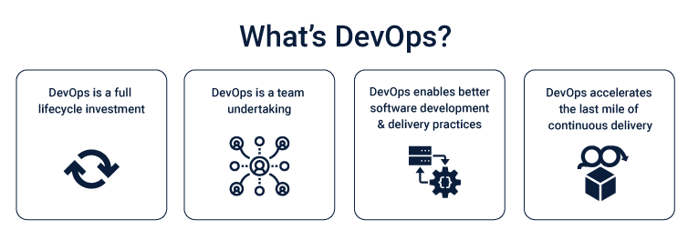
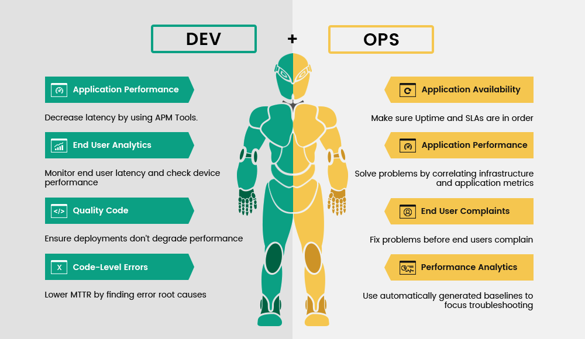

# What is DevOps? 

DevOps is a set of practices that combines software development and IT operations. It aims to shorten the systems development life cycle and provide continuous delivery with high software quality.

The goal of DevOps is to increase the speed and reliability of software delivery, while also improving the quality of the software and the ability to respond to changes and issues.

- DevOps practices include automation, continuous integration and delivery, infrastructure as code, monitoring and logging, and many others.

- DevOps also emphasizes the importance of communication, collaboration, and a shared responsibility for the software development process among all members of the team, regardless of their role or department.

- This helps to break down silos between development and operations teams and promote a more agile, responsive, and efficient software development process.

- It's not only about the tool set but a culture that focuses on collaboration, automation, measurement, and sharing.

- DevOps also focuses on automating the entire software delivery process, from development and testing to deployment and operations, with the goal of reducing errors and increasing efficiency.

By implementing DevOps practices, organizations can improve the speed and quality of their software delivery, while also reducing costs and increasing competitiveness.
 

# Why do we need DevOps ?
DevOps (Development and Operations) is an approach that focuses on collaboration and communication between software development and IT operations teams. It aims to streamline the software delivery process and improve the quality of software deployments by automating and integrating the process of building, testing, and deploying software.

Here are some of the reasons why DevOps is important:

- Improved collaboration: DevOps promotes collaboration and communication between development and operations teams, breaking down silos and improving the flow of information. This results in faster and more efficient software development and delivery.

- Faster time-to-market: DevOps practices like continuous integration and continuous delivery (CI/CD) help to reduce the time it takes to get software from development to production, allowing companies to release new features and updates more quickly.

- Increased reliability: DevOps practices help to improve the quality of software deployments by automating testing and deployment processes and implementing monitoring and feedback loops. This results in more reliable software that is less prone to failures.

- Better scalability: DevOps practices allow companies to scale their software development and deployment processes more easily, enabling them to handle increased demand and growth.

- Improved customer satisfaction: DevOps helps to improve the customer experience by delivering software that is more reliable, more feature-rich, and more responsive to customer needs.

Overall, DevOps is a critical approach for companies that want to stay competitive in today's fast-paced digital environment, by enabling them to deliver better software, more quickly and reliably.

### For more information
[What is DevOps](https://www.youtube.com/watch?v=_Gpe1Zn-1fE&t=43s)
