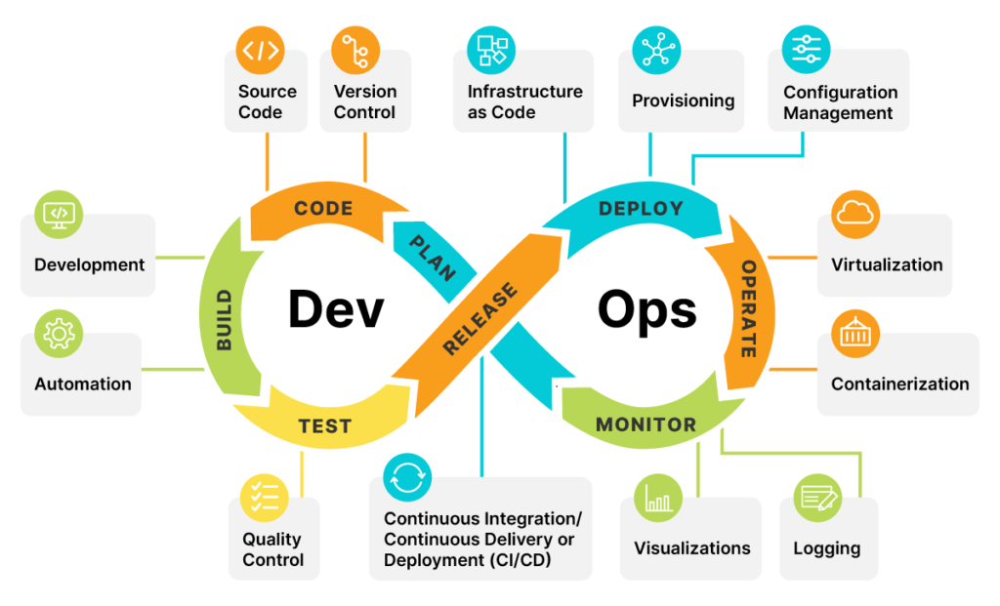
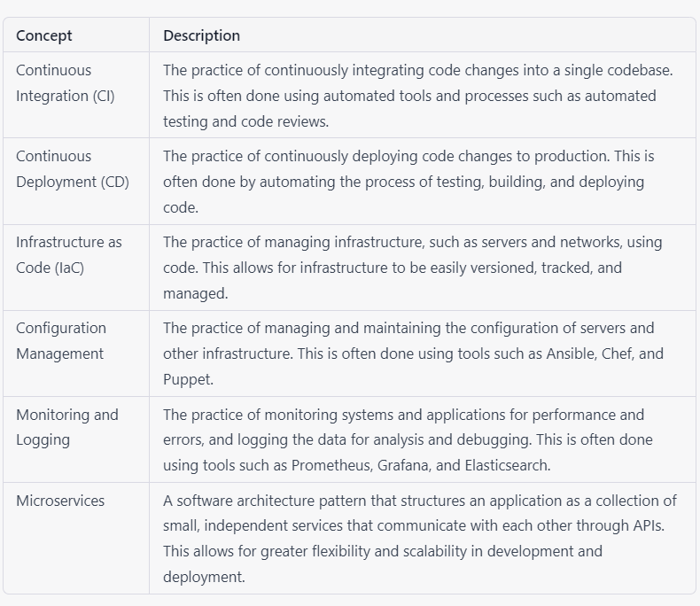

# DevOps In 5 minutes 

DevOps combines development (Dev) and operations (Ops) to unite people, process, and technology in application planning, development, delivery, and operations. DevOps enables coordination and collaboration between formerly siloed roles like development, IT operations, quality engineering, and security.

## Key Concepts in DevOps 

## For More Information
https://www.youtube.com/watch?v=Xrgk023l4lI