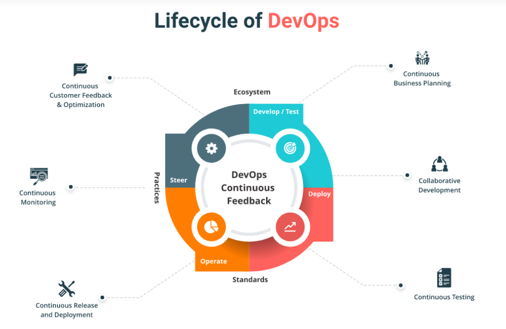
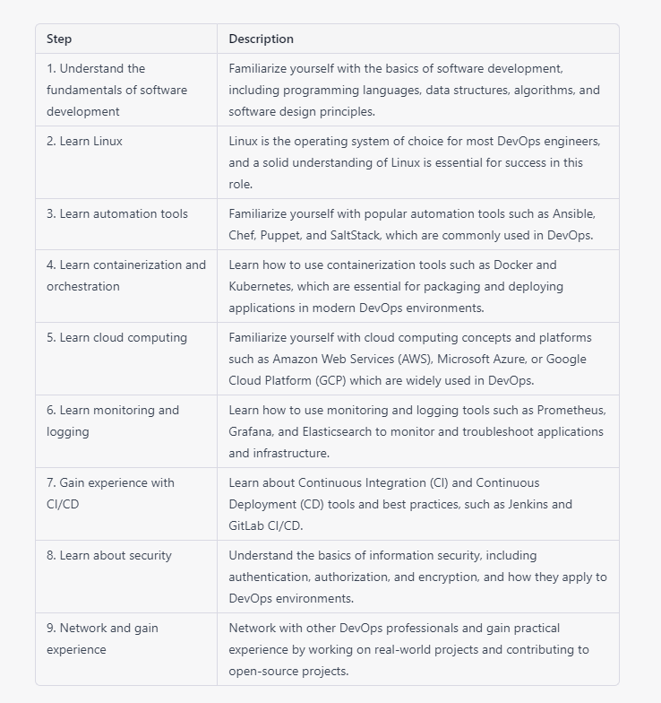

# How to become a DevOps Engineer 

If you are a Developer, an Ops person, or a Quality Assurance guy, or even a fresher, you can become a DevOps Engineer. But, let me tell you it will be a pretty long journey if you want to call yourself a DevOps person :)

## Let’s begin this journey, by listing down some important skills that organizations look for in a DevOps Engineer:

 This blog on DevOps skills will explain the skills required to become a successful DevOps professional. These skills are collected after consulting the recruiters from various companies. 

### [1. Learn programming languages.(Python, Go, Bash scripts)](https://github.com/maithelys/rtd/blob/main/Level-1/M1-IntroductionToDevops/L04-ProgrammingLanguages.md)
### [2. Study operating systems. (Linux, Windows, Mac)](https://github.com/maithelys/rtd/blob/main/Level-1/M1-IntroductionToDevops/L05-OperatingSystems.md)
### [3. Version Control / Project Management Tool. (GitHub, GitLab, BitBucket)](https://github.com/maithelys/rtd/blob/main/Level-1/M1-IntroductionToDevops/L06-VersionControl.md)
### [4. Review networking security and protocols. (HTTP, HTTPS, SSL, SSH)](https://github.com/maithelys/rtd/blob/main/Level-1/M1-IntroductionToDevops/L07-HttpHttpsSslSsh.md)
### [5. Understand Infrastructure as Code.](https://github.com/maithelys/rtd/blob/main/Level-1/M1-IntroductionToDevops/L08-IAC.md) 
### [6. Understand Containerization, Docker & Kubernetes](https://github.com/maithelys/rtd/blob/main/Level-1/M1-IntroductionToDevops/L09-Containerization.md)
### [7. Understand Configuration Orchestration](https://github.com/maithelys/rtd/blob/main/Level-1/M1-IntroductionToDevops/L09-Containerization.md)
### [8. Understand Configuration Management](https://github.com/maithelys/rtd/blob/main/Level-1/M1-IntroductionToDevops/L11-ConfigurationManagement.md)
### [9. Explore Source Code Management and Build Tool Integration Techniques for Continuous Integration (CI)](https://github.com/maithelys/rtd/blob/main/Level-1/M1-IntroductionToDevops/L12-CI.md)
### [10.Learn How To Advance Continuous Integration For Continuous Testing (Continuous Delivery)](https://github.com/maithelys/rtd/blob/main/Level-1/M1-IntroductionToDevops/L13-CD.md)
### [11. Learn How To Deploy And Configure Development, Testing, And Production Environments](https://github.com/maithelys/rtd/blob/main/Level-1/M1-IntroductionToDevops/L14-Deployment.md)
### [12. Invest in application and infrastructure monitoring.( Prometheus, Loki, Grafana, CloudWatch, Nagios, Datadog, New Relic, Sentry )](https://github.com/maithelys/rtd/blob/main/Level-1/M1-IntroductionToDevops/L15-Observability.md)
### [13. Observe cloud service providers. (AWS, Azure, Google Cloud, Heroku)](https://github.com/maithelys/rtd/blob/main/Level-1/M1-IntroductionToDevops/L16-CloudProviders.md)
### [14. Study cloud design. (Data Management, Design, and Implementation)](https://github.com/maithelys/rtd/blob/main/Level-1/M1-IntroductionToDevops/L17-CloudDesign.md)

#### For more information

https://www.youtube.com/watch?v=9pZ2xmsSDdo&t=125s

https://www.youtube.com/watch?v=7l_n97Mt0ko

