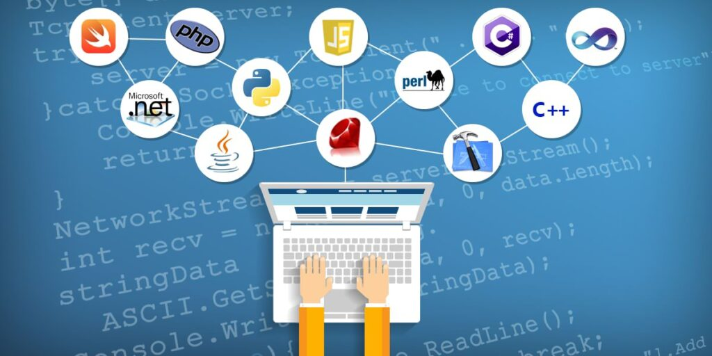
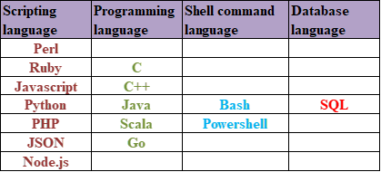

# Learn programming languages.(Python, Go, Bash scripts)

This requirement means that a good DevOps engineer must know several programming or scripting languages. What’s more, the more coding languages you know, the better you’ll be at streamlining operations and building software efficiently.

- Bash scripts - Mandatory 
- Python - Good to have 
- Java - Good to have
- Go - Optional 
- PHP - Optional 
- Ruby - Optional 
- Perl - Optional 

Bash, PowerShell, and python are the commonly used scripting languages in DevOps-based projects. Groovy is essential if the project uses Jenkins.

#### What’s Python’s role in DevOps? 

Python is one of the primary technologies used by teams practicing DevOps. Its flexibility and accessibility make Python a great fit for this job, enabling the whole team to build web applications, data visualizations, and to improve their workflow with custom utilities.

#### Is Go a good language for DevOps?

With uses in container systems, API integration and microservices, Go -- sometimes known as Golang -- is an increasingly popular programming language for DevOps and cloud projects. 

#### For more information 
https://devopscube.com/programming-languages-devops/

https://www.apexgloballearning.com/programming-languages-useful-for-devops/