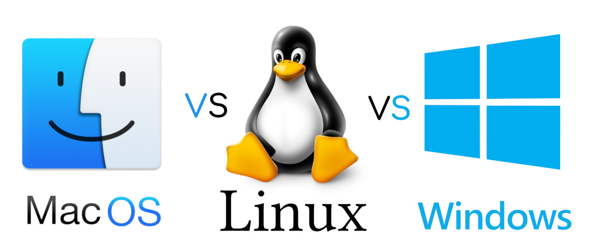
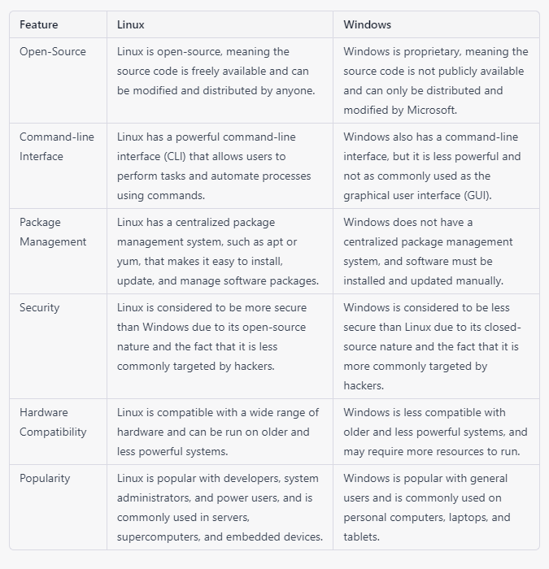

# Study operating systems. (Linux, Windows, Mac)

- Linux - Mandatory 
- Windows - Good to have 
- Mac - Optional 

#### Why do DevOps use Linux?
The customization aspect of Linux is of particular importance for DevOps. It allows for design and security applications specific to a particular development environment or development goals to be created. There is much more freedom over how the operating system functions compared to Windows.

#### [Linux V/S Windows](https://www.geeksforgeeks.org/difference-between-linux-and-windows/)

Please note that this table is a general representation and there are many different variations of Linux and Windows. Some Linux distros like Red hat, Debian, Ubuntu are more popular for enterprise use case, Windows Server is also widely used on enterprise.

#### [How to install and Run Linux Software in Windows 10 using WSL2?](https://docs.google.com/document/d/1Npjvn1ZJ4sntjlHPZ6waFTZroFHnifR01BNQvPFk8Mc/edit#heading=h.b5xkd57q5dj)
