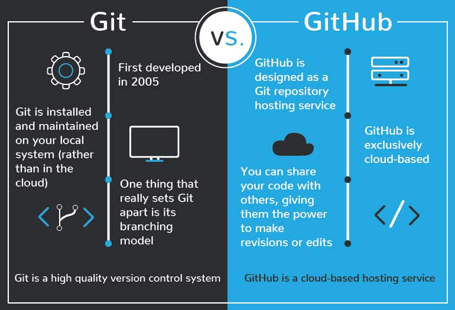

# Version Control / Project Management Tool. (GitHub, GitLab, BitBucket)

#### What is Git in DevOps?
It is a free, high-quality distributed version control system suitable for tracking modifications in source code in software development. It was originally created as an open-source system for coordinating tasks among programmers, but today it is widely used to track changes in any set of files. The key objectives of Git are as follows:
- Speed and efficiency
- Data integrity
- Support for distributed and non-linear workflows

Please note that Git and GitHub are closely related and often used together, but they are not the same thing. Git is a version control system, and GitHub is a web-based platform that uses Git. There are other alternatives for Git hosting and collaboration such as Gitlab, Bitbucket etc.

Here is a table that highlights some of the key differences between Git and GitHub:

### What is GitHub/GitLab/BitBucket ?

It is a platform for hosting code that allows for version control and collaboration. It allows you and others to collaborate on projects from anywhere. 

#### For more information refer the below links

[What is GIT ? ](https://www.simplilearn.com/tutorials/git-tutorial/what-is-git)

[GIT V/S GITHUB ](https://www.simplilearn.com/tutorials/git-tutorial/git-vs-github )