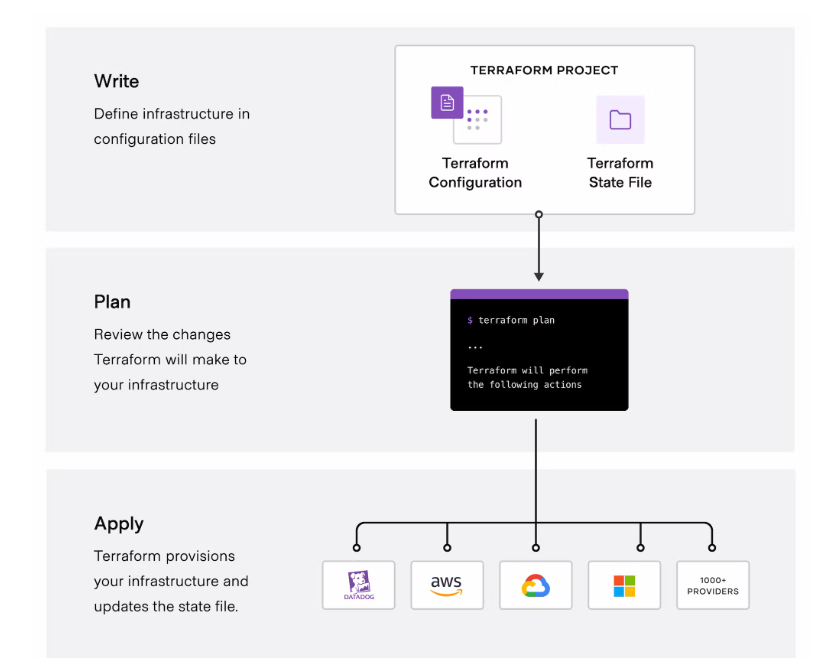

# Understand Infrastructure as Code. 

#### What is the use of IAC ?
Infrastructure as Code (IAC) is a method to provision and manage IT infrastructure through the use of source code, rather than through standard operating procedures and manual processes

**CloudFormation** and **Terraform** are provisioning tools, which means they are designed to provision the servers themselves (as well as the rest of our infrastructure, like load balancers, databases, networking configuration, etc)

#### Terraform 

HashiCorp Terraform is an infrastructure as code tool that lets you define both cloud and on-prem resources in human-readable configuration files that you can version, reuse, and share. You can then use a consistent workflow to provision and manage all of your infrastructure throughout its lifecycle. Terraform can manage low-level components like compute, storage, and networking resources, as well as high-level components like DNS entries and SaaS features.

##### How does Terraform work?
Terraform creates and manages resources on cloud platforms and other services through their application programming interfaces (APIs). Providers enable Terraform to work with virtually any platform or service with an accessible API.

HashiCorp and the Terraform community have already written thousands of providers to manage many different types of resources and services. You can find all publicly available providers on the Terraform Registry, including Amazon Web Services (AWS), Azure, Google Cloud Platform (GCP), Kubernetes, Helm, GitHub, Splunk, DataDog, and many more.

The core Terraform workflow consists of three stages:

- **Write**: You define resources, which may be across multiple cloud providers and services. For example, you might create a configuration to deploy an application on virtual machines in a Virtual Private Cloud (VPC) network with security groups and a load balancer.
- **Plan**: Terraform creates an execution plan describing the infrastructure it will create, update, or destroy based on the existing infrastructure and your configuration.
- **Apply**: On approval, Terraform performs the proposed operations in the correct order, respecting any resource dependencies. For example, if you update the properties of a VPC and change the number of virtual machines in that VPC, Terraform will recreate the VPC before scaling the virtual machines.
  
#### Cloudformation 

AWS CloudFormation is a service that gives developers and businesses an easy way to create a collection of related AWS and third-party resources, and provision and manage them in an orderly and predictable fashion.

cloudFormation introduces four concepts: 
- A template is a JSON or YAML declarative code file that describes the intended state of all the resources you need to deploy your application.
- A stack implements and manages the group of resources outlined in your template, and allows the state and dependencies of those resources to be managed together. 
- A change set is a preview of changes that will be executed by stack operations to create, update, or remove resources. 
- A stack set is a group of stacks you manage together that can replicate a group.

CloudFormation templates are JSON or YAML-formatted text files comprised of five types of elements:

1. An optional list of template parameters (input values supplied at stack creation time)
2. An optional list of output values (e.g., the complete URL to a web application)
3. An optional list of data tables used to look up static configuration values (e.g., AMI names)
4. The list of AWS resources and their configuration values
5. A template file format version number
   

#### Best IAC Tools as per the industry usage
- Terraform 
- Ansible
- AWS CloudFormation
- Azure Resource Manager
- Google Cloud Deployment Manager
- Chef
- Puppet
- SaltStack
- Vagrant

#### For more information check the below links
[What is IAC ?](https://www.redhat.com/en/topics/automation/what-is-infrastructure-as-code-iac#:~:text=Infrastructure%20as%20Code%20(IaC)%20is,to%20edit%20and%20distribute%20configurations.)

[Best Pratices for IAC](https://stackify.com/what-is-infrastructure-as-code-how-it-works-best-practices-tutorials/)
