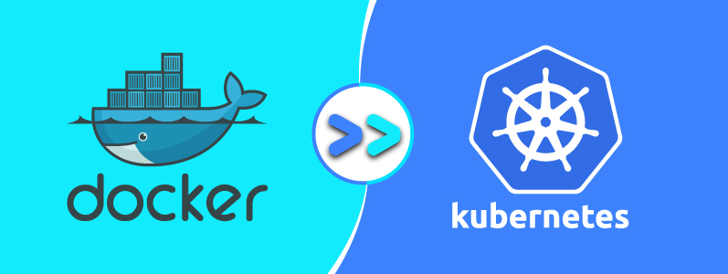
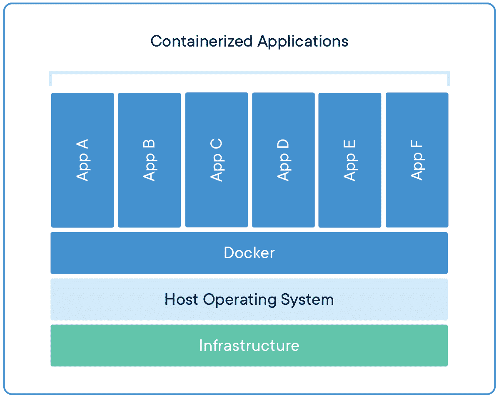
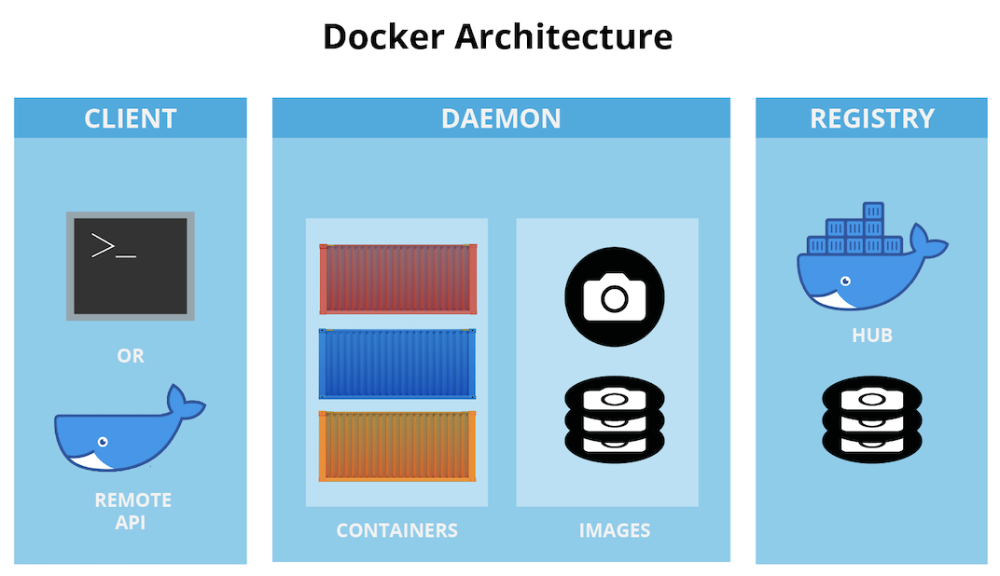
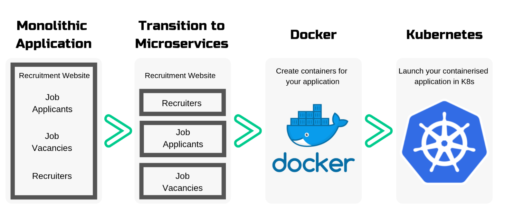
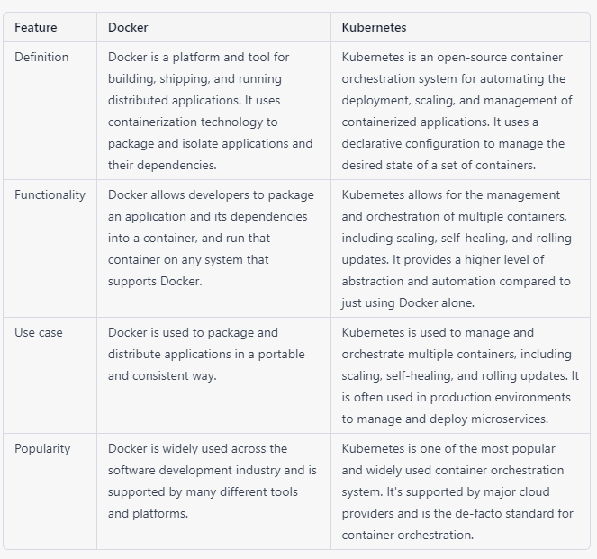

# Understand Containerization, Docker & Kubernetes 

#### What is containerization ?
Containerization is a software deployment process that bundles an application’s code with all the files and libraries it needs to run on any infrastructure. Traditionally, to run any application on your computer, you had to install the version that matched your machine’s operating system. For example, you needed to install the Windows version of a software package on a Windows machine. However, with containerization, you can create a single software package, or container, that runs on all types of devices and operating systems. 

#### What is container ?
A container is a standard unit of software that packages up code and all its dependencies so the application runs quickly and reliably from one computing environment to another.

#### What is docker ?
Docker is a software platform that allows you to build, test, and deploy applications quickly. Docker packages software into standardized units called containers that have everything the software needs to run including libraries, system tools, code, and runtime. Using Docker, you can quickly deploy and scale applications into any environment and know your code will run.

Docker ecosystem is composed of the following components
- Docker Daemon (dockerd)
- Docker Client
- Docker Images
- Docker Registries
- Docker Containers

#### Why use Docker ?
Using Docker lets you ship code faster, standardize application operations, seamlessly move code, and save money by improving resource utilization. With Docker, you get a single object that can reliably run anywhere. Docker's simple and straightforward syntax gives you full control. Wide adoption means there's a robust ecosystem of tools and off-the-shelf applications that are ready to use with Docker.

#### What Are Docker Volumes ?
The purpose of using Docker volumes is to persist data outside the container so it can be backed up or shared.

Docker volumes are dependent on Docker’s file system and are the preferred method of persisting data for Docker containers and services. When a container is started, Docker loads the read-only image layer, adds a read-write layer on top of the image stack, and mounts volumes onto the container filesystem.

#### What is Kubernetes ? 
Kubernetes is a popular open source platform for container orchestration. It enables developers to easily build containerized applications and services, as well as scale, schedule and monitor those containers.

A Kubernetes cluster consists of a set of worker machines, called nodes, that run containerized applications. Every cluster has at least one worker node.

The worker node(s) host the Pods that are the components of the application workload. The control plane manages the worker nodes and the Pods in the cluster. 

#### Difference between Docker and Kubernetes 

Please note that Docker and Kubernetes are closely related and often used together, but they have different purposes. Docker is a containerization technology and Kubernetes is a container orchestration system. You can also use other orchestration systems like Docker Swarm, Mesos etc. Here is a table that highlights some of the key differences between Docker and Kubernetes:

#### For more information 
[Kubernetes Overview](https://www.redhat.com/en/topics/containers/what-is-kubernetes)