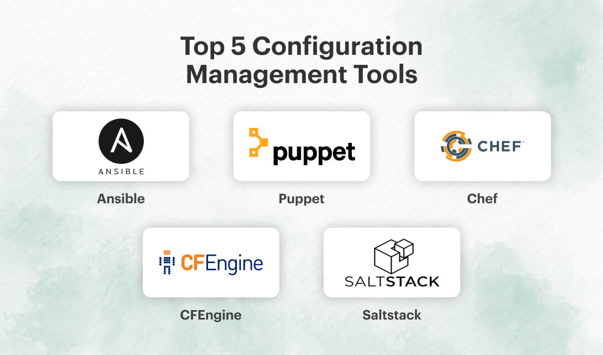

# Understand Configuration Orchestration

## What is configuration orchestration?
Orchestration is the automation of processes. In other words, determining the order in which certain tasks need to take place. For example, prescribing how an application should move from provisioning to deployment. The bottom line? Orchestration facilitates agility.

#### Configuration Orchestration vs Configuration Management

Configuration orchestration tools, which include Terraform and AWS CloudFormation, are designed to automate the deployment of servers and other infrastructure. 

Configuration management tools like Chef, Puppet, and the others on this list help configure the software and systems on this infrastructure that has already been provisioned.

Configuration orchestration tools do some level of configuration management, and configuration management tools do some level of orchestration. Companies can and many times use both types of tools together. 
