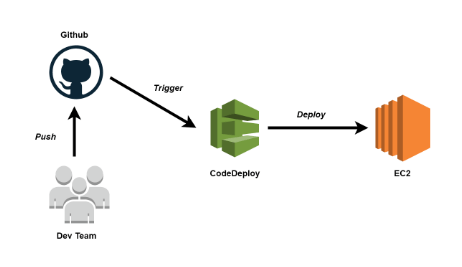

# Learn How To Deploy And Configure Development, Testing, And Production Environments

DevOps deployment tools are not a tool but a practice. This practice helps various organizations and businesses to perform to their full ability. It is a combination of many practices, cultural philosophies, and several tools that increases the ability of an organization to produce and deliver various products, applications, and services at a growing velocity. DevOps helps to evolve and produce products at a faster rate with better quality when compared to the products that the old infrastructure management processes and traditional software development applications used to produce.

However, it is not a mandatory practice that you have to implement. But because it has a ton of benefits and works towards the upliftment of any company, plenty of organizations are implementing DevOps in their operations.

DevOps continuous deployment tools remove the hindrances in communication, create visibility, and build trust throughout the organization. The team members that are responsible for performing the software development applications face challenging circumstances for making the process better. It has to make the organization efficient and effective. Choosing the right tool will always make the organizational process seamless, scalable, and open.

## What Is Deployment in DevOps?
Deployment in DevOps is a process that enables you to retrieve important codes from version control so that they can be made readily available to the public and they can use the application in a ready-to-use and automated fashion. Deployment tools DevOps comes into play when the developers of a particular application are working on certain features that they need to build and implement in the application. It is a very effective, reliable, and efficient means of testing and deploying organizational work.

Continuous deployment tools in DevOps simply mean updating the required codes on a particular server. There can be multiple servers and you need the required amount of tools to continuously update the codes and refresh the website. The functionality of the DevOps continuous deployment tools can be explained as follows: 

1. In the first phase of testing, the DevOps codes are merged for internal testing.  
2. The next phase is staging where the client's test takes place as per their requirements. 
3. Last but not least the production phase makes sure that any other feature does not get impacted because of the updating these codes on the server. 
   
DevOps deployment tools make the functionality of the servers very convenient and easy for the users. It is different from the traditional way of dealing with the applications and the improvement has given positive results to all the companies as well as to all the users. 

## What are DevOps Deployment Tools?
DevOps tools make it convenient and easier for companies to reduce the probability of errors and maintain continuous integration in operations. It addresses the key aspects of a company. DevOps tools automate the whole process and automatically build, test, and deploy the features. 

DevOps tools make the whole deployment process and easy going one and they can help you with the following aspects: 

- Increased development. 
- Improvement in operational efficiency. 
- Faster release. 
- Non-stop delivery. 
- Quicker rate of innovation. 
- Improvement in collaboration. 
- Seamless flow in the process chain. 
  
The DevOps tools play a very vital role in every organization, let us take an example for the most commonly used tool of AWS is **CODE DEPLOY**

- It is a tool that is automated and works for deployment that is exclusively offered by Amazon. It is used for releasing new features without any Hassle. 
- Cost price: Free for Amazon E2C instances. Chargeable for team-based on-premise instances.

**Advantages of using CODE DEPLOY:**

- Reliable and faster deployments. 
- Applications are easy to launch and track. 
- Decreases downtime and increases application availability. 
- Easily adapt to other applications. 
- Companies using AWS CodeDeploy: Algorithmia, Indica, Hello Labs, Adsia, Zugata, Eventtus. 

### For more information you can refer the following links 

- [Deploy WordPress to an Amazon EC2 instance](https://docs.aws.amazon.com/codedeploy/latest/userguide/tutorials-wordpress.html)
- [Deploy a "hello, world!" application with CodeDeploy](https://docs.aws.amazon.com/codedeploy/latest/userguide/tutorials-windows.html)
- [Deploy application on EC2](https://docs.aws.amazon.com/codedeploy/latest/userguide/tutorials-github-deploy-application.html)
- [Deploy an Amazon ECS service](https://docs.aws.amazon.com/codedeploy/latest/userguide/tutorial-ecs-deployment.html)
- [Deploy an application to an on-premises instance](https://docs.aws.amazon.com/codedeploy/latest/userguide/tutorials-on-premises-instance.html)
- [Use CodeDeploy to deploy an application to an Auto Scaling group](https://docs.aws.amazon.com/codedeploy/latest/userguide/tutorials-auto-scaling-group.html)
- [Use CodeDeploy to deploy an application from GitHub](https://docs.aws.amazon.com/codedeploy/latest/userguide/tutorials-github.html)
- [Deploy Lambda function with CodeDeploy and the AWS SAM](https://docs.aws.amazon.com/codedeploy/latest/userguide/tutorial-lambda-sam.html)

