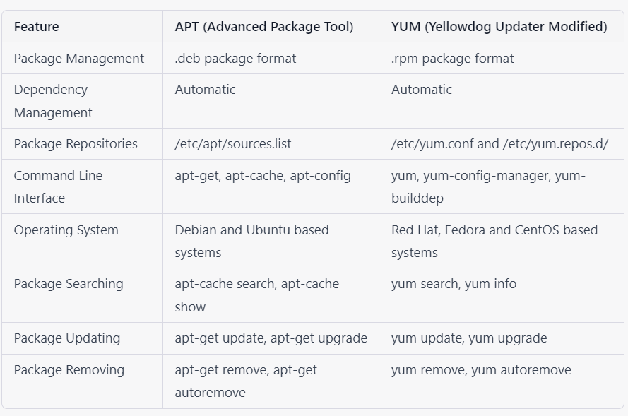

## Linux server software package management ( YUM and APT with repo management ) 

Most modern Unix-like operating systems offer a centralized mechanism for finding and installing software. Software is usually distributed in the form of packages, kept in repositories. Working with packages is known as package management. Packages provide the core components of an operating system, along with shared libraries, applications, services, and documentation.

A package management system does much more than one-time installation of software. It also provides tools for upgrading already-installed packages. Package repositories help to ensure that code has been vetted for use on your system, and that the installed versions of software have been approved by developers and package maintainers.

### Package Management Systems: A Brief Overview

Most package systems are built around collections of package files. A package file is usually an archive which contains compiled applications and other resources used by the software, along with installation scripts. Packages also contain valuable metadata, including their dependencies, a list of other packages required to install and run them.

While their functionality and benefits are broadly similar, packaging formats and tools vary by platform:

- For Debian / Ubuntu: .deb packages installed by apt and dpkg
- For Rocky / Fedora / RHEL: .rpm packages installed by yum
- For FreeBSD: .txz packages installed by pkg

In Debian and systems based on it, like Ubuntu, Linux Mint, and Raspbian, the package format is the .deb file. apt, the Advanced Packaging Tool, provides commands used for most common operations: Searching repositories, installing collections of packages and their dependencies, and managing upgrades. apt commands operate as a front-end to the lower-level dpkg utility, which handles the installation of individual .deb files on the local system, and is sometimes invoked directly.

Recent releases of most Debian-derived distributions include a single apt command, which offers a concise and unified interface to common operations that have traditionally been handled by the more-specific apt-get and apt-cache.

Rocky Linux, Fedora, and other members of the Red Hat family use RPM files. These used to use a package manager called yum. In recent versions of Fedora and its derivatives, yum has been supplanted by dnf, a modernized fork which retains most of yum’s interface.

FreeBSD’s binary package system is administered with the pkg command. FreeBSD also offers the Ports Collection, a local directory structure and tools which allow the user to fetch, compile, and install packages directly from source using Makefiles. It’s usually much more convenient to use pkg, but occasionally a pre-compiled package is unavailable, or you may need to change compile-time options.

## Update Package Lists

Most systems keep a local database of the packages available from remote repositories. It’s best to update this database before installing or upgrading packages. As a partial exception to this pattern, dnf will check for updates before performing some operations, but you can ask at any time whether updates are available.

- For Debian / Ubuntu: sudo apt update
- For Rocky / Fedora / RHEL: dnf check-update
- For FreeBSD Packages: sudo pkg update
- For FreeBSD Ports: sudo portsnap fetch update

## Upgrade Installed Packages

Making sure that all of the installed software on a machine stays up to date would be an enormous undertaking without a package system. You would have to track upstream changes and security alerts for hundreds of different packages. While a package manager doesn’t solve every problem you’ll encounter when upgrading software, it does enable you to maintain most system components with a few commands.

On FreeBSD, upgrading installed ports can introduce breaking changes or require manual configuration steps. It’s best to read /usr/ports/UPDATING before upgrading with portmaster.

- For Debian / Ubuntu: sudo apt upgrade
- For Rocky / Fedora / RHEL: sudo dnf upgrade
- For FreeBSD Packages: sudo pkg upgrade

## Find a Package

Most distributions offer a graphical or menu-driven front end to package collections. These can be a good way to browse by category and discover new software. Often, however, the quickest and most effective way to locate a package is to search with command-line tools.

- For Debian / Ubuntu: apt search search_string
- For Rocky / Fedora / RHEL: dnf search search_string
- For FreeBSD Packages: pkg search search_string

### Note: On Rocky, Fedora, or RHEL, you can search package titles and descriptions together by using dnf search all. On FreeBSD, you can search descriptions by using pkg search -D

## Install a Package from Repositories
Once you know the name of a package, you can usually install it and its dependencies with a single command. In general, you can supply multiple packages to install at once by listing them all.

- For Debian / Ubuntu: sudo apt install package
- For Rocky / Fedora / RHEL: sudo dnf install package
- For FreeBSD Packages: sudo pkg install package

## Install a Package from the Local Filesystem

Sometimes, even though software isn’t officially packaged for a given operating system, a developer or vendor will offer package files for download. You can usually retrieve these with your web browser, or via curl on the command line. Once a package is on the target system, it can often be installed with a single command.

On Debian-derived systems, dpkg handles individual package files. If a package has unmet dependencies, gdebi can often be used to retrieve them from official repositories.

On On Rocky Linux, Fedora, or RHEL, dnf is used to install individual files, and will also handle needed dependencies.

- For Debian / Ubuntu: sudo dpkg -i package.deb
 For Rocky / Fedora / RHEL: sudo dnf install package.rpm
- For FreeBSD Packages: sudo pkg add package.txz

## Remove One or More Installed Packages

Since a package manager knows what files are provided by a given package, it can usually remove them cleanly from a system if the software is no longer needed.

- For Debian / Ubuntu: sudo apt remove package
- For Rocky / Fedora / RHEL: sudo dnf erase package
- For FreeBSD Packages: sudo pkg delete package

## Differnce between apt and yum 

## Get Help
In addition to web-based documentation, keep in mind that Unix manual pages (usually referred to as man pages) are available for most commands from the shell. To read a page, use man:

    man page

In man, you can navigate with the arrow keys. Press / to search for text within the page, and q to quit.

- For Debian / Ubuntu: man apt
- For Rocky / Fedora / RHEL: man dnf
- For FreeBSD Packages: man pkg
- For FreeBSD Ports: man ports

- [How to install and Run Linux Software in Windows 10 using WSL2?](https://docs.google.com/document/d/1Npjvn1ZJ4sntjlHPZ6waFTZroFHnifR01BNQvPFk8Mc/edit#heading=h.b5xkd57q5dj)

### For more information refer the following link

[Linux Package Manager Overview](https://www.tecmint.com/linux-package-managers/)

