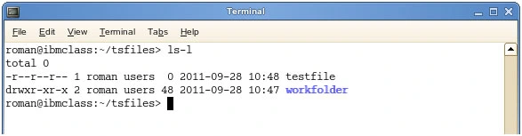
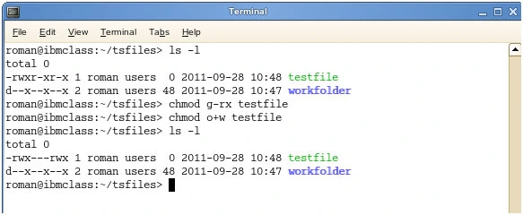
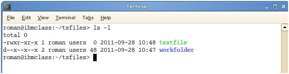
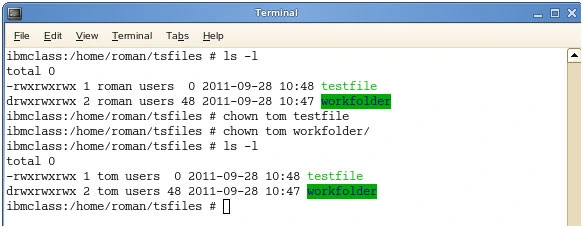
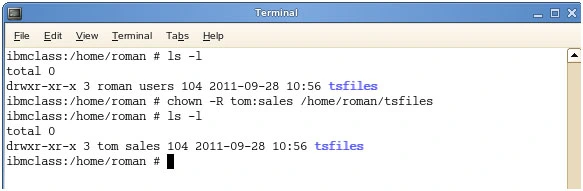
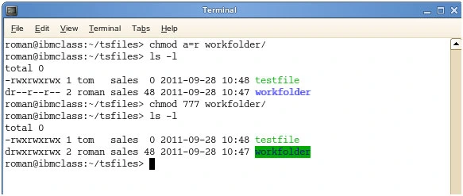

## How to change directory permissions in Linux with chmod
Using Linux as your operating system allows you to easily provide access to many users simultaneously. However, that access also presents potential security risks. Understanding the variety and types of Linux file permissions for users and groups will ensure that your system is optimally secure. 

This guide discusses the basics of Linux file permissions, and it also explains how to accomplish some crucial tasks including

- How to change directory permissions in Linux
- Changing directory permissions for group owners and others
- Managing permissions for groups of files and directories
- Changing ownership
- How to change permissions in numeric code
- How do I change directory permissions in Linux?
- To change directory permissions in Linux, use the following:
- chmod +rwx filename to add permissions
-chmod -rwx directoryname to remove permissions. 
- chmod +x filename to allow executable permissions.
- chmod -wx filename to take out write and executable permissions.
### Note that “r” is for read, “w” is for write, and “x” is for execute. 

This only changes the permissions for the owner of the file.



## What are the three permission groups?
There are three options for permission groups available to you in Linux. These are

- owners: these permissions will only apply to owners and will not affect other groups.
- groups: you can assign a group of users specific permissions, which will only impact users within the group.
- all users: these permissions will apply to all users, and as a result, they present the greatest security risk and should be assigned with caution.

## What are the three kinds of file permissions in Linux?
There are three kinds of file permissions in Linux:

- Read (r): Allows a user or group to view a file.
- Write (w): Permits the user to write or modify a file or directory.
- Execute (x): A user or grup with execute permissions can execute a file or view a directory.  

## More ways to manage permissions
Here's a more comprehensive list of ways you can manage file permissions, groups, and ownership beyond the basic commands listed at the top of this guide. 

### ow to Change Directory Permissions in Linux for the Group Owners and Others
The command for changing directory permissions for group owners is similar, but add a “g” for group or “o” for users:

```
chmod g+w filename

chmod g-wx filename

chmod o+w filename

chmod o-rwx foldername
```

To change directory permissions for everyone, use “u” for users, “g” for group, “o” for others, and “ugo” or “a” (for all).

```
chmod ugo+rwx foldername to give read, write, and execute to everyone.

chmod a=r foldername to give only read permission for everyone.
```



### How to Change Groups of Files and Directories in Linux
By issuing these commands, you can change groups of files and directories in Linux. 

- chgrp groupname filename
- chgrp groupname foldername

## Note that the group must exit before you can assign groups to files and directories.



### Changing ownership in Linux
Another helpful command is changing ownerships of files and directories in Linux:

- chown name filename
- chown name foldername



These commands will give ownership to someone, but all sub files and directories still belong to the original owner.

You can also combine the group and ownership command by using:

        chown -R name:filename /home/name/directoryname



### Changing Linux permissions in numeric code
You may need to know how to change permissions in numeric code in Linux, so to do this you use numbers instead of “r”, “w”, or “x”.
```
0 = No Permission
1 = Execute
2 = Write
4 = Read
```

Basically, you add up the numbers depending on the level of permission you want to give.




Permission numbers are:
```
0 = ---

1 = --x

2 = -w-

3 = -wx

4 = r-

5 = r-x

6 = rw-

7 = rwx
```
For example:

        chmod 777 foldername will give read, write, and execute permissions for everyone.

        chmod 700 foldername will give read, write, and execute permissions for the user only.

        chmod 327 foldername will give write and execute (3) permission for the user, w (2) for the group, and read, write, and execute for the users.

As you can see, there are several options when it comes to permissions. You have the capability to dictate usability among users. While it may be easier to just give all permission to everyone, it may end up biting you in the end. So choose wisely.

