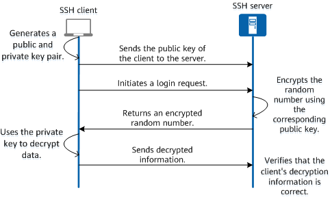
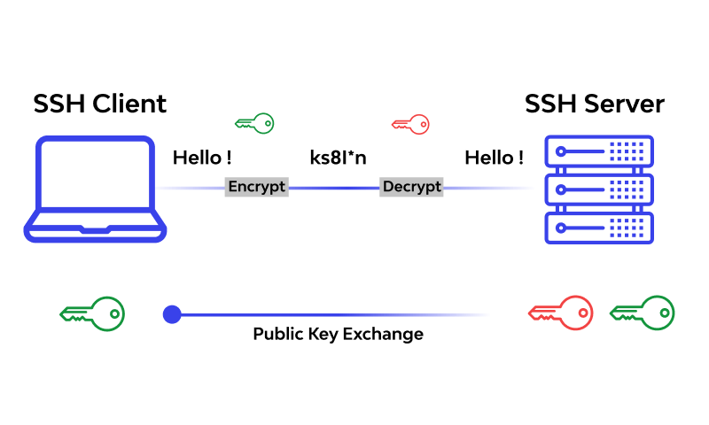

# Secure Shell 

## What is SSH?
SSH, also known as Secure Shell or Secure Socket Shell, is a network protocol that gives users, particularly system administrators, a secure way to access a computer over an unsecured network.

SSH also refers to the suite of utilities that implement the SSH protocol. Secure Shell provides strong password authentication and public key authentication, as well as encrypted data communications between two computers connecting over an open network, such as the internet.

In addition to providing strong encryption, SSH is widely used by network administrators to manage systems and applications remotely, enabling them to log in to another computer over a network, execute commands and move files from one computer to another.

SSH refers both to the cryptographic network protocol and to the suite of utilities that implement that protocol. SSH uses the client-server model, connecting a Secure Shell client application, which is the end where the session is displayed, with an SSH server, which is the end where the session runs. SSH implementations often include support for application protocols used for terminal emulation or file transfers.

SSH can also be used to create secure tunnels for other application protocols, for example, to securely run X Window System graphical sessions remotely. An SSH server, by default, listens on the standard Transmission Control Protocol (TCP) port 22.

## How does SSH work?
Secure Shell was created to replace insecure terminal emulation or login programs, such as Telnet, rlogin (remote login) and rsh (remote shell). SSH enables the same functions -- logging in to and running terminal sessions on remote systems. SSH also replaces file transfer programs, such as File Transfer Protocol (FTP) and rcp (remote copy).

The most basic use of SSH is to connect to a remote host for a terminal session. The form of that command is the following:

        ssh UserName@SSHserver.example.com

This command will cause the client to attempt to connect to the server named server.example.com, using the user ID UserName. If this is the first time negotiating a connection between the local host and the server, the user will be prompted with the remote host's public key fingerprint and prompted to connect, despite there having been no prior connection:

        The authenticity of host 'sample.ssh.com' cannot be established.
            DSA key fingerprint is 01:23:45:67:89:ab:cd:ef:ff:fe:dc:ba:98:76:54:32:10.
            Are you sure you want to continue connecting (yes/no)?

Answering yes to the prompt will cause the session to continue, and the host key is stored in the local system's known_hosts file. This is a hidden file, stored by default in a hidden directory, called /.ssh/known_hosts, in the user's home directory. Once the host key has been stored in the known_hosts file, the client system can connect directly to that server again without need for any approvals; the host key authenticates the connection.

## What is SSH used for?

Present in all data centers, SSH ships by default with every Unix, Linux and Mac server. SSH connections have been used to secure many different types of communications between a local machine and a remote host, including secure remote access to resources, remote execution of commands, delivery of software patches, and updates and other administrative or management tasks.

In addition to creating a secure channel between local and remote computers, SSH is used to manage routers, server hardware, virtualization platforms, operating systems (OSes), and inside systems management and file transfer applications.

Secure Shell is used to connect to servers, make changes, perform uploads and exit, either using tools or directly through the terminal. SSH keys can be employed to automate access to servers and often are used in scripts, backup systems and configuration management tools.

Designed to be convenient and work across organizational boundaries, SSH keys provide single sign-on (SSO) so that users can move between their accounts without typing a password each time.

While playing pivotal roles in identity management and access management, SSH does more than authenticate over an encrypted connection. All SSH traffic is encrypted. Whether users are transferring a file, browsing the web or running a command, their actions are private.

While it is possible to use SSH with an ordinary user ID and password as credentials, SSH relies more often on public key pairs to authenticate hosts to each other. Individual users must still employ their user ID and password -- or other authentication methods -- to connect to the remote host itself, but the local machine and the remote machine authenticate separately to each other. This is accomplished by generating a unique public key pair for each host in the communication. A single session requires two public key pairs: one public key pair to authenticate the remote machine to the local machine and a second public key pair to authenticate the local machine to the remote machine.

## Secure Shell capabilities

Functions that SSH enables include the following:

- secure remote access to SSH-enabled network systems or devices for users, as well as automated processes;
- secure and interactive file transfer sessions;
- automated and secured file transfers;
- secure issuance of commands on remote devices or systems; and
- secure management of network infrastructure components.
- SSH can be used interactively to enable terminal sessions and should be used instead of the less secure Telnet program. SSH is also commonly used in scripts and other software to enable programs and systems to remotely and securely access data and other resources.

### For more information:

- [How to SSH to connect to remote host](https://www.digitalocean.com/community/tutorials/how-to-use-ssh-to-connect-to-a-remote-server) 
- [How to create a user on EC2 instance](https://aws.amazon.com/premiumsupport/knowledge-center/new-user-accounts-linux-instance/)
- [How to generate keys using ssh-keygen]( https://www.thegeekdiary.com/using-the-ssh-keygen-command-in-linux/)

