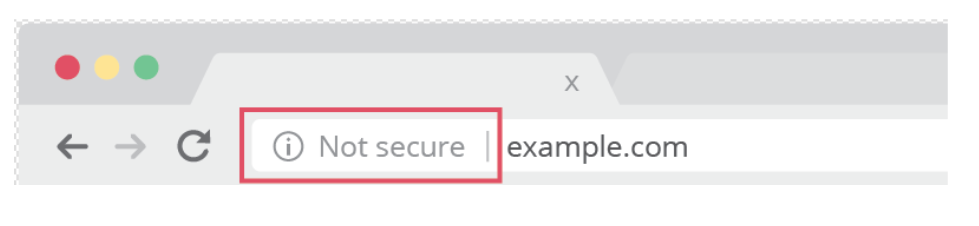
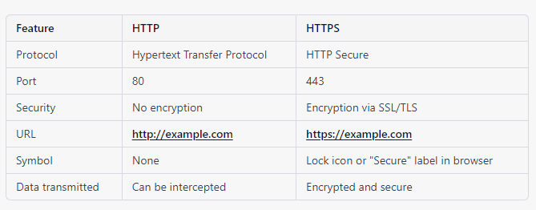

## What is HTTP ?
- HTTP stands for Hyper Text Transfer Protocol
- WWW is about communication between web clients and servers
- Communication between client computers and web servers is done by sending HTTP Requests and receiving HTTP Responses

### World Wide Web Communication
The World Wide Web is about communication between web clients and web servers.Clients are often browsers (Chrome, Edge, Safari), but they can be any type of program or device.Servers are most often computers in the cloud.

## HTTP Request / Response
Communication between clients and servers is done by requests and responses:

1. A client (a browser) sends an HTTP request to the web
2. A web server receives the request
3. The server runs an application to process the request
4. The server returns an HTTP response (output) to the browser
5. The client (the browser) receives the response

## The HTTP Request Circle
A typical HTTP request / response circle:

1. The browser requests an HTML page. The server returns an HTML file.
2. The browser requests a style sheet. The server returns a CSS file.
3. The browser requests an JPG image. The server returns a JPG file.
4. The browser requests JavaScript code. The server returns a JS file
5. The browser requests data. The server returns data (in XML or JSON).

## What is HTTPS ?
Hypertext transfer protocol secure (HTTPS) is the secure version of HTTP, which is the primary protocol used to send data between a web browser and a website. HTTPS is encrypted in order to increase security of data transfer. This is particularly important when users transmit sensitive data, such as by logging into a bank account, email service, or health insurance provider.

Any website, especially those that require login credentials, should use HTTPS. In modern web browsers such as Chrome, websites that do not use HTTPS are marked differently than those that are. Look for a padlock in the URL bar to signify the webpage is secure. Web browsers take HTTPS seriously; Google Chrome and other browsers flag all non-HTTPS websites as not secure.

## How does HTTPS work?
HTTPS uses an encryption protocol to encrypt communications. The protocol is called Transport Layer Security (TLS), although formerly it was known as Secure Sockets Layer (SSL). This protocol secures communications by using what’s known as an asymmetric public key infrastructure. This type of security system uses two different keys to encrypt communications between two parties:

1. The private key - this key is controlled by the owner of a website and it’s kept, as the reader may have speculated, private. This key lives on a web server and is used to decrypt information encrypted by the public key.
2. The public key - this key is available to everyone who wants to interact with the server in a way that’s secure. Information that’s encrypted by the public key can only be decrypted by the private key.

## Why is HTTPS important? What happens if a website doesn’t have HTTPS?
HTTPS prevents websites from having their information broadcast in a way that’s easily viewed by anyone snooping on the network. When information is sent over regular HTTP, the information is broken into packets of data that can be easily “sniffed” using free software. This makes communication over the an unsecure medium, such as public Wi-Fi, highly vulnerable to interception. In fact, all communications that occur over HTTP occur in plain text, making them highly accessible to anyone with the correct tools, and vulnerable to on-path attacks.

With HTTPS, traffic is encrypted such that even if the packets are sniffed or otherwise intercepted, they will come across as nonsensical characters. Let’s look at an example:

## Before encryption:
        This is a string of text that is completely readable
## After encryption:
        ITM0IRyiEhVpa6VnKyExMiEgNveroyWBPlgGyfkflYjDaaFf/Kn3bo3OfghBPDWo6AfSHlNtL8N7ITEwIXc1gU5X73xMsJormzzXlwOyrCs+9XCPk63Y+z0=

In websites without HTTPS, it is possible for Internet service providers (ISPs) or other intermediaries to inject content into webpages without the approval of the website owner. This commonly takes the form of advertising, where an ISP looking to increase revenue injects paid advertising into the webpages of their customers. Unsurprisingly, when this occurs, the profits for the advertisements and the quality control of those advertisements are in no way shared with the website owner. HTTPS eliminates the ability of unmoderated third parties to inject advertising into web content.

## How is HTTPS different from HTTP?
Technically speaking, HTTPS is not a separate protocol from HTTP. It is simply using TLS/SSL encryption over the HTTP protocol. HTTPS occurs based upon the transmission of TLS/SSL certificates, which verify that a particular provider is who they say they are.

When a user connects to a webpage, the webpage will send over its SSL certificate which contains the public key necessary to start the secure session. The two computers, the client and the server, then go through a process called an SSL/TLS handshake, which is a series of back-and-forth communications used to establish a secure connection. To take a deeper dive into encryption and the SSL/TLS handshake, read about what happens in a TLS handshake.

## How does a website start using HTTPS?
Many website hosting providers and other services will offer TLS/SSL certificates for a fee. These certificates will be often be shared amongst many customers. More expensive certificates are available which can be individually registered to particular web properties.

All websites using Cloudflare receive HTTPS for free using a shared certificate (the technical term for this is a multi-domain SSL certificate). Setting up a free account will guarantee a web property receives continually updated HTTPS protection. You can also explore our paid plans for individual certificates and other features. In either case, a web property receives all the benefits of using HTTPS.

### For more information 
https://www.youtube.com/watch?v=iYM2zFP3Zn0
https://www.tutorialspoint.com/http/http_requests.htm

