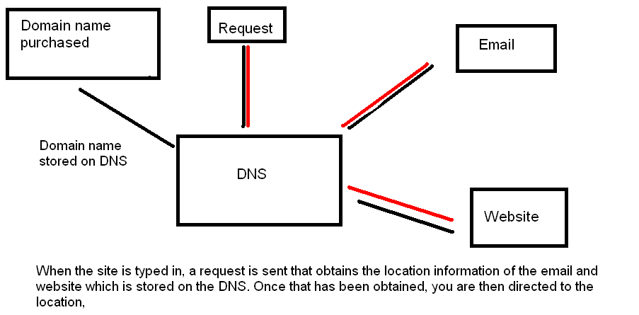

# DNS Hosting 

What is DNS hosting ?

DNS hosting is a type of network service that provides domain name system resolution services. A DNS hosting service builds, operates and provisions domain name servers, which are used and integrated with domain name registrars, Web hosting services and Internet service providers (ISP).

### For more information 
https://www.techopedia.com/definition/29030/dns-hosting 
https://www.youtube.com/watch?v=e2xLV7pCOLI 