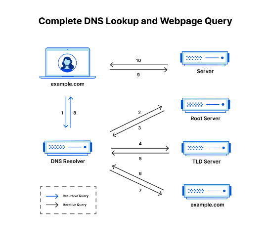

# DNS Hosting 

What is DNS hosting ?

DNS hosting is a type of network service that provides domain name system resolution services. A DNS hosting service builds, operates and provisions domain name servers, which are used and integrated with domain name registrars, Web hosting services and Internet service providers (ISP).

## How does DNS work?
The process of DNS resolution involves converting a hostname (such as www.example.com) into a computer-friendly IP address (such as 192.168.1.1). An IP address is given to each device on the Internet, and that address is necessary to find the appropriate Internet device - like a street address is used to find a particular home. When a user wants to load a webpage, a translation must occur between what a user types into their web browser (example.com) and the machine-friendly address necessary to locate the example.com webpage.

In order to understand the process behind the DNS resolution, it’s important to learn about the different hardware components a DNS query must pass between. For the web browser, the DNS lookup occurs "behind the scenes" and requires no interaction from the user’s computer apart from the initial request.

## There are 4 DNS servers involved in loading a webpage:

**DNS recursor**- The recursor can be thought of as a librarian who is asked to go find a particular book somewhere in a library. The DNS recursor is a server designed to receive queries from client machines through applications such as web browsers. Typically the recursor is then responsible for making additional requests in order to satisfy the client’s DNS query.

**Root nameserver** - The root server is the first step in translating (resolving) human readable host names into IP addresses. It can be thought of like an index in a library that points to different racks of books - typically it serves as a reference to other more specific locations.

**TLD nameserver** - The top level domain server (TLD) can be thought of as a specific rack of books in a library. This nameserver is the next step in the search for a specific IP address, and it hosts the last portion of a hostname (In example.com, the TLD server is “com”).

**Authoritative nameserver** - This final nameserver can be thought of as a dictionary on a rack of books, in which a specific name can be translated into its definition. The authoritative nameserver is the last stop in the nameserver query. If the authoritative name server has access to the requested record, it will return the IP address for the requested hostname back to the DNS Recursor (the librarian) that made the initial request.

## What are the steps in a DNS lookup?
For most situations, DNS is concerned with a domain name being translated into the appropriate IP address. To learn how this process works, it helps to follow the path of a DNS lookup as it travels from a web browser, through the DNS lookup process, and back again. Let's take a look at the steps.

**Note:** Often DNS lookup information will be cached either locally inside the querying computer or remotely in the DNS infrastructure. There are typically 8 steps in a DNS lookup. When DNS information is cached, steps are skipped from the DNS lookup process which makes it quicker. The example below outlines all 8 steps when nothing is cached.

### The 8 steps in a DNS lookup:
1. A user types ‘example.com’ into a web browser and the query travels into the Internet and is received by a DNS recursive resolver.
2. The resolver then queries a DNS root nameserver (.).
3. The root server then responds to the resolver with the address of a Top Level Domain (TLD) DNS server (such as .com or .net), which stores the information for its domains. When searching for example.com, our request is pointed toward the .com TLD.
4. The resolver then makes a request to the .com TLD.
5. The TLD server then responds with the IP address of the domain’s nameserver, example.com.
6. Lastly, the recursive resolver sends a query to the domain’s nameserver.
7. The IP address for example.com is then returned to the resolver from the nameserver.
8. The DNS resolver then responds to the web browser with the IP address of the domain requested initially.
   
Once the 8 steps of the DNS lookup have returned the IP address for example.com, the browser is able to make the request for the web page:

9. The browser makes a HTTP request to the IP address.
10. The server at that IP returns the webpage to be rendered in the browser (step 10).
    

### For more information refer the following links 

[DNS hosting overview ](https://www.techopedia.com/definition/29030/dns-hosting)

[Introduction to Domain Name System](https://www.youtube.com/watch?v=e2xLV7pCOLI)