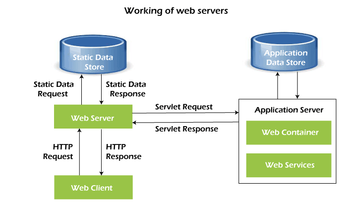
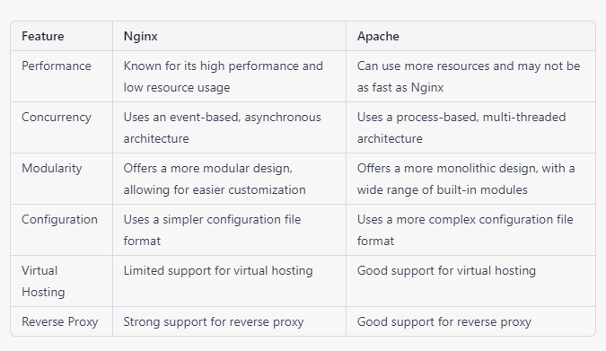

## Web Sever Basics 

A web server is a software or hardware component that is responsible for accepting HTTP requests from clients (typically web browsers) and serving back HTTP responses along with optional data contents, which usually are web pages such as HTML documents and linked objects (images, etc.). Some popular web servers include Apache, Nginx, IIS (Internet Information Services), and Lighttpd. Web servers can be installed on a wide variety of operating systems, including Windows, Linux, and macOS.

Web server hardware is connected to the internet and allows data to be exchanged with other connected devices, while web server software controls how a user accesses hosted files. The web server process is an example of the client/server model. All computers that host websites must have web server software.

Web servers are used in web hosting, or the hosting of data for websites and web-based applications -- or web applications.

## How do web servers work?
Web server software is accessed through the domain names of websites and ensures the delivery of the site's content to the requesting user. The software side is also comprised of several components, with at least an HTTP server. The HTTP server is able to understand HTTP and URLs. As hardware, a web server is a computer that stores web server software and other files related to a website, such as HTML documents, images and JavaScript files.

When a web browser, like Google Chrome or Firefox, needs a file that's hosted on a web server, the browser will request the file by HTTP. When the request is received by the web server, the HTTP server will accept the request, find the content and send it back to the browser through HTTP.

More specifically, when a browser requests a page from a web server, the process will follow a series of steps. First, a person will specify a URL in a web browser's address bar. The web browser will then obtain the IP address of the domain name -- either translating the URL through DNS (Domain Name System) or by searching in its cache. This will bring the browser to a web server. The browser will then request the specific file from the web server by an HTTP request. The web server will respond, sending the browser the requested page, again, through HTTP. If the requested page does not exist or if something goes wrong, the web server will respond with an error message. The browser will then be able to display the webpage.

Multiple domains also can be hosted on one web server.

## Examples of web server uses
Web servers often come as part of a larger package of internet- and intranet-related programs that are used for:

- sending and receiving emails;
- downloading requests for File Transfer Protocol (FTP) files; and
- building and publishing webpages.

Many basic web servers will also support server-side scripting, which is used to employ scripts on a web server that can customize the response to the client. Server-side scripting runs on the server machine and typically has a broad feature set, which includes database access. The server-side scripting process will also use Active Server Pages (ASP), Hypertext Preprocessor (PHP) and other scripting languages. This process also allows HTML documents to be created dynamically.

## Dynamic vs. static web servers
A web server can be used to serve either static or dynamic content. Static refers to the content being shown as is, while dynamic content can be updated and changed. A static web server will consist of a computer and HTTP software. It is considered static because the sever will send hosted files as is to a browser.

Dynamic web browsers will consist of a web server and other software such as an application server and database. It is considered dynamic because the application server can be used to update any hosted files before they are sent to a browser. The web server can generate content when it is requested from the database. Though this process is more flexible, it is also more complicated.

## Common and top web server software on the market
There are a number of common web servers available, some including:

- Apache HTTP Server. Developed by Apache Software Foundation, it is a free and open source web server for Windows, Mac OS X, Unix, Linux, Solaris and other operating systems; it needs the Apache license.
- Microsoft Internet Information Services (IIS). Developed by Microsoft for Microsoft platforms; it is not open sourced, but widely used.
- Nginx. A popular open source web server for administrators because of its light resource utilization and scalability. It can handle many concurrent sessions due to its event-driven architecture. Nginx also can be used as a proxy server and load balancer.
- Lighttpd. A free web server that comes with the FreeBSD operating system. It is seen as fast and secure, while consuming less CPU power.
- Sun Java System Web Server. A free web server from Sun Microsystems that can run on Windows, Linux and Unix. It is well-equipped to handle medium to large websites.

Leading web servers include Apache, Microsoft's Internet Information Services (IIS) and Nginx -- pronounced engine X. Other web servers include Novell's NetWare server, Google Web Server (GWS) and IBM's family of Domino servers.

Considerations in choosing a web server include how well it works with the operating system and other servers; its ability to handle server-side programming; security characteristics; and the publishing, search engine and site-building tools that come with it. Web servers may also have different configurations and set default values. To create high performance, a web server, high throughput and low latency will help.

## Web server security practices
There are plenty of security practices individuals can set around web server use that can make for a safer experience. A few example security practices can include processes like:

- a reverse proxy, which is designed to hide an internal server and act as an intermediary for traffic originating on an internal server;
- access restriction through processes such as limiting the web host's access to infrastructure machines or using Secure Socket Shell (SSH);
- keeping web servers patched and up to date to help ensure the web server isn't susceptible to vulnerabilities;
- network monitoring to make sure there isn't any or unauthorized activity; and
- using a firewall and SSL as firewalls can monitor HTTP traffic while having a Secure Sockets Layer (SSL) can help keep data secure.
### Mostly used web servers 

#### Nginx 

Nginx (pronounced "engine x") is a web server and reverse proxy server. It is known for its high performance, stability, rich feature set, simple configuration, and low resource consumption.

Nginx can handle a large number of concurrent connections, making it suitable for high-traffic websites. It can also be used as a load balancer and a cache server. Nginx can be used to serve a wide range of content, including static files, dynamic web pages, and media streaming. It is also commonly used as a reverse proxy, which allows it to forward requests to other servers.

Nginx is open-source software and is available for multiple operating systems, including Windows, Linux, and macOS. It is widely used by many popular websites and is considered to be one of the most popular web servers in the world.

#### Apache
Apache is a widely-used open-source web server software. It is developed and maintained by the Apache Software Foundation. It is known for its flexibility, reliability, and its wide range of features.

Apache is a multi-process, multi-threaded web server, which means it can handle multiple requests simultaneously using multiple processes or threads. It supports a wide range of protocols including HTTP, HTTPS, FTP, and more. It can be used to serve both static and dynamic content, and supports a wide range of programming languages and technologies through its built-in modules and third-party modules.

Apache also supports virtual hosting, which allows a single server to host multiple websites with different domain names. It also has a rich set of features for security and access control, such as authentication, authorization and encryption.

Apache is available for multiple operating systems including Windows, Linux, and macOS. It is considered to be one of the most popular web servers in the world, and is used by many large websites and organizations.

## Difference between nginx and apche 
It's important to note that both Nginx and Apache are powerful, flexible web servers that can be used to serve a wide range of websites and applications. The choice of which one to use will depend on the specific requirements of your application and the resources available on your server.

### For more information:
https://www.youtube.com/watch?v=9J1nJOivdyw 
