# [Connecting AWS instance with VS CODE](https://docs.google.com/document/d/12kXBKDif_-Pc5Q5l45yfJa6SlvvW_Pkk/edit)

Connecting AWS Instance using Visual Studio Code.

Step1: Open Visual Studio code and click on Extensions.

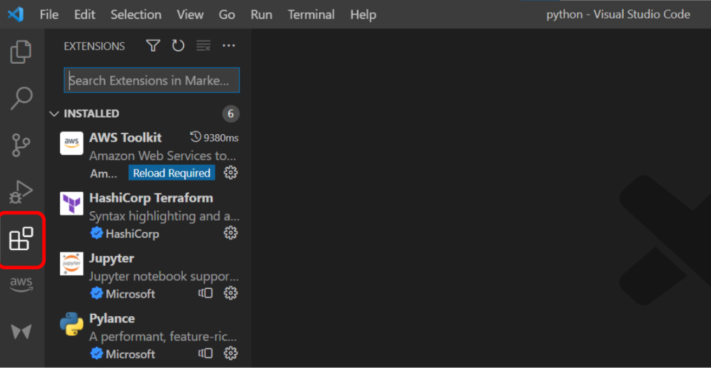

Step 2: Search for Remote-SSH extension and download it. 

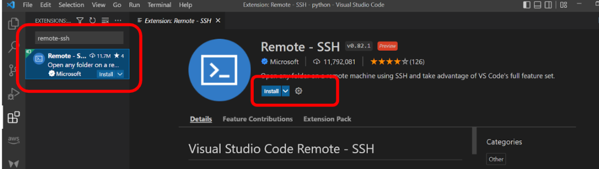

Step3: Once you have installed the Remote-SSH extension click on the left below Green symbol to open the remote window or press “ctrl+shift+p”.

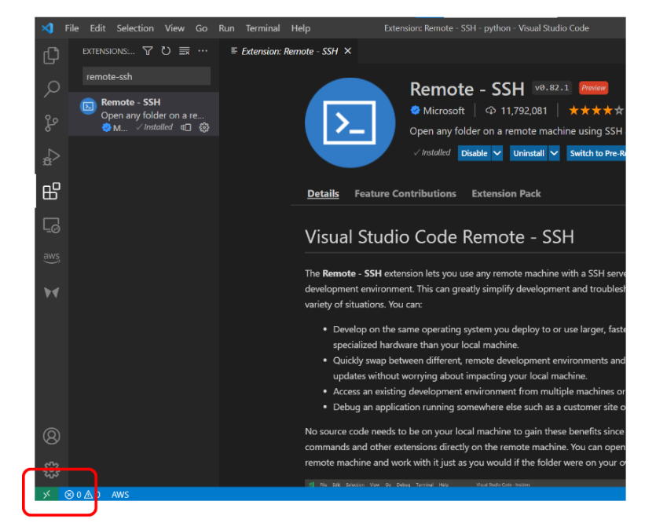

Step 4: it will open a remote window. In which search for “Option SSH Configuration file” and open it.

Step 5: Click on the first option to edit the config file.

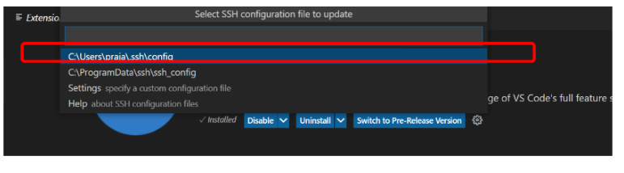

Step 6: Provide the valid config file.

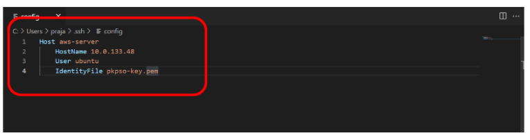

- Host =(aws-ec2) is just a name that will appear in VS Code. It can be any name.
- HostName =is the server’s host or IP.
- User =is the Ubuntu username.
- IdentityFile = private key name.

Step 7: Before executing the config file copy the private key (.pem file) and paste it in the default Windows user of yours.

Step 8: Save the config file

(Ctrl+s)

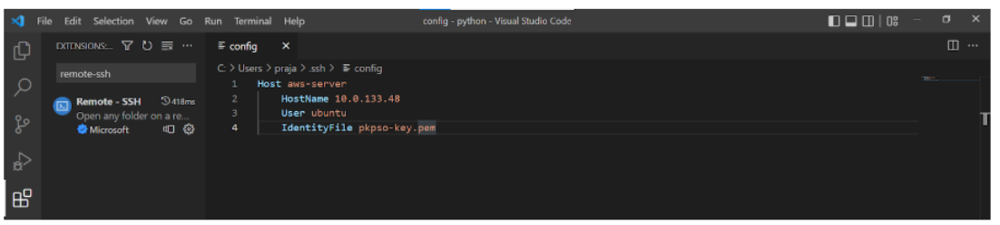

Step 9: Again, open the remote window by clicking green Icon in the left below or press “Ctrl+Shift+P”

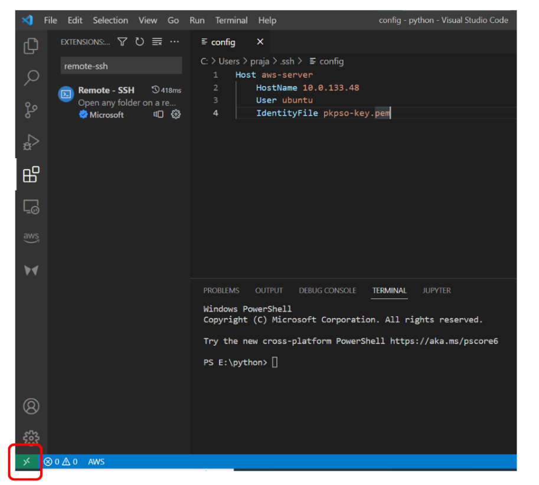

Step 10: Search for “SSH: Connect to host” and click on it.

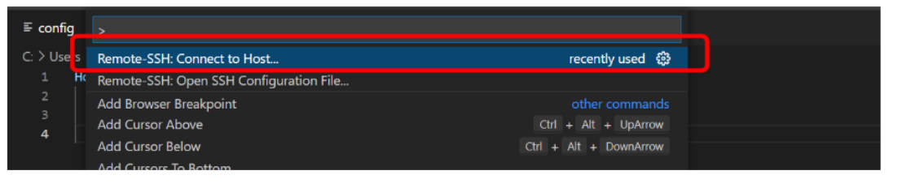

Step 11: Select the host name you have giver in the config file.

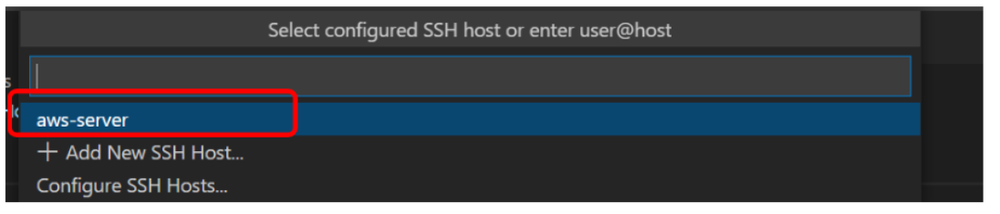

Step 12: We will be connected to our ec2 instance, select the folder you want to open.

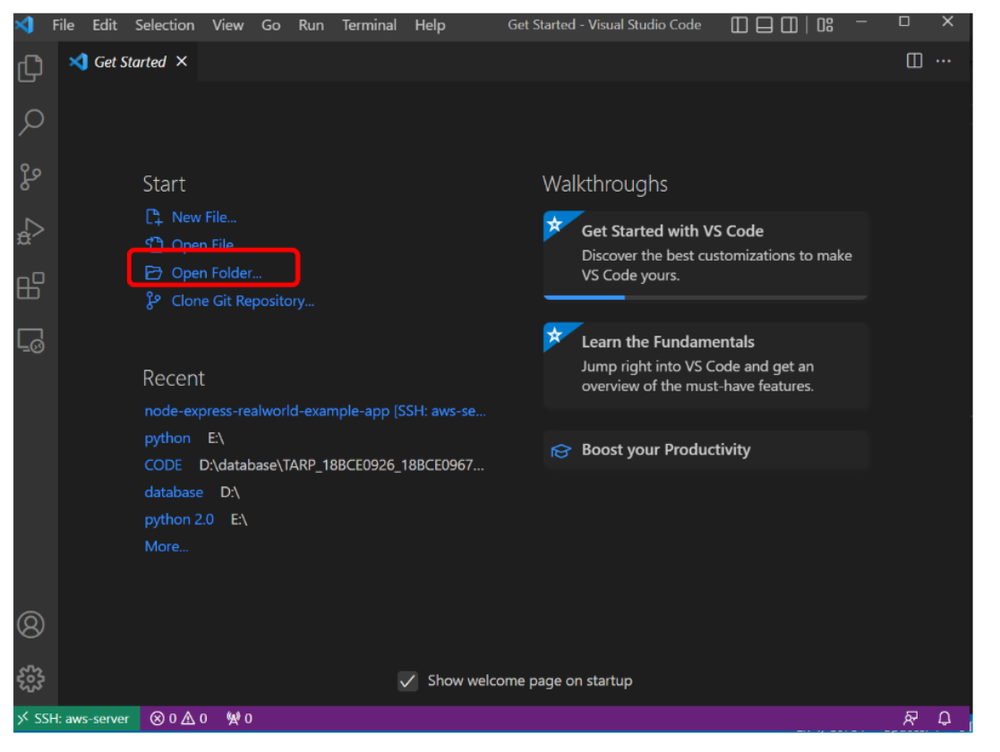

Step 13: Click on the Open Folder and then click on “OK”

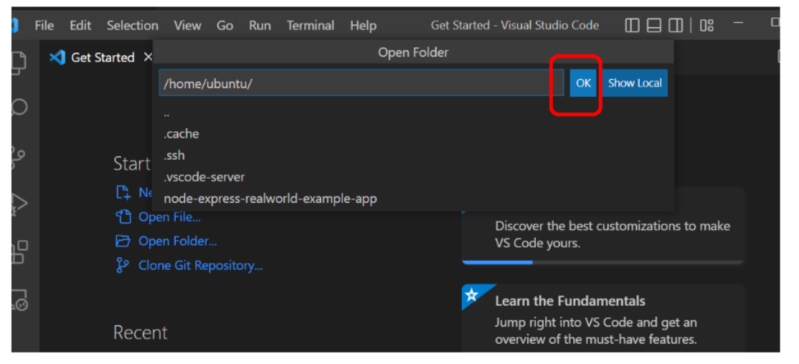

## Note will be connected to our instance.

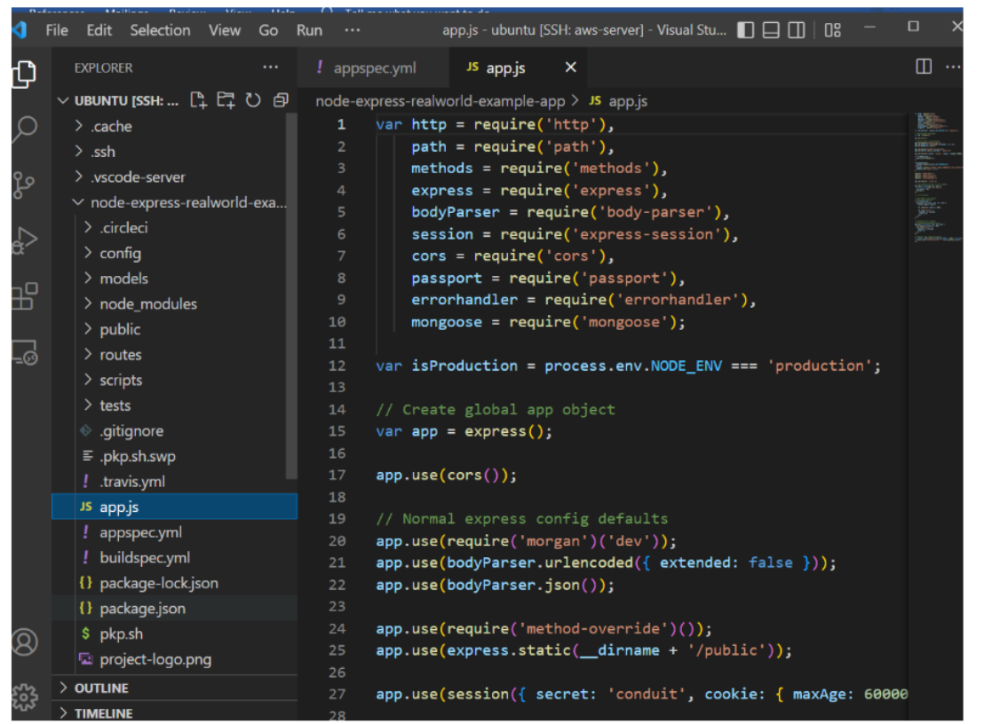

Step 14: Click on Terminal and select new terminal and here we run all our commands.

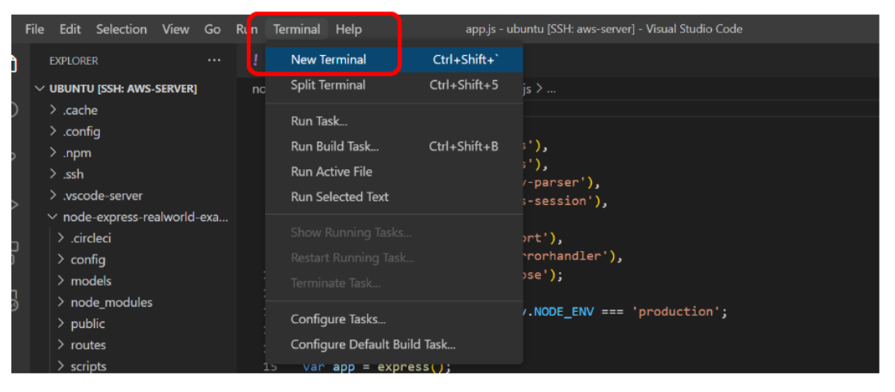

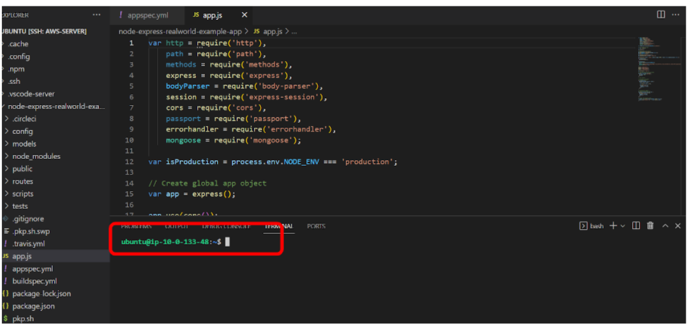

