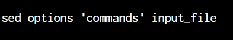
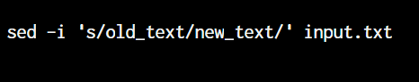
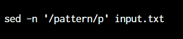

## Introduction to Linux sed Command

## What is sed?

Sed is a command-line utility that processes text line by line and allows you to perform various operations like search, replace, insert, delete, and more. It's commonly used in shell scripts and one-liners for text transformations.

## Getting Started

To use sed, open a terminal on your Linux system. You can find the terminal application by searching for "Terminal" in your applications menu.

## Basic Syntax

The basic syntax of the sed command is as follows:

- options: These are optional flags that modify the behavior of sed.
- commands: These are the operations you want to perform on the input text.
- input_file: The file containing the text to be processed.

## Key Operations with Examples

**1. Search and Replace**

Search for a specific string and replace it with another string in the text.

Example:

**2. In-place Editing**

Modify the file directly without creating a separate output file.

Example:

**3. Print Lines**

Display specific lines that match certain patterns.

Example:

**4. Delete Lines**

Remove lines that match a given pattern

Example:

**5. Insert Lines**

Add new lines before or after specific patterns.

Example:

## Practice and Explore

The best way to learn sed is through practice. Create sample text files, experiment with different commands, and observe the output. Try combining sed with other Linux commands like grep and awk for more complex text manipulation tasks.

## Conclusion

Keep practicing and exploring to enhance your text manipulation skills, and soon you'll be ready to tackle more advanced DevOps concepts.

## Resources

- Official GNU sed documentation: https://www.gnu.org/software/sed/manual/sed.html
- Linux Journey - Sed Tutorial: https://linuxjourney.com/lesson/sed

**Note**: Make sure to replace input.txt with the actual filename you want to work with in the examples. Also, feel free to adjust the difficulty level and examples according to the learners' needs.
