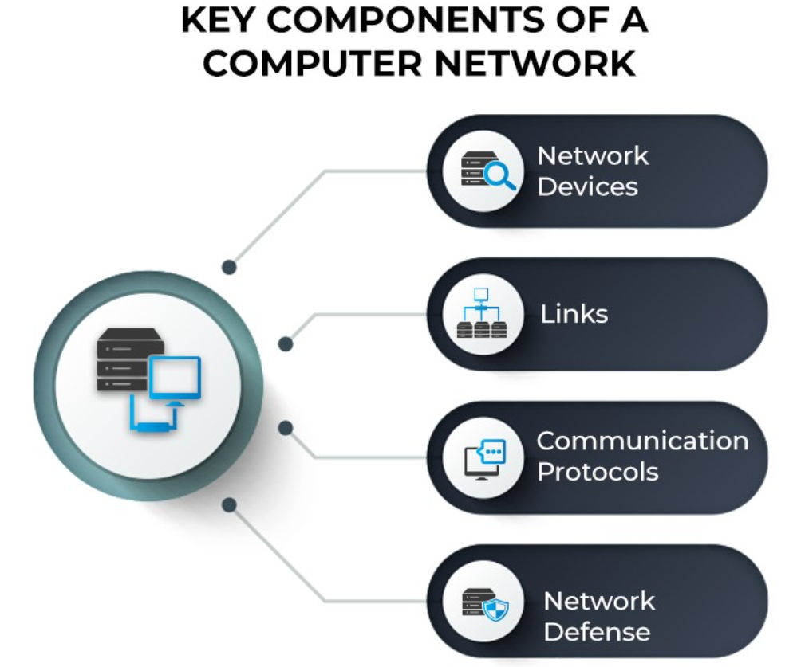

# Networking Basics:

Let's forget the DevOps side of things to begin with here, we now need to look very briefly into some of the Networking fundamentals. A computer network is defined as a system that connects two or more computing devices for transmitting and sharing information.

## What Is a Computer Network?
A computer network is a system that connects two or more computing devices for transmitting and sharing information. Computing devices include everything from a mobile phone to a server. These devices are connected using physical wires such as fiber optics, but they can also be wireless.

The first working network, called ARPANET, was created in the late 1960s and was funded by the U.S. Department of Defense. Government researchers used to share information at a time when computers were large and difficult to move. We have come a long way today from that basic kind of network. Today’s world revolves around the internet, which is a network of networks that connects billions of devices across the world. Organizations of all sizes use networks to connect their employees’ devices and shared resources such as printers.

An example of a computer network at large is the traffic monitoring systems in urban cities. These systems alert officials and emergency responders with information about traffic flow and incidents. A simpler example is using collaboration software such as Google Drive to share documents with colleagues who work remotely. Every time we connect via a video call, stream movies, share files, chat with instant messages, or just access something on the internet, a computer network is at work.

Computer networking is the branch of computer science that deals with the ideation, architecture, creation, maintenance, and security of computer networks. It is a combination of computer science, computer engineering, and telecommunication.

## Key Components of a Computer Network
From a broader lens, a computer network is built with two basic blocks: nodes or network devices and links. The links connect two or more nodes with each other. The way these links carry the information is defined by communication protocols. The communication endpoints, i.e., the origin and destination devices, are often called ports.

## Types of Computer Networks
Computer networks can be classified based on several criteria, such as the transmission medium, the network size, the topology, and organizational intent. Based on a geographical scale, the different types of networks are:

**Nanoscale networks**: These networks enable communication between minuscule sensors and actuators.\

**Personal area network (PAN)**: PAN refers to a network used by just one person to connect multiple devices, such as laptops to scanners, etc.

**Local area network (LAN)**: The local area network connects devices within a limited geographical area, such as schools, hospitals, or office buildings.

**Storage area network (SAN)**: SAN is a dedicated network that facilitates block-level data storage. This is used in storage devices such as disk arrays and tape libraries.

**Campus area network (CAN)**: Campus area networks are a collection of interconnected LANs. They are used by larger entities such as universities and governments.

**Metropolitan area network (MAN)**: MAN is a large computer network that spans across a city.

**Wide area network (WAN)**: Wide area networks cover larger areas such as large cities, states, and even countries.

**Enterprise private network (EPN)**: An enterprise private network is a single network that a large organization uses to connect its multiple office locations.

**Virtual private network (VPN)**: VPN is an overlay private network stretched on top of a public network.

**Cloud network**: Technically, a cloud network is a WAN whose infrastructure is delivered via cloud services.

## Based on organizational intent, networks can be classified as:

1. Intranet: Intranet is a set of networks that is maintained and controlled by a single entity. It is generally the most secure type of network, with access to authorized users alone. An intranet usually exists behind the router in a local area network.
2. Internet: The internet (or the internetwork) is a collection of multiple networks connected by routers and layered by networking software. This is a global system that connects governments, researchers, corporates, the public, and individual computer networks.
3. Extranet: An extranet is similar to the intranet but with connections to particular external networks. It is generally used to share resources with partners, customers, or remote employees.
4. Darknet: The darknet is an overlay network that runs on the internet and can only be accessed by specialized software. It uses unique, customized communication protocols.
   
## Network Devices (Hub, Repeater, Bridge, Switch, Router, Gateways and Brouter)
Host are any devices which send or receive traffic.

Network Devices: Network devices, also known as networking hardware, are physical devices that allow hardware on a computer network to communicate and interact with one another. For example Repeater, Hub, Bridge, Switch, Routers, Gateway, Brouter, and NIC, etc.

## For more information refer the following links

[Computer Network Overview ](https://www.spiceworks.com/tech/networking/articles/what-is-a-computer-network/)

[Network Devices](https://www.geeksforgeeks.org/network-devices-hub-repeater-bridge-switch-router-gateways/)
