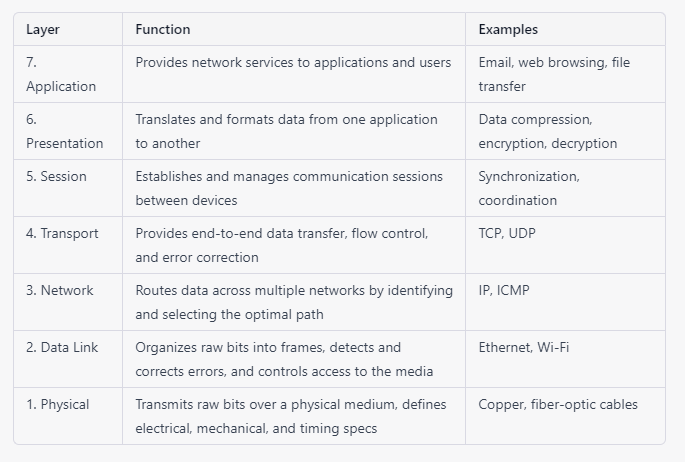

# The OSI Model - The 7 Layers

The OSI model (Open Systems Interconnection model) is a conceptual model that describes how data is transmitted and received over a network. It was developed by the International Organization for Standardization (ISO) in the early 1980s as a framework for understanding network communication.

The OSI model is divided into seven layers, each of which is responsible for a specific aspect of network communication. These layers are:

 

## Physical layer
This layer is responsible for the physical transmission of data, including the electrical, mechanical, and physical specifications of the network medium.

## Data link layer
This layer is responsible for transmitting data over a physical link, including the formatting of data packets and error correction.

## Network layer
This layer is responsible for routing data between different networks, including addressing, routing, and congestion control.

## Transport layer
This layer is responsible for ensuring the reliable transmission of data between hosts, including error recovery, flow control, and congestion control.

## Session layer
This layer is responsible for managing the communication sessions between applications, including establishing, managing, and terminating sessions.

## Presentation layer
This layer is responsible for presenting data to the application layer in a meaningful way, including encryption, compression, and data conversion.

## Application layer 
This layer is responsible for providing access to network services for applications, including email, file transfer, and remote login.

The OSI model provides a framework for understanding network communication, and it is often used as a reference model for the development of networking standards and protocols.

 

 ## For more Information refer the following link

 [OSI Model Overview](https://www.imperva.com/learn/application-security/osi-model/#:~:text=SecurityEssentialsProtocols-,What%20Is%20the%20OSI%20Model,companies%20in%20the%20early%201980s)

