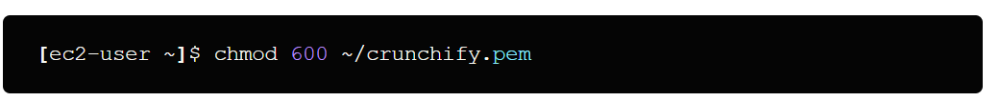
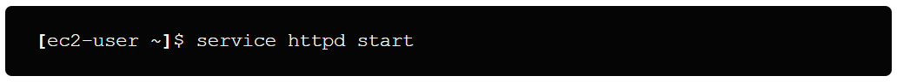
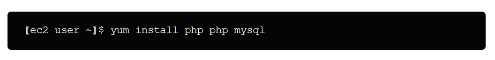
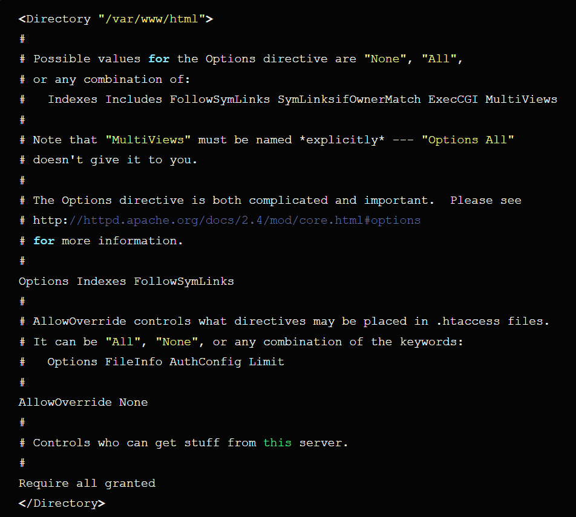
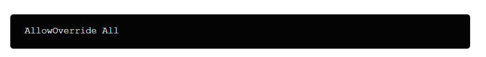
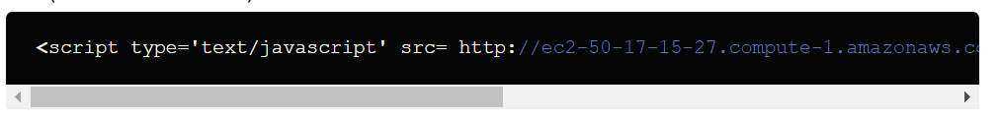

# 2-Tier Highly Available WordPress Deployment

In this tutorial I’ll show you how you can setup LAMP environment on Linux platform and install WordPress blog manually on Amazon EC2 instance.

## Step 1. Create an AWS Account


First of all you need to create your AWS account. You can sign up by following this link. You will have to provide a credit card or international Debit card and a phone number on which you will be called as part of the online registration verification process as par their terms and policy.

Your credit card or debit card will be charge of minor value and it will be refunded once they verify it. Amazon offers a Free Usage Tier on which we will install WordPress, which is great to explore the services and even host real apps without being charged of single penny.

## 2. Create an Instance
After registration you have many options available and then you probably have this question in your mind that Which type of instance should I choose?

If you have new blog then you can choose EC2 micro instance which can handle around 200+ real-time traffic.

It has also attractive price structure but if you are migrating your existing blog and having traffic more than thousand per day then you must choose Small instance which can handle that traffic very easily.

To create a new instance, access the AWS Management Console and click the EC2 tab:
- Choose an AMI in the classic instance wizard:

        - I chose the Basic 64-bit Ubuntu Server Amazon Linux AMI.


Instance details:

        - Select the Instance Type you want to use. I chose Small (m5a.small).


- Create a new key pair.

        - Enter a name for your key pair (i.e. crunchify) and download your key pair (i.e. crunchify.pem).

- Select the quick start security group.

- Launch your instance.

## 3. SSH into your Instance
Once your instance setup is complete and it shows instance is running, you can ssh into it.

First of all, you need to identify the IP Address (public DNS) of your instance:
- Select the instance in the AWS Management Console.
- Look for the Public DNS in the instance description (bottom part of the screen).
- Use that address (and a path to your .pem file) to ssh into your instance:

                ssh ec2-user@ec2-50-17-15-27.compute-1.amazonaws.com -i ~/crunchify.pem


If you are on windows system then you should use Putty for connect as SSH. You can connect with putty by following this article.
- If you get an error message about your .pem file permissions being too open, chmod your .pem file as follows:

        [ec2-user ~]$ chmod 600 ~/crunchify.pem




In this tutorial you need to perform many shell commands and most of command require root access. So, to avoid this we will prefix these all command with sudo by switching user once for all by this command.

        [ec2-user ~]$ sudo su


## 4. Install the Apache Web Server to run PHP

To install the Apache Web Server, type in terminal:
```
[ec2-user ~]$ sudo yum -y install python-simplejson     # Install PHP latest version
[ec2-user ~]$ sudo yum update                           # System wide upgrade
[ec2-user ~]$ sudo yum install -y default-jre           # Install Java (just to be safe)
[ec2-user ~]$ sudo yum install httpd                    # Install HTTPD server
```


Start the Apache Web Server:

        [ec2-user ~]$ service httpd start



After setup, to test your Web Server, open a browser and access your web site:

http://ec2-50-17-15-27.compute-1.amazonaws.com


(Use your actual public DNS name). You should see a standard Amazon place holder default page.
## 5. Install PHP to run WordPress
To install PHP, type in terminal:

        [ec2-user ~]$ yum install php php-mysql



After installing php successfully Restart the Apache Web Server:

        [ec2-user ~]$ service httpd restart


Create a page to test your PHP installation:
```
[ec2-user ~]$ cd /var/www/html
[ec2-user ~]$ vi test.php
```


Type i to start the insert mode
Type <?php phpinfo() ?>
Type :wq to write the file and quit vi
Open a browser and access test.php to test your PHP installation:
http://ec2-50-17-15-27.compute-1.amazonaws.com/test.php


(Use your public DNS name)
## 6. Install MySQL for adding database
To install MySQL, type:

        [ec2-user ~]$ yum install mysql-server


Start MySQL:

        [ec2-user ~]$ service mysqld start


Create your “blog” database:

        [ec2-user ~]$ mysqladmin -u root create blog


Secure your database:

        [ec2-user ~]$ mysql_secure_installation


Answer the wizard questions as follows:
```
Enter current password for root: Press return for none
Change Root Password: Y
New Password: Enter your new password
Remove anonymous user: Y
Disallow root login remotely: Y
Remove test database and access to it: Y
Reload privilege tables now: Y
```
## 7. Install WordPress
To install WordPress, type:

        [ec2-user ~]$ cd /var/www/html

        [ec2-user ~]$ wget http://wordpress.org/latest.tar.gz


To uncompress tar.gz file type:

        [ec2-user ~]$ tar -xzvf latest.tar.gzcd


This will uncompress WordPress in its own WordPress directory.
I like having WordPress in a separate directory, but would rather rename it to “blog” if you want to install it to subdomain like “http://your-site.com/blog”:

        [ec2-user ~]$ mv wordpress blog


otherwise move all files to parent folder by typing:

        [ec2-user ~]$ mv *.* ..


Create the WordPress wp-config.php file:
```
[ec2-user ~]$ cd blog
[ec2-user ~]$ mv wp-config-sample.php wp-config.php
[ec2-user ~]$ vi wp-config.php
```


- Type i to start insert mode.
Modify the database connection parameters as follows:

define(‘DB_NAME’, ‘blog’);
define(‘DB_USER’, ‘root’);
define(‘DB_PASSWORD’, ‘YOUR_PASSWORD’);
define(‘DB_HOST’, ‘localhost’);


- Press esc one time then
- Type :wq to write the file and quit vi
-  Open a Browser and access your blog:

http://ec2-50-17-15-27.compute-1.amazonaws.com/blog (Use your public DNS name).


This should open the WordPress installation configuration process.

### TIP: To allow WordPress to use permalinks

WordPress permalinks need to use Apache .htaccess files to work properly, but this is not enabled by default on Amazon Linux. Use this procedure to allow all overrides in the Apache document root.

Open the httpd.conf file with your favorite text editor (such as nano or vim). If you do not have a favorite text editor, nano is much easier for beginners to use.

        [ec2-user wordpress]$ sudo vim /etc/httpd/conf/httpd.conf


Find the section that starts with <Directory “/var/www/html“>.
<Directory "/var/www/html">
```
#
# Possible values for the Options directive are "None", "All",
# or any combination of:
#   Indexes Includes FollowSymLinks SymLinksifOwnerMatch ExecCGI MultiViews
#
# Note that "MultiViews" must be named *explicitly* --- "Options All"
# doesn't give it to you.
#
# The Options directive is both complicated and important.  Please see
# http://httpd.apache.org/docs/2.4/mod/core.html#options
# for more information.
#
Options Indexes FollowSymLinks
#
# AllowOverride controls what directives may be placed in .htaccess files.
# It can be "All", "None", or any combination of the keywords:
#   Options FileInfo AuthConfig Limit
#
AllowOverride None
#
# Controls who can get stuff from this server.
#
Require all granted
</Directory>
```


Change the AllowOverride None line in the above section to read AllowOverride All.

### Note:
There are multiple AllowOverride lines in this file; be sure you change the line in the <Directory "/var/www/html"> section.
                
                AllowOverride All

Save the file and exit your text editor.



## 8. Map IP Address and Domain Name
To use your blog in production, you will have to:

- Associate an IP address to your instance
- Map your domain name to that IP address
- To associate an IP address to your instance:
Steps:
a. In the AWS Management Console, click Elastic IPs (left navigation bar)

b. Click Allocate New Address, and confirm by clicking the “Yes, Allocate” button

c. Right-click the newly allocated IP address and select “Associate” in the popup menu. Select the instance you just created and click “Yes, Associate”

d. To map your domain name to your IP address, you will have to use the tools provided by your domain registrar.

e. If you use GoDaddy, specify NS73.DOMAINCONTROL.COM and NS74.DOMAINCONTROL.COM as the name servers for your domain, and use the DNS Manager to modify the A record and point to your IP address.

f. Once everything is configured and mapped correctly, access the General Settings in the WordPress management console and make sure the WordPress Address and Site Address are specified correctly using your domain name

## Other Method: To change your WordPress site URL with the wp-cli

Note the old site URL and the new site URL for your instance. The old site URL is likely the public DNS name for your EC2 instance when you installed WordPress. The new site URL is the current public DNS name for your EC2 instance.

If you are not sure of your old site URL, you can use curl to find it with the following command.

                [ec2-user ~]$ curl localhost | grep wp-content


You should see references to your old public DNS name in the output, which will look like this (old site URL in red):

                <script type='text/javascript' src= http://ec2-50-17-15-27.compute-1.amazonaws.com/blog/wp-content/themes/twentyfifteen/js/functions.js?ver=20150330'></script>



Download the wp-cli with the following command.

                [ec2-user ~]$ curl -O https://raw.githubusercontent.com/wp-cli/builds/gh-pages/phar/wp-cli.phar


Search and replace the old site URL in your WordPress installation with the following command. Substitute the old and new site URLs for your EC2 instance and the path to your WordPress installation (usually /var/www/html or /var/www/html/blog).

                [ec2-user ~]$ php wp-cli.phar search-replace 'old_site_url' 'new_site_url' --path=/path/to/wordpress/installation --skip-columns=guid


In a web browser, enter the new site URL of your WordPress blog to verify that the site is working properly again.
That’s it.

You have successfully created LAMP environment and installed WordPress on Amazon EC2.