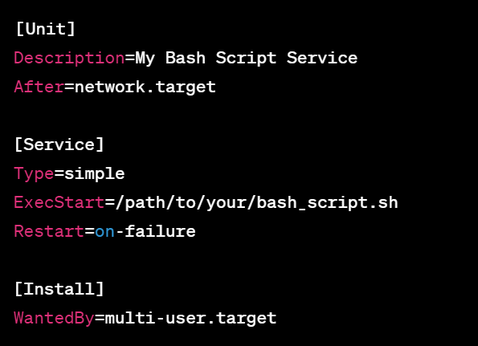

## Starting a Bash Script Using Systemd: Enhancing Service Management in DevOps

In the DevOps world, effective service management is crucial for maintaining the stability and reliability of applications and processes. Systemd is a powerful init system used in modern Linux distributions to manage services and daemons. By creating a systemd unit file for your Bash script, you can ensure that your script runs as a managed service, providing better control and monitoring capabilities.

## Creating a Systemd Unit File

To start a Bash script using systemd, you need to create a unit file with the .service extension. This file contains information about the service and its configuration.

**Step 1: Create the Bash Script**

First, create your Bash script that you want to run as a service. Make sure the script has the necessary permissions to execute.

**Step 2: Create the Unit File**

Next, create a systemd unit file in the /etc/systemd/system/ directory or the /etc/systemd/user/ directory if it's specific to a user.

Example: /etc/systemd/system/my_script.service

**Step 3: Define the Unit File**

Open the unit file using a text editor and define the service configuration. At a minimum, it should contain the following:

- Description: A description of your service.
- After: Specifies any units that your service should start after, like network.target.
- Type: Specifies the process type. For a simple script, use simple.
- ExecStart: The path to your Bash script.
- Restart: Specifies when the service should be restarted, such as on failure.
- WantedBy: Specifies the target that should enable this service. Use multi-user.target for a service that starts in multi-user mode.

**Step 4: Enable and Start the Service**

After creating the unit file, reload systemd to read the new configuration:

- sudo systemctl daemon-reload

Enable the service to start at boot:

- sudo systemctl enable my_script.service

Start the service:

- sudo systemctl start my_script.service

## Monitoring the Service

Now that your Bash script is running as a systemd service, you can monitor its status, view its logs, and manage it like any other systemd-managed service.

Check the status of the service:

- sudo systemctl status my_script.service

View the service logs:

- sudo journalctl -u my_script.service

## Conclusion

By leveraging systemd, you can elevate your Bash scripts to fully managed services in the Linux environment. This enables you to have better control, monitoring, and automation capabilities, contributing to a more robust and efficient DevOps workflow.

