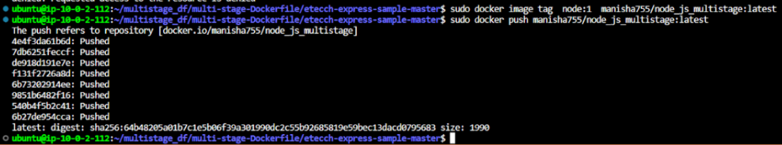

# DOCKER REGISTRY (ECR OR DOCKERHUB)
Docker Hub is a service provided by Docker for finding and sharing container images with your team. It provides the following major features: Repositories: Push and pull container images.

# Steps to upload docker image in docker hub
1. Create account in dockerHub and login to it using command: docker login -u name -p

2. Create docker image tag
        docker image tag node:1  name/node_js_multistage

3. Push your code to dockerHub: sudo docker push name/node

4. View image uploaded in dockerHub 

