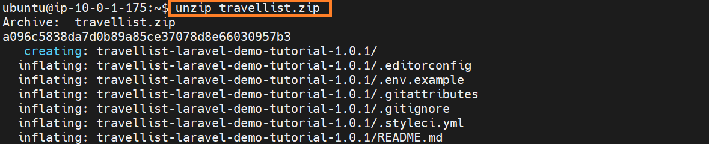
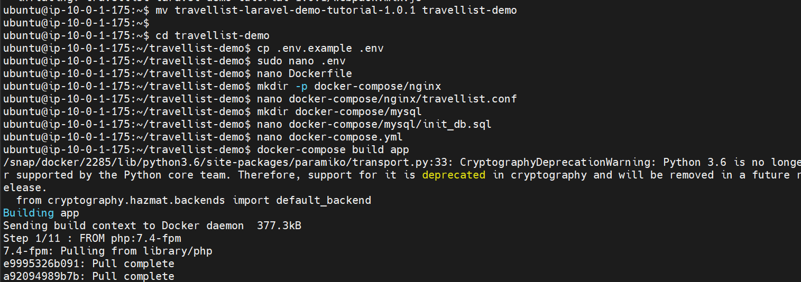
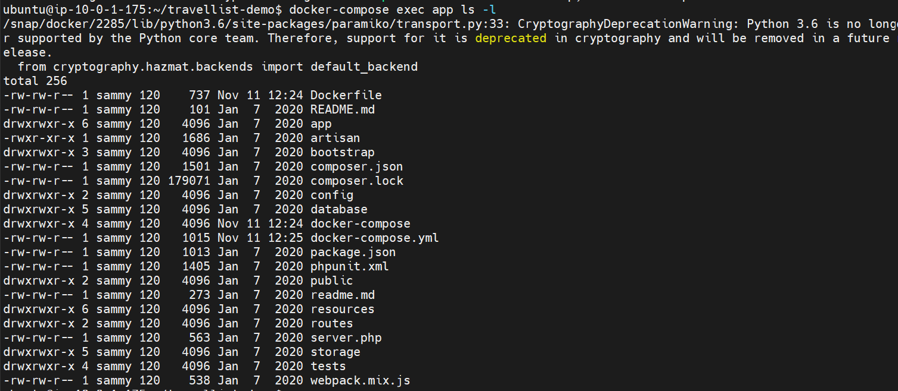

## Install & Setup Laravel APP [with Docker Compose on Ubuntu 22.04]
[How To Install and Set Up Laravel with Docker Compose on Ubuntu 22.04](https://www.digitalocean.com/community/tutorials/how-to-install-and-set-up-laravel-with-docker-compose-on-ubuntu-22-04)

In this guide, we’ll use Docker Compose to containerize a Laravel application for development. When you’re finished, you’ll have a demo Laravel application running on three separate service containers:

- An app service running PHP7.4-FPM;
- A db service running MySQL 5.7;
- An nginx service that uses the app service to parse PHP code before serving the Laravel application to the final user.

### Prerequisites
- Access to an Ubuntu 22.04 local machine or development server as a non-root user with sudo privileges. If you’re using a remote server, it’s advisable to have an active firewall installed. To set these up, please refer to our Initial Server Setup Guide for Ubuntu 22.04.
- Docker installed on your server, following Steps 1 and 2 of How To Install and Use Docker on Ubuntu 22.04.
- Docker Compose installed on your server, following Step 1 of How To Install and Use Docker Compose on Ubuntu 22.04.

Step 1 : Run apt update and upgrade 


Step 2 : Install docker and clone the https://github.com/do-community/travellist-laravel-demo.git 


Step 3: To obtain the application code that is compatible with this tutorial, download release tutorial-1.0.1 to your home directory with:
```
cd ~
curl -L https://github.com/do-community/travellist-laravel-demo/archive/tutorial-1.0.1.zip -o travellist.zip
```
Step 4: We’ll need the unzip command to unpack the application code. In case you haven’t installed this package before, do so now with:
```
sudo apt update
sudo apt install unzip
unzip travellist.zip
```


Step 5: Rename the unpacked directory for easier access  and navigate to the travellist-demo directory:
```
mv travellist-laravel-demo-tutorial-1.0.1 travellist-demo
cd travellist-demo
```
Step 6 : Setting Up the Application’s .env File
        cp .env.example .env
```
APP_NAME=Travellist
APP_ENV=dev
APP_KEY=
APP_DEBUG=true
APP_URL=http://localhost:8000

LOG_CHANNEL=stack

DB_CONNECTION=mysql
DB_HOST=db
DB_PORT=3306
DB_DATABASE=travellist
DB_USERNAME=travellist_user
DB_PASSWORD=password
```

Step 7: Setting Up the Application’s Dockerfile

```
FROM php:7.4-fpm

# Arguments defined in docker-compose.yml
ARG user
ARG uid

# Install system dependencies
RUN apt-get update && apt-get install -y \
    git \
    curl \
    libpng-dev \
    libonig-dev \
    libxml2-dev \
    zip \
    unzip

# Clear cache
RUN apt-get clean && rm -rf /var/lib/apt/lists/*

# Install PHP extensions
RUN docker-php-ext-install pdo_mysql mbstring exif pcntl bcmath gd

# Get latest Composer
COPY --from=composer:latest /usr/bin/composer /usr/bin/composer

# Create system user to run Composer and Artisan Commands
RUN useradd -G www-data,root -u $uid -d /home/$user $user
RUN mkdir -p /home/$user/.composer && \
    chown -R $user:$user /home/$user

# Set working directory
WORKDIR /var/www

USER $user
```

Step 8 : Running the Application with Docker Compose

        docker-compose build app






Step 9 : Laravel application up and running on server port 8000


