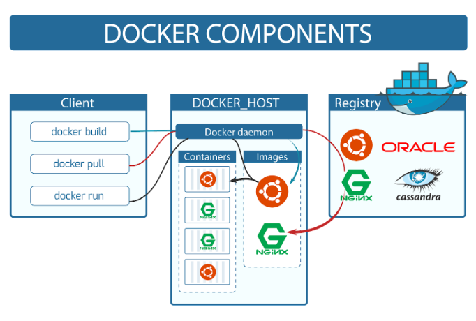

# Docker Architecture

Before learning the Docker architecture, first, you should know about the Docker Daemon.

What is Docker daemon?
Docker daemon runs on the host operating system. It is responsible for running containers to manage docker services. Docker daemon communicates with other daemons. It offers various Docker objects such as images, containers, networking, and storage. s

Docker architecture
Docker follows Client-Server architecture, which includes the three main components that are Docker Client, Docker Host, and Docker Registry.

## 1. Docker Client
Docker client uses commands and REST APIs to communicate with the Docker Daemon (Server). When a client runs any docker command on the docker client terminal, the client terminal sends these docker commands to the Docker daemon. Docker daemon receives these commands from the docker client in the form of command and REST API's request.

Note: Docker Client has an ability to communicate with more than one docker daemon.
Docker Client uses Command Line Interface (CLI) to run the following commands -

- docker build
- docker pull
- docker run

## 2. Docker Host
Docker Host is used to provide an environment to execute and run applications. It contains the docker daemon, images, containers, networks, and storage.

## 3. Docker Registry
Docker Registry manages and stores the Docker images.

There are two types of registries in the Docker -

- Pubic Registry - Public Registry is also called as Docker hub.
- Private Registry - It is used to share images within the enterprise.

# Docker Images
Docker images are the read-only binary templates used to create Docker Containers. It uses a private container registry to share container images within the enterprise and also uses public container registry to share container images within the whole world. Metadata is also used by docket images to describe the container's abilities.

# Docker Containers
Containers are the structural units of Docker, which is used to hold the entire package that is needed to run the application. The advantage of containers is that it requires very less resources.

In other words, we can say that the image is a template, and the container is a copy of that template.

