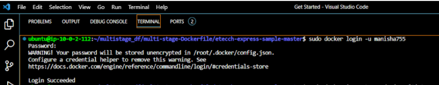
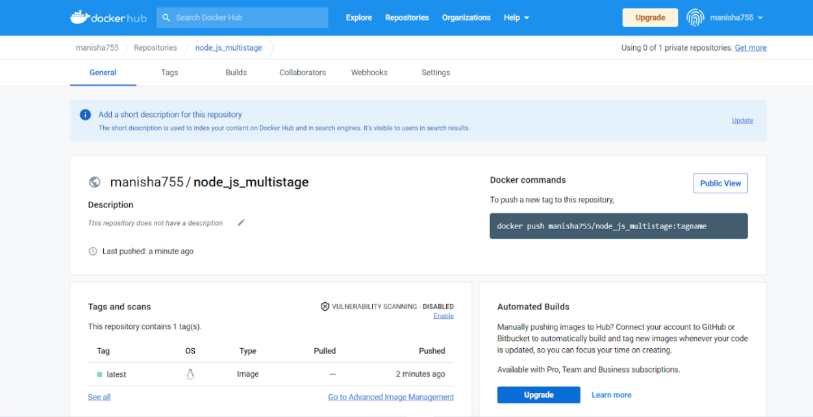

# DOCKER REGISTRY (ECR OR DOCKERHUB)
Docker Hub is a service provided by Docker for finding and sharing container images with your team. It provides the following major features: Repositories: Push and pull container images.

# Steps to upload docker image in docker hub
1. Create account in dockerHub and login to it using command: docker login -u name -p

2. Create docker image tag
        docker image tag node:1  name/node_js_multistage

3. Push your code to dockerHub: sudo docker push name/node

4. View image uploaded in dockerHub 

# ECR 

Amazon Elastic Container Registry (Amazon ECR) is an AWS managed container image registry service that is secure, scalable, and reliable. Amazon ECR supports private repositories with resource-based permissions using AWS IAM. This is so that specified users or Amazon EC2 instances can access your container repositories and images. You can use your preferred CLI to push, pull, and manage Docker images, Open Container Initiative (OCI) images, and OCI compatible artifacts.

## Components of Amazon ECR
Amazon ECR contains the following components:

**Registry**: An Amazon ECR private registry is provided to each AWS account; you can create one or more repositories in your registry and store images in them. 

**Authorization token**: Your client must authenticate to Amazon ECR registries as an AWS user before it can push and pull images. 

**Repository**: An Amazon ECR repository contains your Docker images, Open Container Initiative (OCI) images, and OCI compatible artifacts. 

**Repository policy** : You can control access to your repositories and the images within them with repository policies. 

**Image**: You can push and pull container images to your repositories. You can use these images locally on your development system, or you can use them in Amazon ECS task definitions and Amazon EKS pod specifications. ]