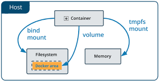

# Docker Storage
Docker Storage is used to store data on the container. 

Docker offers the following options for the Storage:

- Data Volume - Data Volume provides the ability to create persistence storage. It also allows us to name volumes, list volumes, and containers associates with the volumes.
- Directory Mounts - It is one of the best options for docker storage. It mounts a host's directory into a container.
- Storage Plugins - It provides an ability to connect to external storage platforms.

## For more information refer the following link 

(Docker Storage Overview)[https://docs.docker.com/storage/]