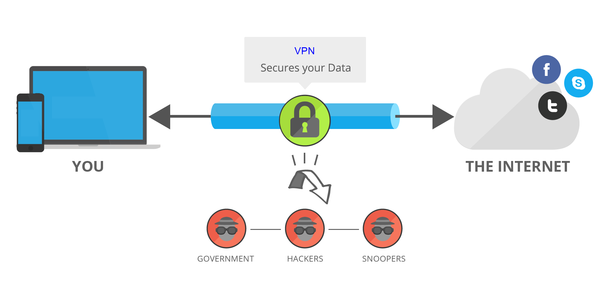

## What is VPN ?

VPN stands for "Virtual Private Network" and describes the opportunity to establish a protected network connection when using public networks. VPNs encrypt your internet traffic and disguise your online identity. This makes it more difficult for third parties to track your activities online and steal data. The encryption takes place in real time.

## What are the benefits of a VPN connection?

A VPN connection disguises your data traffic online and protects it from external access. Unencrypted data can be viewed by anyone who has network access and wants to see it. With a VPN, hackers and cyber criminals can’t decipher this data.

### Secure encryption
To read the data, you need an encryption key . Without one, it would take millions of years for a computer to decipher the code in the event of a brute force attack . With the help of a VPN, your online activities are hidden even on public networks.

### Disguising your whereabouts
VPN servers essentially act as your proxies on the internet. Because the demographic location data comes from a server in another country, your actual location cannot be determined. In addition, most VPN services do not store logs of your activities. Some providers, on the other hand, record your behavior, but do not pass this information on to third parties. This means that any potential record of your user behavior remains permanently hidden.

### Access to regional content
Regional web content is not always accessible from everywhere. Services and websites often contain content that can only be accessed from certain parts of the world. Standard connections use local servers in the country to determine your location. This means that you cannot access content at home while traveling, and you cannot access international content from home. With VPN location spoofing , you can switch to a server to another country and effectively “change” your location.

### Secure data transfer
If you work remotely, you may need to access important files on your company’s network. For security reasons, this kind of information requires a secure connection. To gain access to the network, a VPN connection is often required. VPN services connect to private servers and use encryption methods to reduce the risk of data leakage.

## What kind of VPNs are there?
There are many different types of VPNs, but you should definitely be familiar with the three main types:

### SSL VPN
Often not all employees of a company have access to a company laptop they can use to work from home. During the corona crisis in Spring 2020, many companies faced the problem of not having enough equipment for their employees. In such cases, use of a private device (PC, laptop, tablet, mobile phone) is often resorted to. In this case, companies fall back on an SSL-VPN solution, which is usually implemented via a corresponding hardware box.

The prerequisite is usually an HTML-5-capable browser, which is used to call up the company's login page. HTML-5 capable browsers are available for virtually any operating system. Access is guarded with a username and password.

### Site-to-site VPN
A site-to-site VPN is essentially a private network designed to hide private intranets and allow users of these secure networks to access each other's resources.

A site-to-site VPN is useful if you have multiple locations in your company, each with its own local area network (LAN) connected to the WAN (Wide Area Network). Site-to-site VPNs are also useful if you have two separate intranets between which you want to send files without users from one intranet explicitly accessing the other.

Site-to-site VPNs are mainly used in large companies. They are complex to implement and do not offer the same flexibility as SSL VPNs. However, they are the most effective way to ensure communication within and between large departments.

### Client-to-Server VPN
Connecting via a VPN client can be imagined as if you were connecting your home PC to the company with an extension cable. Employees can dial into the company network from their home office via the secure connection and act as if they were sitting in the office. However, a VPN client must first be installed and configured on the computer.

This involves the user not being connected to the internet via his own ISP, but establishing a direct connection through his/her VPN provider. This essentially shortens the tunnel phase of the VPN journey. Instead of using the VPN to create an encryption tunnel to disguise the existing internet connection, the VPN can automatically encrypt the data before it is made available to the user.

This is an increasingly common form of VPN, which is particularly useful for providers of insecure public WLAN. It prevents third parties from accessing and compromising the network connection and encrypts data all the way to the provider. It also prevents ISPs from accessing data that, for whatever reason, remains unencrypted and bypasses any restrictions on the user's internet access (for instance, if the government of that country restricts internet access).

The advantage of this type of VPN access is greater efficiency and universal access to company resources. Provided an appropriate telephone system is available, the employee can, for example, connect to the system with a headset and act as if he/she were at their company workplace. For example, customers of the company cannot even tell whether the employee is at work in the company or in their home office.

## Why do we need VPN ?

Virtual Private Networks (VPNs) are becoming increasingly popular as a means of securing and encrypting internet traffic. Here are some of the main reasons why we need VPNs:

1. Privacy: VPNs help to protect your online privacy by encrypting your internet traffic and hiding your IP address. This prevents ISPs, hackers, and other third parties from tracking your online activities or identifying your location.

2. Security: VPNs provide a secure and encrypted connection to the internet, making it difficult for hackers to intercept and steal your personal data, such as login credentials or financial information.

3. Access to restricted content: VPNs can be used to bypass geolocation restrictions and access content that may be blocked in your region. For example, if you are traveling to a country where certain websites or services are blocked, a VPN can help you access them as if you were still in your home country.

4. Protection on public Wi-Fi: Public Wi-Fi hotspots are often unsecured and can be easily compromised by hackers. A VPN encrypts your internet traffic, protecting your personal information and sensitive data from being intercepted on public Wi-Fi networks.

5. Remote access: VPNs can be used to securely connect to a company's network from a remote location, such as when working from home or traveling. This enables employees to access company resources and applications as if they were physically located in the office.

Overall, VPNs are an essential tool for anyone who values their online privacy and security. They provide a way to browse the internet safely and securely, while also providing access to a wider range of content and services.

