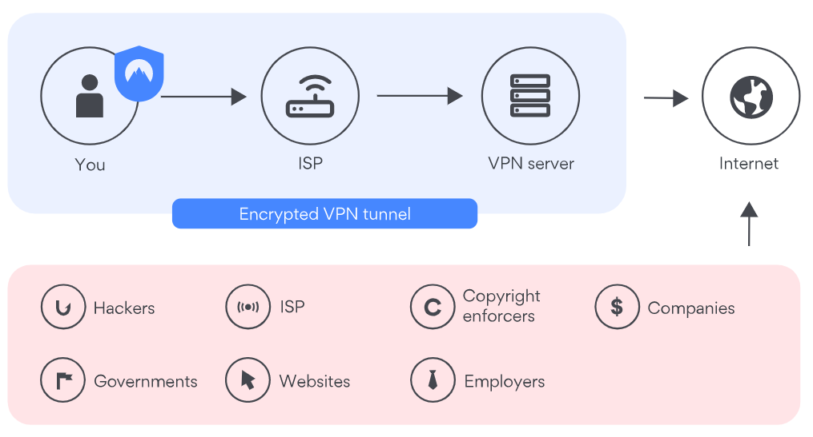

## How does a VPN work?

There are many different VPN types, but we’ll focus on consumer VPN here — that’s the one NordVPN offers. When you download client-based 
VPN software to your device, it does most of the work for you — you only need to log in and connect.

However, it’s helpful to know how a VPN works to understand the service better. Here’s what’s going on behind the scenes:

1. When you connect to a virtual private network service, it authenticates your client with a VPN server.
2. The server then applies an encryption protocol to all the data you send and receive.
3. The VPN service creates an encrypted “tunnel” over the internet. This secures the data traveling between you and your destination.
3. To ensure each data packet stays secure, a VPN wraps it in an outer packet, which is then encrypted through encapsulation. This is the core element of the VPN tunnel, keeping the data safe during transfer.
4. When the data arrives at the server, the outer packet is removed through a decryption process.