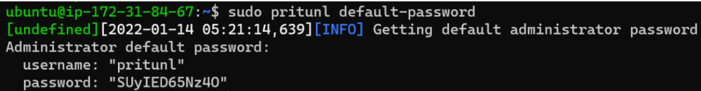
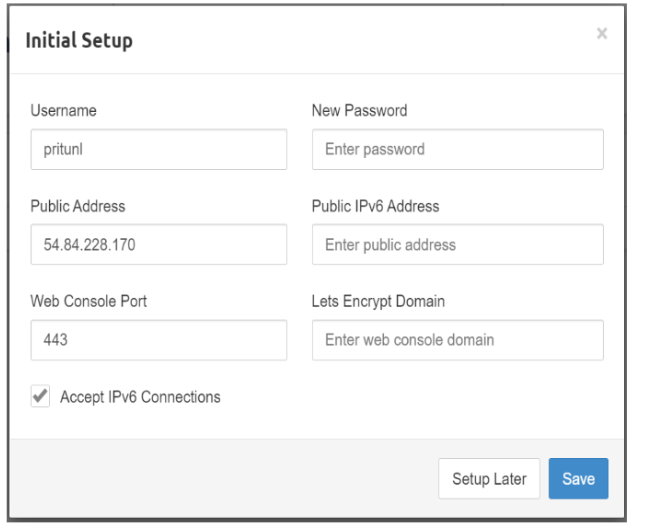
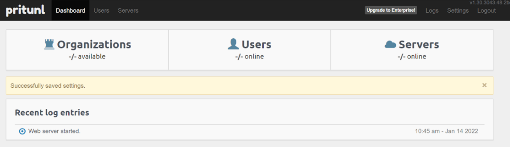
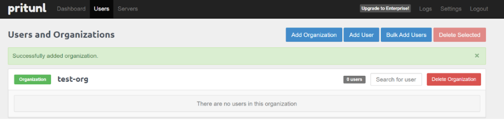
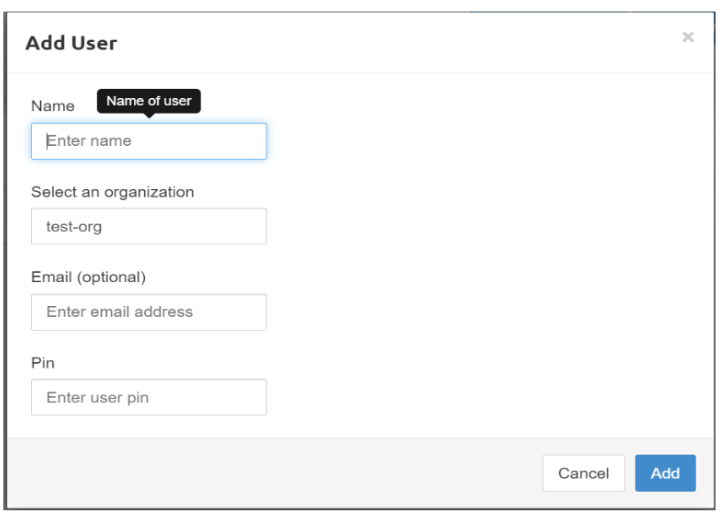
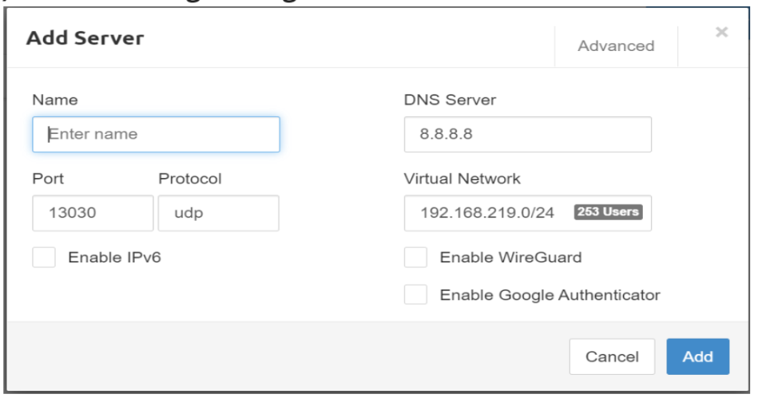
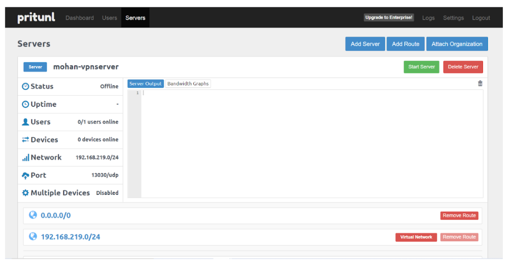

# Pritunl VPN Server Installation

Pritunl VPN is an open source VPN server and management system. It utilizes a graphical interface that is friendly and easy to use to  the user. It is secure and provides a good alternative to the commercial VPN products. It has the ability to create a wide range of cloud vpn networks which can support over a thousand of users.

## Features of Pritunl VPN:
Below are the most notable features of Pritunl VPN that makes it an option for many:
- Simple to install and configure
- Supports multi-cloud VPN peering
- Offers upto five layers of authentication making it more secure.
- Quickly and easily scale to thousands of users, having high availability in the cloud environment without the need for expensive proprietary hardware
- supports all OpenVPN clients with official clients for most devices and platforms.  
- Create multi-cloud site-to-site links with VPC peering. VPC peering available for AWS, Google Cloud, Azure and Oracle Cloud.
- Pritunl is built on MongoDB, a reliable and scalable database that can be quickly deployed

## Installation Process of Pritunl VPN Server   
 
1. Create and launch EC2 instance for the same

2. Follow the below process for adding GPG keys installation.
```
curl -fsSL https://www.mongodb.org/static/pgp/server-4.4.asc | apt-key add -

apt-key adv --keyserver hkp://keyserver.ubuntu.com --recv E162F504A20CDF15827F718D4B7C549A058F8B6B

apt-key adv --keyserver hkp://keyserver.ubuntu.com --recv 7568D9BB55FF9E5287D586017AE645C0CF8E292A
```

3. Install the apt repo for mongo and pritunl:

```
echo "deb http://repo.pritunl.com/stable/apt focal main" | sudo tee /etc/apt/sources.list.d/pritunl.list

echo "deb [ arch=amd64,arm64 ] https://repo.mongodb.org/apt/ubuntu focal/mongodb-org/4.4 multiverse" | sudo tee /etc/apt/sources.list.d/mongodb-org-4.4.list

apt update
apt-get install mongodb-server pritunl -y
systemctl start mongod
systemctl start pritunl
```

If the above commands don’t work, please terminate the public instance and create new one and  follow the below link:
Pritunl Installation on ubuntu-2004

### NOTE: Make sure to allow 80 and 443 in the inbound rule of bastion/jump instance’s security group

4. After Installation Access it from browser using your server public IP/Domain 
https://<your_server_ip/ and you should get a page like below: 


5. Changed the localhost to privateIP in MongoDB URI section and run command to generate setup key.
    
        $ sudo pritunl setup-key


Enter setup key and hit on the “Save” button and you will find a Sign in page.
        


6. Run the command mentioned on the Sign in page for getting username and password.



7. After entering username and password it asks for initial setup and you can set your username and password.



8. Set your new password and save and you should be taken to a page to configure organizations, users and servers.



9. To add users, click on ‘Users’. This will ask you to first add organization.


10. Add Organization name and you will find below screen 



11. After adding the organization go to the “Add user” section and add the user.



12. After adding users go to “servers” sections and add server



13. Now your server is ready. You can attach and start the server through the menu.




