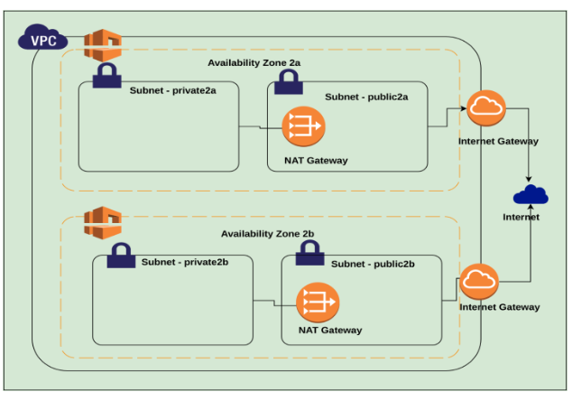
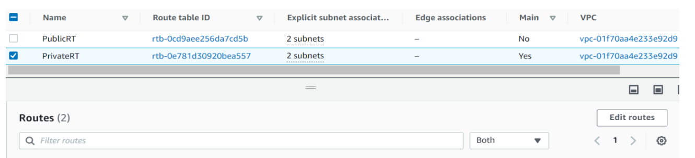
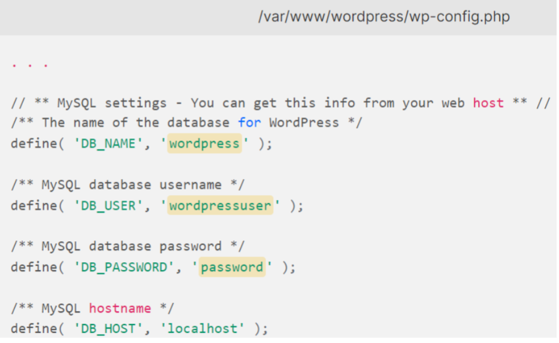

# Deploy WordPress with High Availability

These are the following points that you need to follow when deploying the WORDPRESS application 

1. Use VPC-SquareOps-Ohio in the Ohio region. 

2. VPN basics.
- [Deploy Pritunl VPN server](https://github.com/maithelys/rtd/blob/main/Level-2/M1-VPN/L03-InstallVPN.md) 

3. Deploy RDS in this VPC for MySQL 5.7 inside a private Subnet

4. Upload WordPress source code to git. Use git repository to deploy code to this WordPress ASG. Use a proper .gitignore file

#### NOTE: MAKE SURE NOT TO PUSH ANY USERNAME/PASSWORDS TO GIT

5. Deploy WordPress on EC2 Autoscaling Group in this VPC ( private subnet ). Use EFS mount to store Uploads and other required directories ( understand why EFS is needed ? )

6. Map Subdomain and set up SSL termination on load balancer using ACM

7. Test scaling using [stress tool for Linux](https://www.tecmint.com/linux-cpu-load-stress-test-with-stress-ng-tool/)

## What is Highly Available (HA) ?
In computing, the term availability is used to describe the period of time when a service is available, as well as the time required by a system to respond to a request made by a user. High availability is a quality of a system or component that assures a high level of operational performance for a given period of time.

## What is VPC ?
Amazon Virtual Private Cloud (Amazon VPC) provides a logically isolated area of the AWS cloud where you can launch AWS resources in a virtual network that you define.

# Step-1 : Create a VPC ( with CIDR For Example 10.0.0.0/16)

a. Lets create a VPC in which we create 4 subnets in which create 2 public subnets and 2 private subnets.
Example: For public subnets take CIDR 10.0.0.0/24 and 10.0.1.0/24 and for private subnets take 10.0.2.0/24 and 10.0.3.0/24

b. Create 2 Route Tables inside the VPC, one for the public subnets and one for the private subnets. Inside the subnet association of the public Route Table, add the public subnets of the VPC (10.0.0.0/24 and 10.0.1.0/24) and, In the private Route Table, add the private subnets of VPC (10.0.2.0/24 and 10.0.3.0/24)

c. Now, create an Internet Gateway, and in the public Route Table, add the route to the Internet Gateway so that public subnets can have access to the internet  as shown below.

d. Now create a NAT Gateway in a public subnet as we don’t want the private subnets to have access to the internet directly. And add the routes of private Route Table to NAT gateway so that we have access to the internet in private subnets too as shown below.

e. Now we create two EC2 instances in the VPC. One is in the public subnet in which we have to enable the auto assign Public IP and one in the private subnet in which we should disable the Auto assign Public IP. The one with the public subnet we define/give name as Jump Server or Bastion Server in which Security Group(SG) should be only SSH and we name the other as per project requirement in which SG should be SSH for only bastion SG and HTTP and HTTPS. Now connect the EC2 instance in the private subnet through Bastion Server and check the internet access as we have added route to NAT in the private Route Table.

Check this out for better clarity regarding VPC: [AWS Create NAT Gateway for Private Subnet Internet Access|Connect to EC2 Instances in Private Subnet](https://youtu.be/3L2moOZy3Yw)

## What is RDS?
Amazon Relational Database Service (Amazon RDS) is a web service that makes it easier to set up, operate, and scale a relational database in the AWS Cloud. It provides cost-efficient, resizable capacity for an industry-standard relational database and manages common database administration tasks.

# Step-2 : Create MySQL 5.7 RDS inside the VPC in a private subnet.

Now we need to create a Mysql RDS 5.7.22 inside our VPC so that we can have a database which will connect with the Wordpress Site.

To create the same go through the  link :

[Create and Connect to a MySQL Database with Amazon RDS](https://aws.amazon.com/getting-started/hands-on/create-mysql-db/)

#### NOTE: Do remember the credentials that you have set during the creation of the Mysql 5.7 RDS

# Step-3 : Create EC2 instance and in private subnet

a. Let's just SSH into the EC2 instance that we created in a private subnet through Bastion/Jump Server and add the Security Group for that we created earlier .

b. Now we have to install wordpress using Nginx(Web Server) and Php-fpm(PHP-FPM is a fast CGI process manager which basically makes use of a content management system in order to maintain the websites and load pages  seamlessly to retrieve data conveniently).

c. To install the same follow this document :

https://www.digitalocean.com/community/tutorials/how-to-install-wordpress-with-lemp-on-ubuntu-20-04

#### NOTE: Install Nginx and ignore the MySQL installation step as we have already created MySQL RDS	

a. Enter the credentials of the RDS that we have created earlier and use the RDS endpoint in the mysql hostname in the wp-config.php file so that it can access the RDS database.

b. Mounting EFS to store the uploads.Amazon EFS is a simple, fully managed cloud native file system. EFS provides serverless shared storage so you don’t need to manage any infrastructure or capacity.

Now we need to create EFS in the Amazon management console. Use this link to create the same: 
[Amazon EFS file system creation, mounting & settings](https://www.youtube.com/watch?v=Aux37Nwe5nc) 

After that mount the same to uploads inside the wp-content folder.

c. After that create an AMI of the instance so that we can use it as a template in AutoScaling.
           
# Step-4: Create Application Load Balancer and Target Group .

a. Go to the target group and create a target group in which define the Target group Name and mention the VPC that we created under TG and after that do register the instance in which we have deployed the wordpress as shown below:

b. Now we have to Request an ACM certificate so that we can have the SSL to our website. Go to the certificate manager and request a public certificate and enter your fully qualified Domain Name of yours. If you don’t have one, create the same under Route53 service in AWS.

Refer this document to get an ACM certificate to your domain:
[Requesting a public certificate](https://docs.aws.amazon.com/acm/latest/userguide/gs-acm-request-public.html)

c. Now we need to create an Application Load Balancer in the public subnet in the VPC that we created earlier and in the listener add the HTTP port 80 and HTTPS port 443 so that we can add the SSL termination certificate for the Target Group we already created. Just need to add it in the Load Balancer. Make sure you add the Security Group of port 80 and 443 open for all.Do fill all the required details and create the Application Load Balancer.

# Step-5: Creating Auto Scaling Group in the Private Subnet of VPC.

a. First we create a launch template from the AMI we have created.Give a name of the Launch template according to you .Under AMI slot choose the AMI that you have created.Give a key pair that you want all the Ec2 instance that ASG will create have it,then click on create Launch template.

b. Now select the launch template and click on action and select create AutoScaling Group .Now give a name to it according to your understanding,select your VPC and select both the subnets for HA.

c. Use the Target group which is using the existing Load Balancer which we have created already.Give your inputs for maximum number of instances that needs to be created ,minimum number of instances and required number of instances and create the Auto Scaling Group.

# Step-6: Map subdomain with the Load Balancer .
a. Now we have to go to our subdomain and click on edit record.Under it,click on Alias and you have to choose the endpoint as Application Load Balancer .Choose the region in which you have created all the configurations.
    
b. Now mention the load balancer we have created so that whenever we hit the domain Load Balancer will route the traffic to the instance we have attached through our target group.

c. Now try to check the same by hitting the domain that we mapped to load balancer.

