# Deploy WordPress with High Availability

In computing, the term availability is used to describe the period of time when a service is available, as well as the time required by a system to respond to a request made by a user. High availability is a quality of a system or component that assures a high level of operational performance for a given period of time.

These are the following steps that you need to follow when deploying the WORDPRESS application 

1. Use an isolated networking environment to deploy all the AWS resources such as EC2 and RDS 

2. Deploy a VPN server using the following document to [Install VPN](M1-VPN/L03-InstallVPN.md) 

3. Deploy RDS in this same VPC for MySQL inside a private Subnet

4. Upload WordPress source code to git. Use git repository to deploy code to this WordPress ASG. Use a proper .gitignore file

- NOTE: MAKE SURE NOT TO PUSH ANY USERNAME/PASSWORDS TO GIT

5. Deploy WordPress on EC2 Autoscaling Group in this VPC ( private subnet ). Use EFS mount to store Uploads and other required directories ( understand why EFS is needed ? )

6. Map Subdomain and set up SSL termination on load balancer using ACM

7. Test scaling using [stress tool for Linux](https://www.tecmint.com/linux-cpu-load-stress-test-with-stress-ng-tool/)

[Deploy a secure networking stack](#step-1--deploy-a-secure-networking-stack)
[](#step-2-install-pritunl-on-ec2-instance)
[](#step-3-create-role-to-connect-using-session-manager)
[](#step-4-create-mysql-rds-inside-the-vpc-in-a-private-subnet)
[](#step-5--create-ec2-instance-and-install-nginx)


# Step-1 : Deploy a secure networking stack 

Create a file named secure_vpc.yml and copy the following code in it 

```
AWSTemplateFormatVersion: 2010-09-09
Description: This template will deploy a work station
Metadata:
  AWS::CloudFormation::Interface:
   ParameterGroups:
      - Label:
          default: "Configurations"
        Parameters:
          - VpcCIDR
          - PublicSubnet1ID
          - PublicSubnet2ID
          - PrivateSubnet1ID
          - PrivateSubnet2ID
          - KeyPairName
          - AppSG
          - ALBSecurityGroup
          - amiId
          - InstanceVolumeSize
          - InstanceType
          - min
          - max
          - DesiredCapacity
          - CPUPolicyTargetValue
          - SSLCert
          - OnDemandBaseCapacity
          - OnDemandPercentageAboveBaseCapacity
          - SpotMaxPrice
          - EstimatedInstanceWarmup
          - HealthCheckPath

Parameters:
  VpcCIDR:
    Description: Enter the Ip range (CIDR notation) for this VPC
    Type: String
    Default: 10.0.0.0/16
  PublicSubnet1CIDR:
    Description: CIDR for public subnet 1.
    Type: String
    Default: 10.0.1.0/24
  PublicSubnet2CIDR:
    Description: CIDR for public subnet 2.
    Type: String
    Default: 10.0.2.0/24
  PrivateSubnet1CIDR:
    Description: CIDR for private subnet 1.
    Type: String
    Default: 10.0.3.0/24
  PrivateSubnet2CIDR:
    Description: CIDR for private subnet 2.
    Type: String
    Default: 10.0.4.0/24
  KeyPairName:
    Description: Amazon EC2 Key Pair
    Type: AWS::EC2::KeyPair::KeyName
    ConstraintDescription: must be a valid Key Pair
  AppSG:
    Description: Name of application security group.
    Type: AWS::EC2::SecurityGroup::Id
  ALBSecurityGroup:
    Description: Name of LoadBalancer security group.
    Type: AWS::EC2::SecurityGroup::Id
  amiId:
    Description: Ami id of the machine for private network
    Type: String
    AllowedPattern: '[-a-zA-Z0-9]*'
    ConstraintDescription: must contain only alphanumeric characters.
  InstanceVolumeSize:
    Description: Application instance EBS volume size in GiBs.
    Type: Number
    Default: 30
  InstanceType:
    Description: WebServer EC2 instance type for Private network.Refer:- https://aws.amazon.com/ec2/instance-types/
    Type: String
    Default: t3a.medium
    AllowedValues:
    - t3a.medium
    ConstraintDescription: must be a valid EC2 instance type.
  min:
    Description: Minimum Ec2 instances for Auto Scaling group.
    Default: 2
    Type: Number
  max:
    Description: Maximum Ec2 instances for Auto Scaling group.
    Default: 6
    Type: Number
  DesiredCapacity:
    Description: The number to ec2 instances you want to launch.
    Type: Number
    Default: 2
  CPUPolicyTargetValue:
    Description: Target value for Target based scaling group.
    Default: 60
    Type: Number
  SSLCert:
    Description: SSL Certificate ARN
    Type: String
    ConstraintDescription: must be a valid Certificate ARN
  OnDemandBaseCapacity:
    Description: Minimum number of OnDemand instances to launched for AutoScaling.
    Type: Number
    Default: 2
  OnDemandPercentageAboveBaseCapacity:
    Description: for example, 20 specifies 20% On-Demand Instances, 80% Spot Instances
    Type: Number
    Default: 50
  SpotMaxPrice:
    Description: Maximum Bid price for spot instance. It depends on instance size.
    Type: Number
    Default: 0.005
  EstimatedInstanceWarmup:
    Description: Instance Warmup time for ASG
    Type: Number
    Default: 300
  HealthCheckPath:
    Description: Instance Warmup time for ASG
    Type: String
    Default: /

#Resources to be created
Resources:
  VPC:
    Type: AWS::EC2::VPC
    Properties:
      CidrBlock: !Ref VpcCIDR
      EnableDnsHostnames: true
      EnableDnsSupport: true
      InstanceTenancy: "default"
      Tags:
      - Key: Name
        Value: !Sub vpc-${AWS::StackName}

  InternetGateway:
    Type: AWS::EC2::InternetGateway
    Properties:
      Tags:
      - Key: Name
        Value: !Sub IGW-${AWS::StackName}

  AttachIGW:
    Type: AWS::EC2::VPCGatewayAttachment
    Properties:
      InternetGatewayId: !Ref InternetGateway
      VpcId: !Ref VPC

  PublicSubnet1:
    Type: AWS::EC2::Subnet
    Properties:
      CidrBlock: !Ref PublicSubnet1ID
      VpcId: !Ref VPC
      AvailabilityZone: !Select [ '0', !GetAZs '' ]
      MapPublicIpOnLaunch: true       #it will assign public ip on launch
      Tags:
      - Key: Name
        Value: !Sub Public-Subnet1-${AWS::StackName}

  PublicSubnet2:
    Type: AWS::EC2::Subnet
    Properties:
      CidrBlock: !Ref PublicSubnet2ID
      VpcId: !Ref VPC
      AvailabilityZone: !Select [ '1', !GetAZs '' ]
      MapPublicIpOnLaunch: true       #it will assign public ip on launch
      Tags:
      - Key: Name
        Value: !Sub Public-Subnet2-${AWS::StackName}

  PrivateSubnet1:
    Type: AWS::EC2::Subnet
    Properties:
      CidrBlock: !Ref PrivateSubnet1ID
      VpcId: !Ref VPC
      AvailabilityZone: !Select [ '0', !GetAZs '' ]
      Tags:
      - Key: Name
        Value: !Sub Private-Subnet1-${AWS::StackName}

  PrivateSubnet2:
    Type: AWS::EC2::Subnet
    Properties:
      CidrBlock: !Ref PrivateSubnet2ID
      VpcId: !Ref VPC
      AvailabilityZone: !Select [ '1', !GetAZs '' ]
      Tags:
      - Key: Name
        Value: !Sub Private-Subnet2-${AWS::StackName}

  PublicRouteTable:
    Type: AWS::EC2::RouteTable
    Properties:
      VpcId: !Ref VPC
      Tags:
      - Key: Name
        Value: !Sub PublicRouteTable-${AWS::StackName}

  PublicRoute:
    Type: AWS::EC2::Route
    Properties:
      RouteTableId: !Ref PublicRouteTable
      DestinationCidrBlock: 0.0.0.0/0
      GatewayId: !Ref InternetGateway

  PublicSubnet1RouteTableAssoication:
    Type: AWS::EC2::SubnetRouteTableAssociation
    Properties:
      RouteTableId: !Ref PublicRouteTable
      SubnetId: !Ref PublicSubnet1

  PublicSubnet2RouteTableAssoication:
    Type: AWS::EC2::SubnetRouteTableAssociation
    Properties:
      RouteTableId: !Ref PublicRouteTable
      SubnetId: !Ref PublicSubnet2

  PrivateRouteTable:
    Type: AWS::EC2::RouteTable
    Properties:
      VpcId: !Ref VPC
      Tags:
      - Key: Name
        Value: !Sub PrivateRouteTable-${AWS::StackName}

  PrivateRoute:
    Type: AWS::EC2::Route
    Properties:
      RouteTableId: !Ref PrivateRouteTable
      DestinationCidrBlock: 0.0.0.0/0
      NatGatewayId: !Ref NAT

  PrivateSubnet1RouteTableAssoication:
    Type: AWS::EC2::SubnetRouteTableAssociation
    Properties:
      RouteTableId: !Ref PrivateRouteTable
      SubnetId: !Ref PrivateSubnet1

  PrivateSubnet2RouteTableAssoication:
    Type: AWS::EC2::SubnetRouteTableAssociation
    Properties:
      RouteTableId: !Ref PrivateRouteTable
      SubnetId: !Ref PrivateSubnet2

  DeployAppLaunchTemplate:
    Type: AWS::EC2::LaunchTemplate
    Properties:
      LaunchTemplateData:
        ImageId: !Ref amiId
        InstanceType: !Ref InstanceType
        KeyName: !Ref KeyPairName
        BlockDeviceMappings:
          - DeviceName: '/dev/sda1'
            Ebs:
              DeleteOnTermination: true
              Encrypted: false
              VolumeSize: !Ref InstanceVolumeSize
              VolumeType: gp2
        IamInstanceProfile:
          Arn:
            Fn::GetAtt:
            - S3accessProfile
            - Arn
        SecurityGroupIds:
          - !Ref AppSG

  DeployAppASG:
    Type: AWS::AutoScaling::AutoScalingGroup
    Properties:
      VPCZoneIdentifier:
        - !Ref PrivateSubnet1ID
        - !Ref PrivateSubnet2ID
      DesiredCapacity: !Ref DesiredCapacity
      TargetGroupARNs:
        - !Ref WebAppTargetGroup
      MaxSize: !Ref max
      MinSize: !Ref min
      MixedInstancesPolicy:
        InstancesDistribution:
          OnDemandAllocationStrategy: prioritized
          OnDemandBaseCapacity: !Ref OnDemandBaseCapacity
          OnDemandPercentageAboveBaseCapacity: !Ref OnDemandPercentageAboveBaseCapacity
          SpotAllocationStrategy: lowest-price
          SpotInstancePools: 3
          SpotMaxPrice: !Ref SpotMaxPrice
        LaunchTemplate:
          LaunchTemplateSpecification:
            LaunchTemplateId: !Ref DeployAppLaunchTemplate
            Version: !GetAtt DeployAppLaunchTemplate.LatestVersionNumber
      Tags:
          - Key: Name
            Value: !Sub ASG-${AWS::StackName}
            PropagateAtLaunch: True
    UpdatePolicy:
      AutoScalingReplacingUpdate:
        WillReplace: True

  AppScalingPolicy:
    Type: AWS::AutoScaling::ScalingPolicy
    Properties:
      AutoScalingGroupName: !Ref DeployAppASG
      PolicyType: TargetTrackingScaling
      EstimatedInstanceWarmup: !Ref EstimatedInstanceWarmup #-> 30
      TargetTrackingConfiguration:
        PredefinedMetricSpecification:
          PredefinedMetricType: ASGAverageCPUUtilization
        TargetValue: !Ref CPUPolicyTargetValue


Outputs:
  VPCID:
    Description: VPC
    Value: !Ref VPC
  PublicSubnet1:
    Description: Public Subnet1
    Value: !Ref PublicSubnet1
  PublicSubnet2:
    Description: Public Subnet1
    Value: !Ref PublicSubnet2
  PrivateSubnet1:
    Description: Private Subnet1
    Value: !Ref PrivateSubnet1
    Export:
      Name: !Sub "${AWS::StackName}-PrivateSubnet1ID"
  PrivateSubnet2:
    Description: Private Subnet1
    Value: !Ref PrivateSubnet2
    Export:
      Name: !Sub "${AWS::StackName}-PrivateSubnet2ID"
  ASG:
    Description: Information about the Auto scaling group
    Value: !Ref DeployAppASG
  AppSecruityGroup:
    Description: Application security group
    Value: !Ref AppSG
  ALBSG:
    Description: application load balancer security group.
    Value: !Ref ALBSecurityGroup
```
Now go to the cloudformation section and upload the template 

 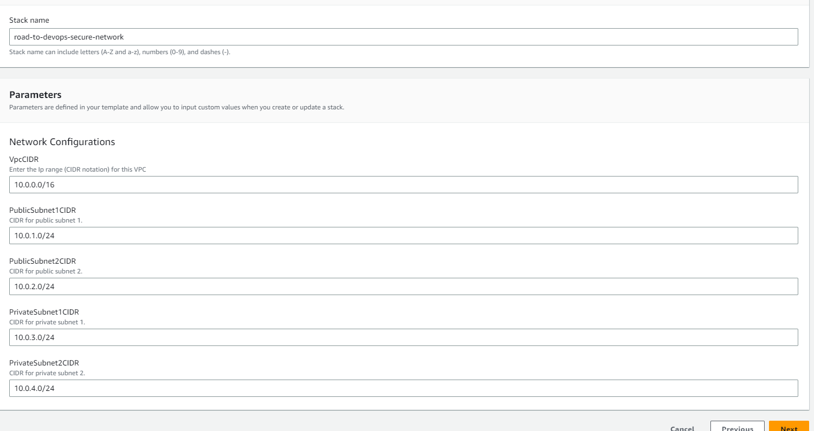

Then review and launch the stack successfully 

 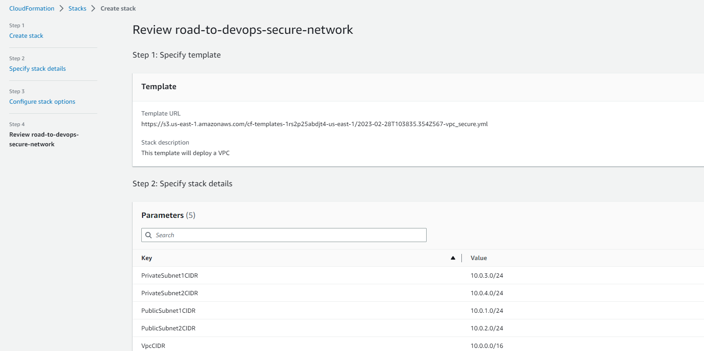

After successful deployment of stack, check the resources created

 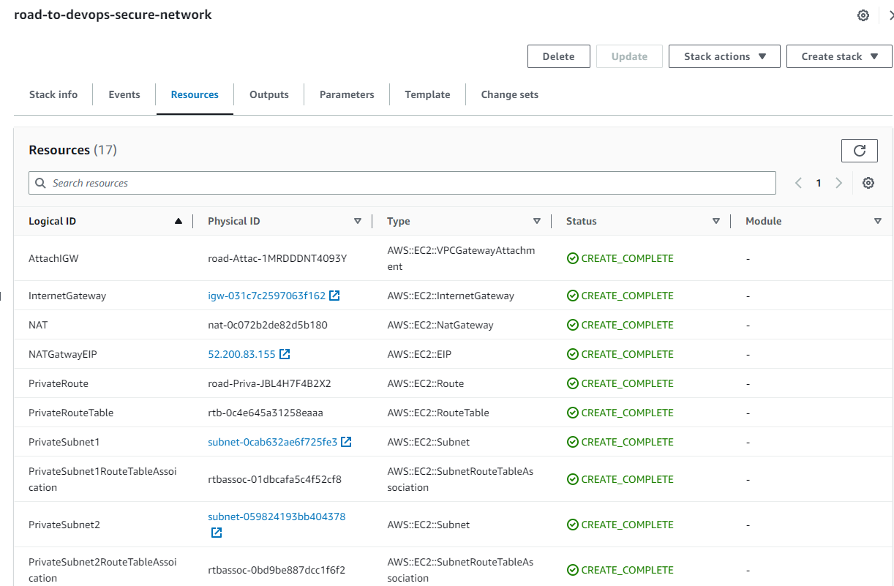

In the secure networking stack it will create the following AWS resources 

- a VPC in which we create 4 subnets in which create 2 public subnets and 2 private subnets.
Example: For public subnets take CIDR 10.0.0.0/24 and 10.0.1.0/24 and for private subnets take 10.0.2.0/24 and 10.0.3.0/24

- Create 2 Route Tables inside the VPC, one for the public subnets and one for the private subnets. Inside the subnet association of the public Route Table, add the public subnets of the VPC (10.0.0.0/24 and 10.0.1.0/24) and, In the private Route Table, add the private subnets of VPC (10.0.2.0/24 and 10.0.3.0/24)

- create an Internet Gateway, and in the public Route Table, add the route to the Internet Gateway so that public subnets can have access to the internet  as shown below.

- create a NAT Gateway in a public subnet as we don’t want the private subnets to have access to the internet directly. And add the routes of private Route Table to NAT gateway so that we have access to the internet in private subnets too as shown below.

# Step-2: Install Pritunl on EC2 instance  
We will create one EC2 instances in public subnet and we will define name as Jump Server or Bastion Server in which Security Group(SG) should only allow SSH 

Using this document you can [install pritunl vpn client on the ec2 server](M1-VPN/L03-InstallVPN.md) 

# Step-3: Create role to connect using session manager 

a. Go to IAM section and choose to create an IAM role 


b. add AmazonSSMManagedInstanceCore policy

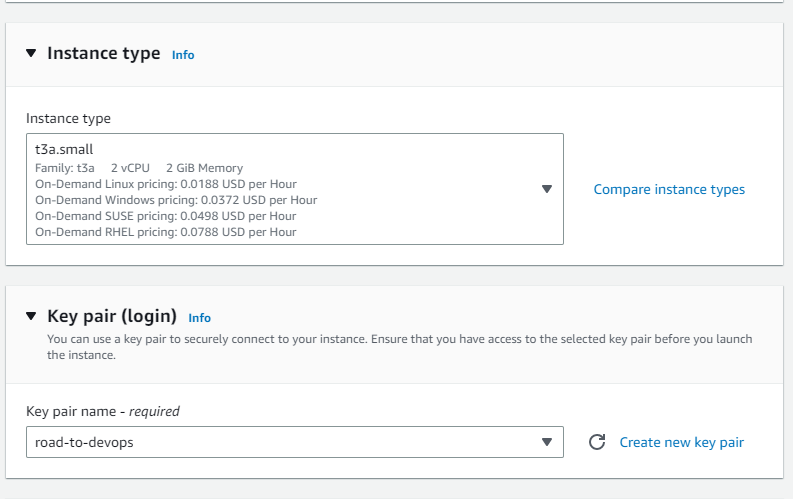

c. give the role name and create the role 

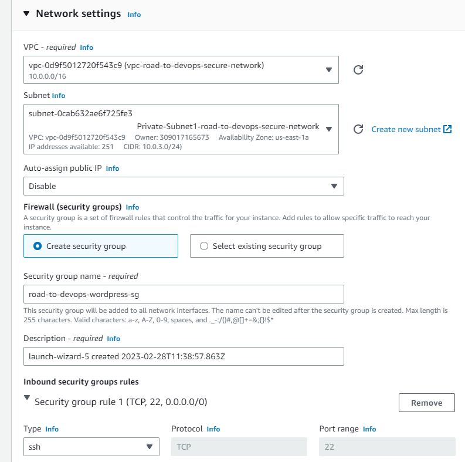

# Step-4 : Create MySQL RDS inside the VPC in a private subnet.

Now we need to create a Mysql RDS inside our VPC so that we can have a database which will connect with the Wordpress Site.

In this step, we will use Amazon RDS to create a MySQL DB Instance with db.t2.micro DB instance class, 20 GB of storage, and automated backups enabled with a retention period of one day. As a reminder, all of this is Free Tier eligible.

1. In the Create database section, choose Create database. Then choose MYSQL engine-type and the mysql version as 8.0.

 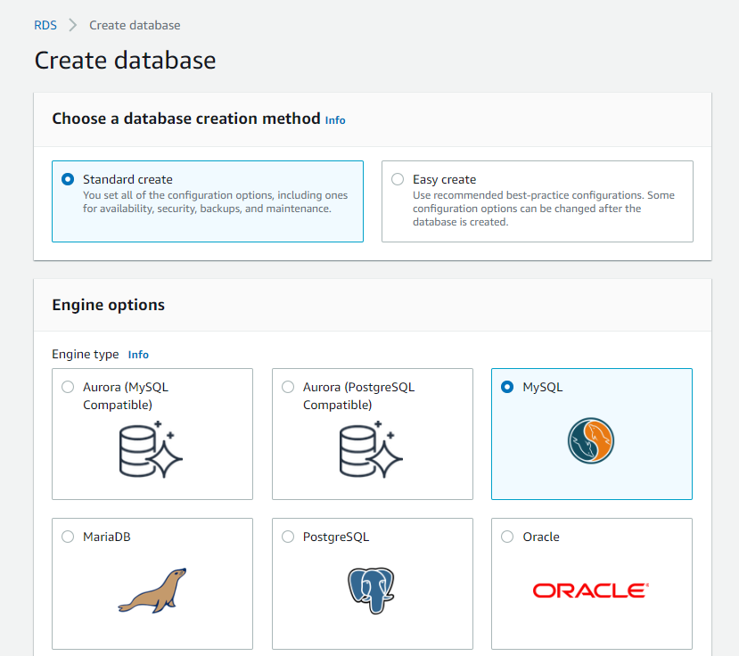

 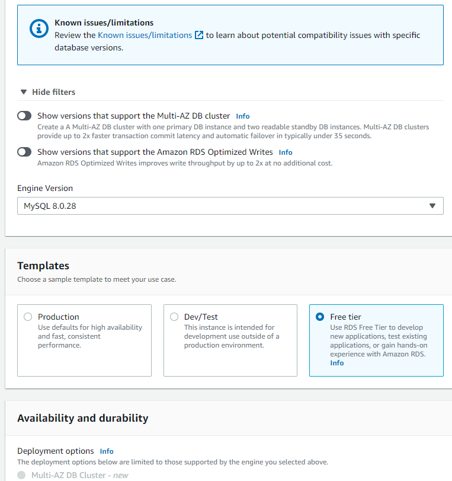

 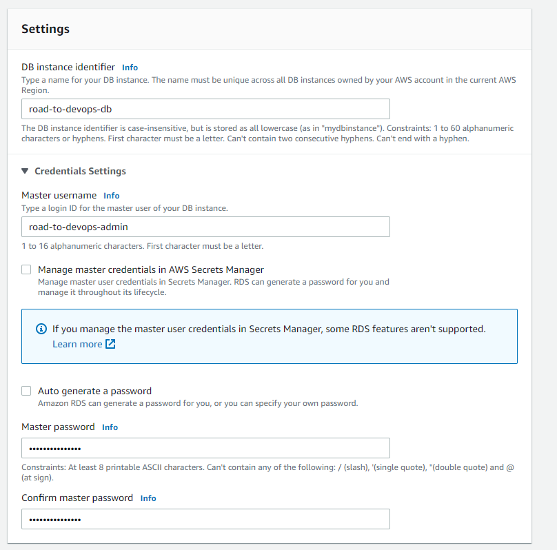

 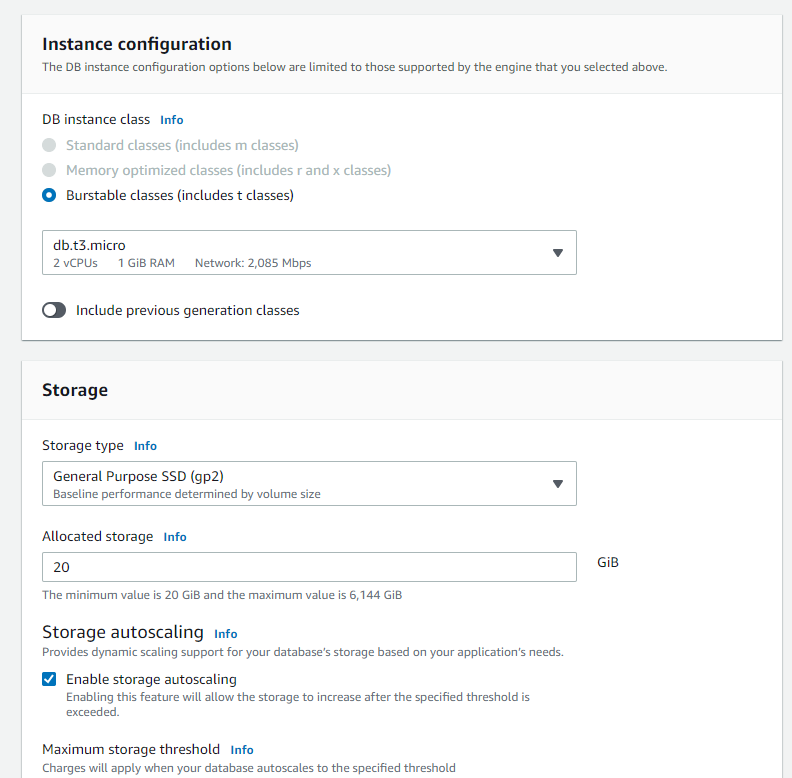

 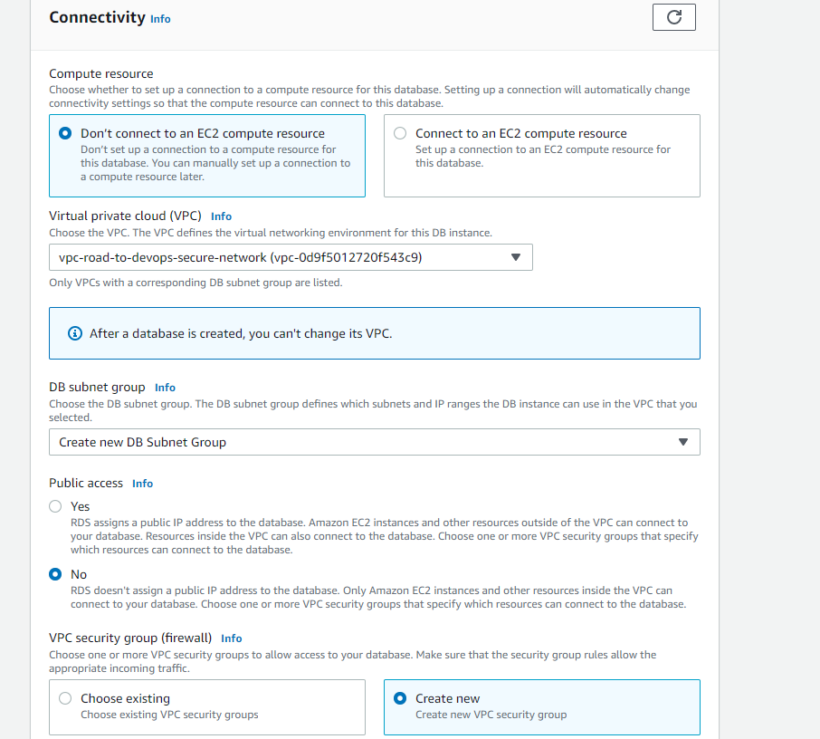

 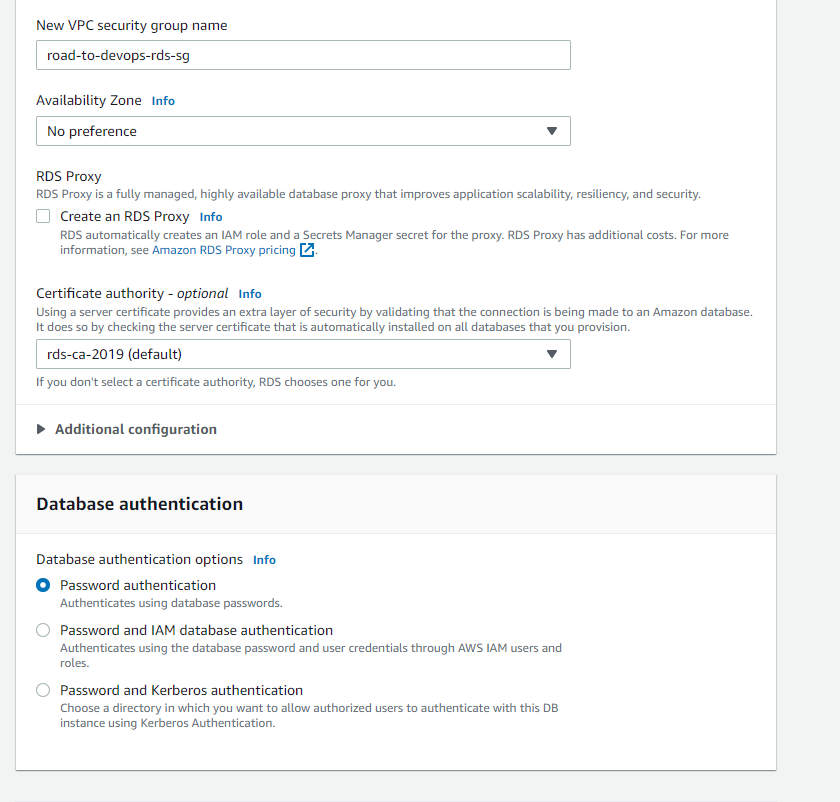

2. Now check the RDS created successfully 

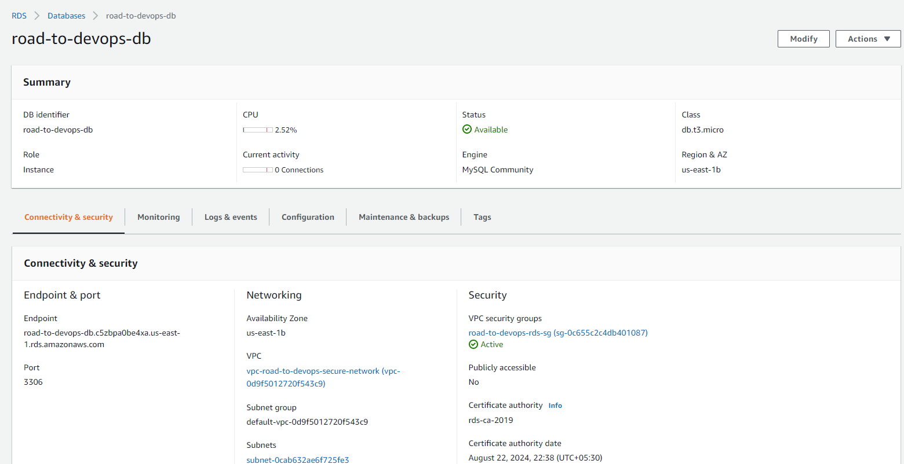

3. Login into the database with the following string to verify credentials 

But firstly install the mysql client for testing the db connection on the pritunl EC2 instance:

      sudo apt install mysql-client-core-8.0 

Now run the following command 

      mysql -h road-to-devops-db.c5zbpa0be4xa.us-east-1.rds.amazonaws.com -P 3306 -u road_to_devops -p

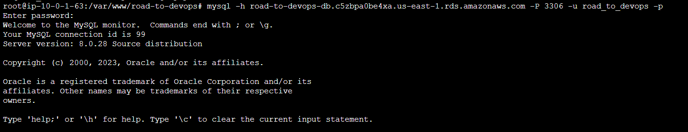

4. Create the database 

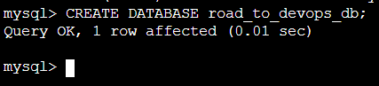

verify the database created 

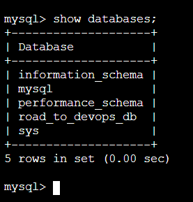

5. 

- NOTE: Do remember the credentials that you have set during the creation of the Mysql RDS

# Step-5 : Create EC2 instance and install nginx, 

Now we have to install wordpress using Nginx(Web Server) and Php-fpm(PHP-FPM is a fast CGI process manager which basically makes use of a content management system in order to maintain the websites and load pages  seamlessly to retrieve data conveniently).

To install the same follow this document :

https://www.digitalocean.com/community/tutorials/how-to-install-wordpress-with-lemp-on-ubuntu-20-04

Firstly we will create an EC2 instance with the following configurations 


In the advanced setting choose the IAM instance profile and choose role name created in step 3

Now you can connect to the instance launched in private subnet using session manager, so on the EC2 console click on the CONNECT option 

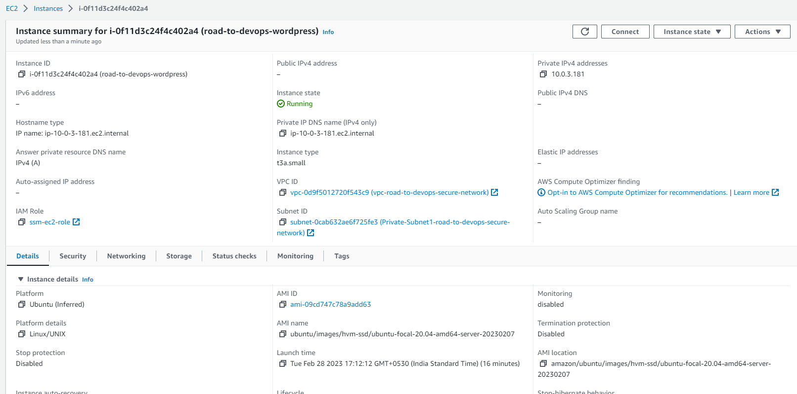

Then click on connect option 

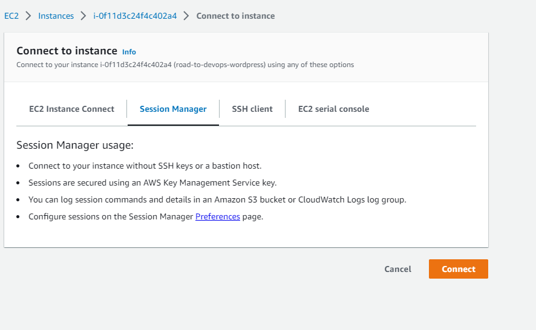

run command 
    sudo -i 

## Install nginx 
```
sudo apt update
sudo apt install nginx
```

Type the address that you receive in your web browser and it will take you to Nginx’s default landing page:

http://server_domain_or_IP

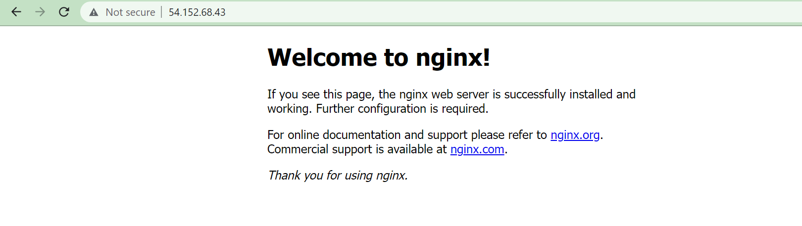

note: allow port 80 in security group from everywhere 

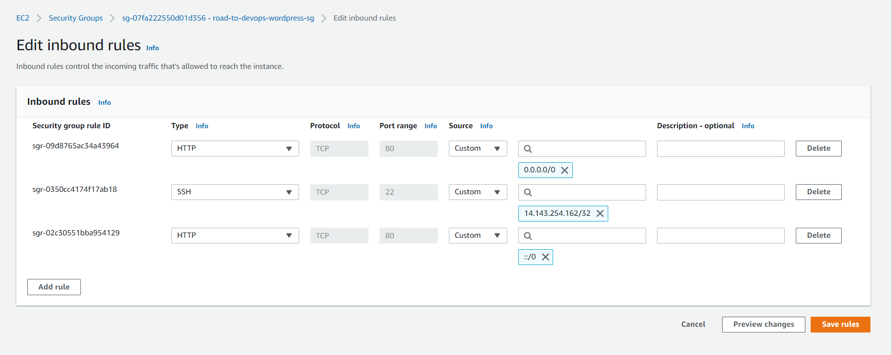

## Install PHP by running the following commands:

```
sudo apt install php-fpm php-mysql
```
check the php version by running the following command 

```
php -v
```

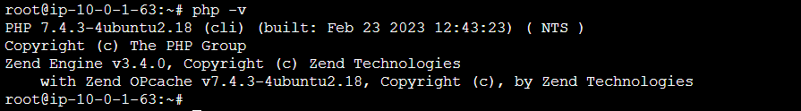

##  Configuring Nginx to Use the PHP Processor

Create the root web directory for your_domain as follows:

      sudo mkdir /var/www/your_domain

Next, assign ownership of the directory with the $USER environment variable, which will reference your current system user:   

      sudo chown -R $USER:$USER /var/www/your_domain

Then, open a new configuration file in Nginx’s sites-available directory using your preferred command-line editor. Here, we’ll use nano:

      sudo nano /etc/nginx/sites-available/your_domain

This will create a new blank file. Paste in the following bare-bones configuration:

```
server {
    listen 80;
    server_name your_domain www.your_domain;
    root /var/www/your_domain;

    index index.html index.htm index.php;

    location / {
        try_files $uri $uri/ =404;
    }

    location ~ \.php$ {
        include snippets/fastcgi-php.conf;
        fastcgi_pass unix:/var/run/php/php7.4-fpm.sock;
     }

    location ~ /\.ht {
        deny all;
    }

}
```
Activate your configuration by linking to the config file from Nginx’s sites-enabled directory:

      sudo ln -s /etc/nginx/sites-available/your_domain /etc/nginx/sites-enabled/

Then, unlink the default configuration file from the /sites-enabled/ directory:

      sudo unlink /etc/nginx/sites-enabled/default

This will tell Nginx to use the configuration next time it is reloaded. You can test your configuration for syntax errors by typing:

      sudo nginx -t

If any errors are reported, go back to your configuration file to review its contents before continuing.

When you are ready, reload Nginx to apply the changes:

      sudo systemctl reload nginx

Your new website is now active, but the web root /var/www/your_domain is still empty. Create an index.html file in that location so that we can test that your new server block works as expected:

      nano /var/www/your_domain/index.html

Include the following content in this file:

```
<html>
  <head>
    <title>your_domain website</title>
  </head>
  <body>
    <h1>Hello World!</h1>

    <p>This is the landing page of <strong>your_domain</strong>.</p>
  </body>
</html>
```

http://server_domain_or_IP

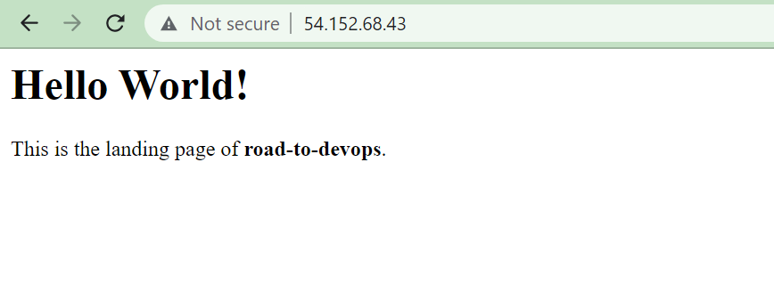

## Testing PHP with Nginx
Your LEMP stack should now be completely set up. You can test it to validate that Nginx can correctly hand .php files off to your PHP processor.

You can do this by creating a test PHP file in your document root. Open a new file called info.php within your document root in your text editor:

      nano /var/www/your_domain/info.php

Type or paste the following lines into the new file. This is valid PHP code that will return information about your server:

```
<?php
phpinfo();
```
When you are finished, save and close the file by typing CTRL+X and then y and ENTER to confirm.

You can now access this page in your web browser by visiting the domain name or public IP address you’ve set up in your Nginx configuration file, followed by /info.php:

      http://server_domain_or_IP/info.php

You will see a web page containing detailed information about your server:

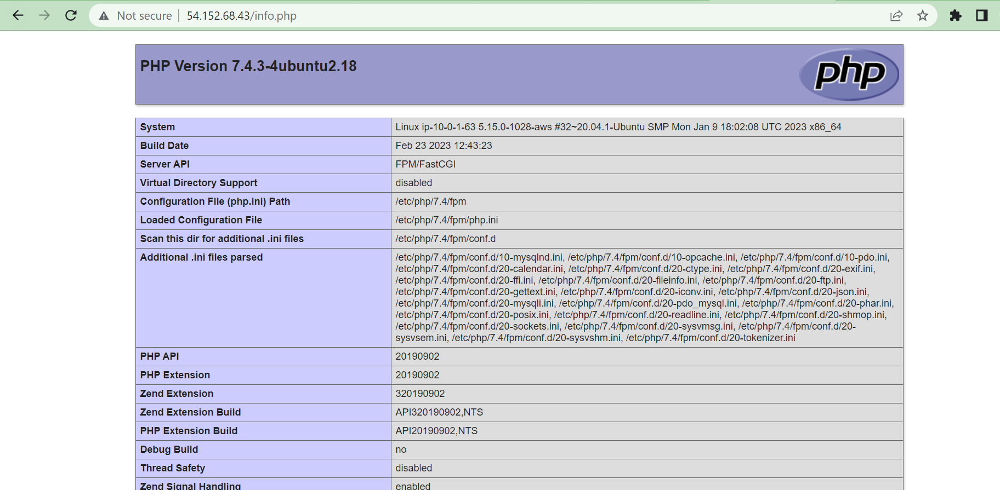

After checking the relevant information about your PHP server through that page, it’s best to remove the file you created as it contains sensitive information about your PHP environment and your Ubuntu server. You can use rm to remove that file:

      sudo rm /var/www/your_domain/info.php

- NOTE: For this blog I have taken your_domain to be road-to-devops 

## Installing Additional PHP Extensions

Let’s download and install some of the most popular PHP extensions for use with WordPress by typing:
```
sudo apt update
sudo apt install php-curl php-gd php-intl php-mbstring php-soap php-xml php-xmlrpc php-zip
```
## Configuring Nginx

Open your site’s server block file with sudo privileges to begin:

    sudo nano /etc/nginx/sites-available/your_domain

Within the main server block, let’s add a few location blocks.

Start by creating exact-matching location blocks for requests to /favicon.ico and /robots.txt, both of which you do not want to log requests for.

Use a regular expression location to match any requests for static files. We will again turn off the logging for these requests and will mark them as highly cacheable, since these are typically expensive resources to serve. You can adjust this static files list to contain any other file extensions your site may use:

```
server {
    . . .

    location = /favicon.ico { log_not_found off; access_log off; }
    location = /robots.txt { log_not_found off; access_log off; allow all; }
    location ~* \.(css|gif|ico|jpeg|jpg|js|png)$ {
        expires max;
        log_not_found off;
    }
    . . .
}
```
Inside of the existing location / block, let’s adjust the try_files list. Comment out the default setting by prepending the line with a pound sign (#) and then add the highlighted line. This way, instead of returning a 404 error as the default option, control is passed to the index.php file with the request arguments.

This should look something like this:
```
server {
    . . .
    location / {
        #try_files $uri $uri/ =404;
        try_files $uri $uri/ /index.php$is_args$args;
    }
    . . .
}
```
When you are finished, save and close the file.

Now, let’s check our configuration for syntax errors by typing:

      sudo nginx -t

If no errors were reported, reload Nginx by typing:

      sudo systemctl reload nginx

Next, let’s download and set up WordPress.

## Downloading WordPress
Now that your server software is configured, let’s download and set up WordPress. For security reasons, it is always recommended to get the latest version of WordPress directly from the project’s website.

Change into a writable directory and then download the compressed release by typing:

      cd /tmp

This changes your directory to the temporary folder. Then, enter the following command to download the latest version of WordPress in a compressed file:

      curl -LO https://wordpress.org/latest.tar.gz

Extract the compressed file to create the WordPress directory structure:

      tar xzvf latest.tar.gz

You will be moving these files into our document root momentarily, but before you do, let’s copy over the sample configuration file to the filename that WordPress actually reads:

      cp /tmp/wordpress/wp-config-sample.php /tmp/wordpress/wp-config.php

Now, let’s copy the entire contents of the directory into our document root. We’re using the -a flag to make sure our permissions are maintained, and a dot at the end of our source directory to indicate that everything within the directory should be copied (including hidden files):

      sudo cp -a /tmp/wordpress/. /var/www/your_domain

Now that our files are in place, you’ll assign ownership to the www-data user and group. This is the user and group that Nginx runs as, and Nginx will need to be able to read and write WordPress files in order to serve the website and perform automatic updates:

      sudo chown -R www-data:www-data /var/www/your_domain 

## Setting up the WordPress Configuration File
Next, let’s make some changes to the main WordPress configuration file.

When you open the file, you’ll start by adjusting some secret keys to provide some security for our installation. WordPress provides a secure generator for these values so that you don’t have to come up with values on your own. These are only used internally, so it won’t hurt usability to have complex, secure values here.

To grab secure values from the WordPress secret key generator, type:

      curl -s https://api.wordpress.org/secret-key/1.1/salt/

You will get back unique values that look something like this:

Warning: It is important that you request unique values each time. Do NOT copy the values shown below!

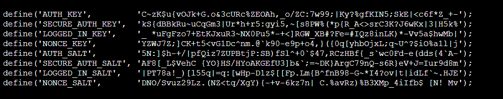

These are configuration lines that you can paste directly in your configuration file to set secure keys. Copy the output you received now.

Now, open the WordPress configuration file:

      sudo nano /var/www/your_domain/wp-config.php

Find the section that contains the dummy values for those settings. It will look something like this:

```
define('AUTH_KEY',         'put your unique phrase here');
define('SECURE_AUTH_KEY',  'put your unique phrase here');
define('LOGGED_IN_KEY',    'put your unique phrase here');
define('NONCE_KEY',        'put your unique phrase here');
define('AUTH_SALT',        'put your unique phrase here');
define('SECURE_AUTH_SALT', 'put your unique phrase here');
define('LOGGED_IN_SALT',   'put your unique phrase here');
define('NONCE_SALT',       'put your unique phrase here');
```
Delete those lines and paste in the values you copied from the command line:

```
define('AUTH_KEY',         'VALUES COPIED FROM THE COMMAND LINE');
define('SECURE_AUTH_KEY',  'VALUES COPIED FROM THE COMMAND LINE');
define('LOGGED_IN_KEY',    'VALUES COPIED FROM THE COMMAND LINE');
define('NONCE_KEY',        'VALUES COPIED FROM THE COMMAND LINE');
define('AUTH_SALT',        'VALUES COPIED FROM THE COMMAND LINE');
define('SECURE_AUTH_SALT', 'VALUES COPIED FROM THE COMMAND LINE');
define('LOGGED_IN_SALT',   'VALUES COPIED FROM THE COMMAND LINE');
define('NONCE_SALT',       'VALUES COPIED FROM THE COMMAND LINE');
```
Next, let’s modify some of the database connection settings at the beginning of the file. You’ll have to adjust the database name, the database user, and the associated password that was configured within MySQL.

The other change you should make is to set the method that WordPress uses to write to the filesystem. Since you’ve given the web server permission to write where it needs to, you can explicitly set the filesystem method to “direct”. Failure to set this with our current settings would result in WordPress prompting for FTP credentials when we perform some actions. Add this setting below the database connection settings, or anywhere else in the file:

Edit the file **/var/www/your_domain/wp-config.php** with the db credentials 

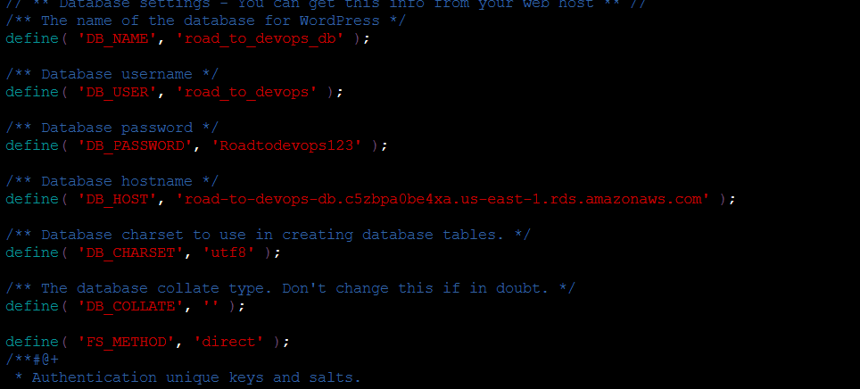

## Completing the Installation Through the Web Interface

Now that the server configuration is complete, you can finish up the installation through WordPress’ web interface.

In your web browser, navigate to your server’s domain name or public IP address:

      http://server_domain_or_IP/wordpress

Select the language you would like to use:

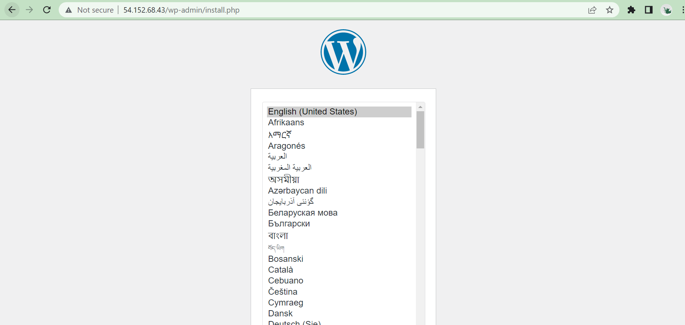

Next, you will come to the main setup page.

Select a name for your WordPress site and choose a username (it is recommended not to choose something like “admin” for security purposes). A strong password is generated automatically. Save this password or select an alternative strong password.

Enter your email address and select whether you want to discourage search engines from indexing your site:

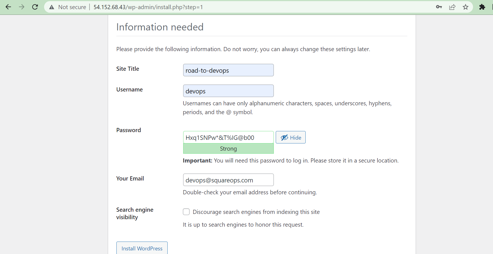

When you click ahead, you will be taken to a page that prompts you to log in:

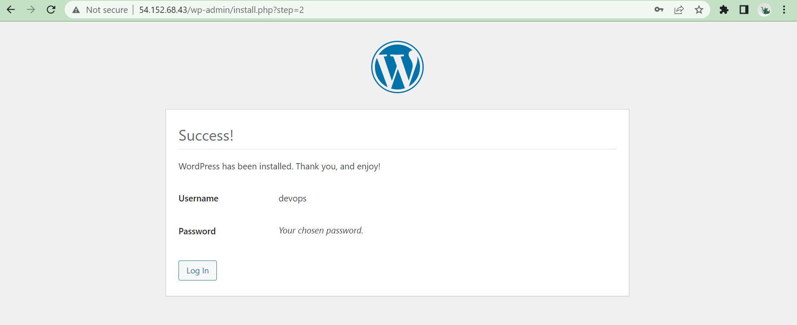

Once you log in, you will be taken to the WordPress administration dashboard:

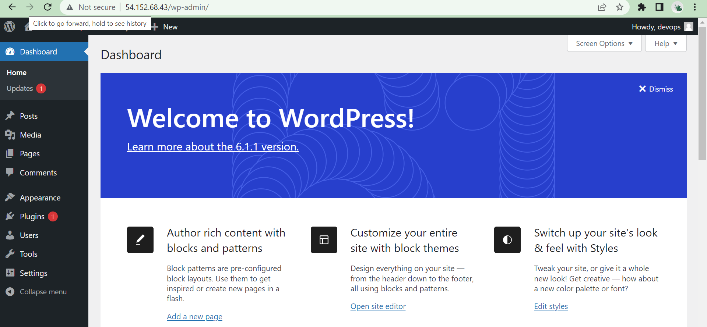

After that create an AMI of the instance so that we can use it as a template in AutoScaling.
           
# Step-4: Create Application Load Balancer and Target Group .

a. Go to the target group and create a target group in which define the Target group Name and mention the VPC that we created under TG and after that do register the instance in which we have deployed the wordpress as shown below:


b. Now we have to Request an ACM certificate so that we can have the SSL to our website. Go to the certificate manager and request a public certificate and enter your fully qualified Domain Name of yours. If you don’t have one, create the same under Route53 service in AWS.

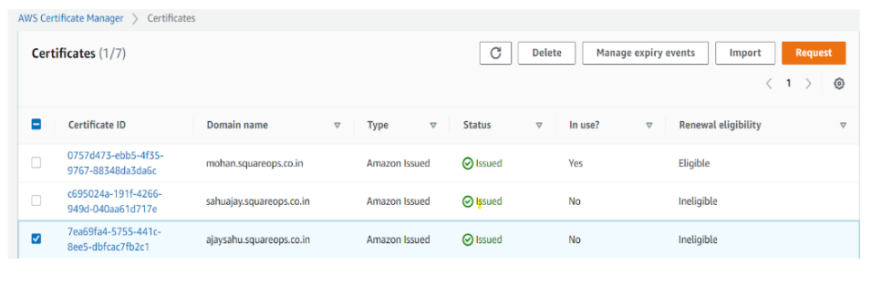


Refer this document to get an ACM certificate to your domain:
[Requesting a public certificate](https://docs.aws.amazon.com/acm/latest/userguide/gs-acm-request-public.html)


c. Now we need to create an Application Load Balancer in the public subnet in the VPC that we created earlier and in the listener add the HTTP port 80 and HTTPS port 443 so that we can add the SSL termination certificate for the Target Group we already created. Just need to add it in the Load Balancer. Make sure you add the Security Group of port 80 and 443 open for all.Do fill all the required details and create the Application Load Balancer.

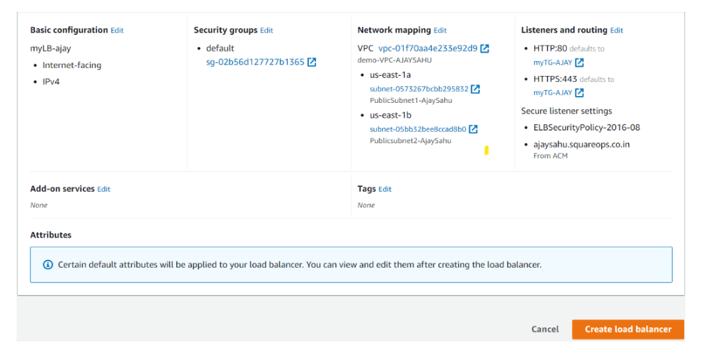

# Step-5: Creating Auto Scaling Group in the Private Subnet of VPC.

a. First we create a launch template from the AMI we have created.Give a name of the Launch template according to you .Under AMI slot choose the AMI that you have created.Give a key pair that you want all the Ec2 instance that ASG will create have it,then click on create Launch template.

b. Now select the launch template and click on action and select create AutoScaling Group .Now give a name to it according to your understanding,select your VPC and select both the subnets for HA.

c. Use the Target group which is using the existing Load Balancer which we have created already.Give your inputs for maximum number of instances that needs to be created ,minimum number of instances and required number of instances and create the Auto Scaling Group.


# Step-6: Map subdomain with the Load Balancer .
a. Now we have to go to our subdomain and click on edit record.Under it,click on Alias and you have to choose the endpoint as Application Load Balancer .Choose the region in which you have created all the configurations.
    
b. Now mention the load balancer we have created so that whenever we hit the domain Load Balancer will route the traffic to the instance we have attached through our target group.

c. Now try to check the same by hitting the domain that we mapped to load balancer.

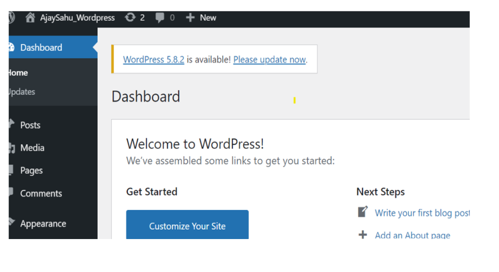


[def]: #step-1--deploy-a-secure-networking-stack