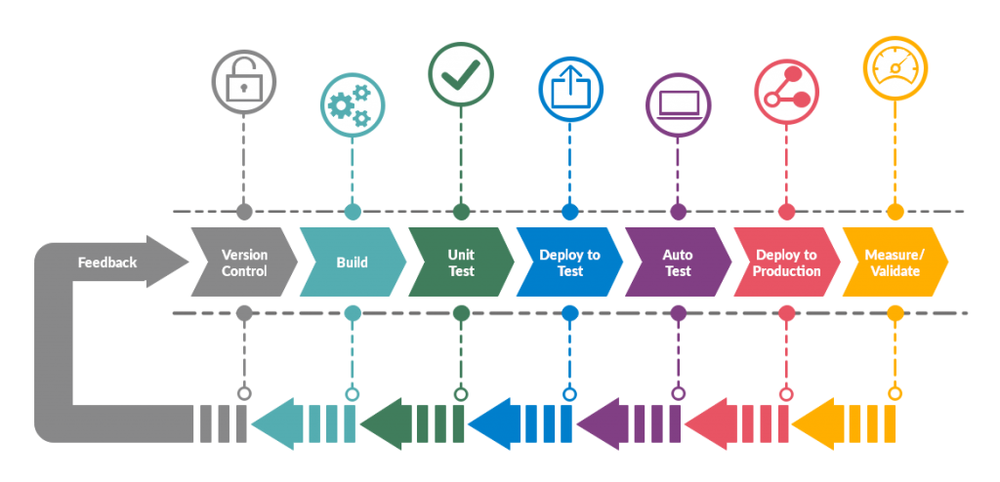
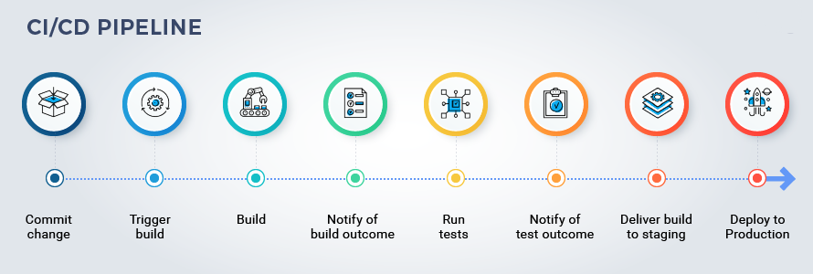
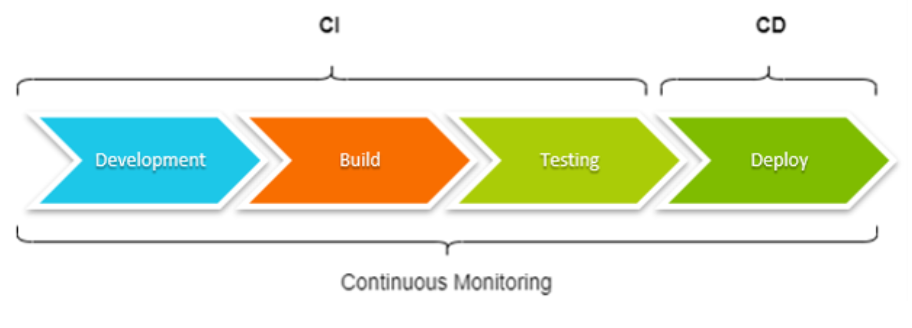

## What is a pipeline in devops ?

A DevOps pipeline is a set of automated processes and tools that allows both developers and operations professionals to work cohesively to build and deploy code to a production environment. While a DevOps pipeline can differ by organization, it typically includes build automation/continuous integration, automation testing, validation, and reporting. It may also include one or more manual gates that require human intervention before code is allowed to proceed.

## Components of a DevOps pipeline

### 1. Continuous integration/continuous delivery/deployment (CI/CD)

- Continuous integration is the practice of making frequent commits to a common source code repository. It’s continuously integrating code changes into existing code base so that any conflicts between different developer’s code changes are quickly identified and relatively easy to remediate. This practice is critically important to increasing deployment efficiency. 

- We believe that trunk-based development is a requirement of continuous integration. If you are not making frequent commits to a common branch in a shared source code repository, you are not doing continuous integration. If your build and test processes are automated but your developers are working on isolated, long-living feature branches that are infrequently integrated into a shared branch, you are also not doing continuous integration. 

- Continuous delivery ensures that the “main” or “trunk” branch of an application's source code is always in a releasable state. In other words, if management came to your desk at 4:30 PM on a Friday and said, “We need the latest version released right now,” that version could be deployed with the push of a button and without fear of failure.

- This means having a pre-production environment that is as close to identical to the production environment as possible and ensuring that automated tests are executed, so that every variable that might cause a failure is identified before code is merged into the main or trunk branch.   

- Continuous deployment entails having a level of continuous testing and operations that is so robust, new versions of software are validated and deployed into a production environment without requiring any human intervention.

- This is rare and in most cases unnecessary. It is typically only the unicorn businesses who have hundreds or thousands of developers and have many releases each day that require, or even want to have, this level of automation. 

- To simplify the difference between continuous delivery and continuous deployment, think of delivery as the FedEx person handing you a box, and deployment as you opening that box and using what’s inside. If a change to the product is required between the time you receive the box and when you open it, the manufacturer is in trouble!

## 2. Continuous feedback

- The single biggest pain point of the old waterfall method of software development — and consequently why agile methodologies were designed — was the lack of timely feedback. When new features took months or years to go from idea to implementation, it was almost guaranteed that the end result would be something other than what the customer expected or wanted. Agile succeeded in ensuring that developers received faster feedback from stakeholders. Now with DevOps, developers receive continuous feedback not not only from stakeholders, but from systematic testing and monitoring of their code in the pipeline.  

- Continuous testing is a critical component of every DevOps pipeline and one of the primary enablers of continuous feedback. In a DevOps process, changes move continuously from development to testing to deployment, which leads not only to faster releases, but a higher quality product. This means having automated tests throughout your pipeline, including unit tests that run on every build change, smoke tests, functional tests, and end-to-end tests.  

- Continuous monitoring is another important component of continuous feedback. A DevOps approach entails using continuous monitoring in the staging, testing, and even development environments. It is sometimes useful to monitor pre-production environments for anomalous behavior, but in general this is an approach used to continuously assess the health and performance of applications in production. 

- Numerous tools and services exist to provide this functionality, and this may involve anything from monitoring your on-premise or cloud infrastructure such as server resources, networking, etc. or the performance of your application or its API interfaces.

## 3. Continuous operations
- Continuous operations is a relatively new and less common term, and definitions vary. One way to interpret it is as “continuous uptime”. For example in the case of a blue/green deployment strategy in which you have two separate production environments, one that is “blue” (publicly accessible) and one that is “green” (not publicly accessible). In this situation, new code would be deployed to the green environment, and when it was confirmed to be functional then a switch would be flipped (usually on a load-balancer) and traffic would switch from the “blue” system to the “green” system. The result is no downtime for the end-users. 

- Another way to think of Continuous operations is as continuous alerting. This is the notion that engineering staff is on-call and notified if any performance anomalies in the application or infrastructure occur. In most cases, continuous alerting goes hand in hand with continuous monitoring.

## In conclusion...
DevOps is about streamlining software development, deployment and operations. The DevOps pipeline is how these ideas are implemented in practice and continuous everything is the name of the game, from code integration to application operations. 

## Benefits of using CI CD tools
Without CI CD tools, organizing code updates is a time-consuming manual procedure. Software projects can automate code updates with the use of CI CD tools.

The primary purpose of using a Continuous Integration tool is for automation and checking the consistency of the developer’s modification with the recent code version. And all changes and dependencies added by the other team members as well. A Continuous Deployment tool ensures that the code change passes through the whole pipeline before being released. 

Some benefits of CI CD tools are:

- Smaller Code Modifications
- Isolation of Faults
- A shorter time to resolution
- Increased Test Reliability
- Increased Release Rate
- Reduced Backlog
- Customer Contentment
- Improve Team Accountability and Transparency
- Reduce expenses
- Updates and maintenance are easy

## How to choose the right CI CD Tool?

Development teams employ CI CD tools to automate aspects of the application build and create a paper trail of the software development process. 

The selection of CI CD tools might be challenging due to the multiple options present in the market. Therefore before making any choices, it’s crucial to think about your requirements and each CI CD tool’s capabilities before finalizing.

One must consider the below parameters while selecting the CI CD tool:

- Functionality
- The tool’s extensibility
- Programming languages and platforms supported
- Your budget
- Convenience and ease of use