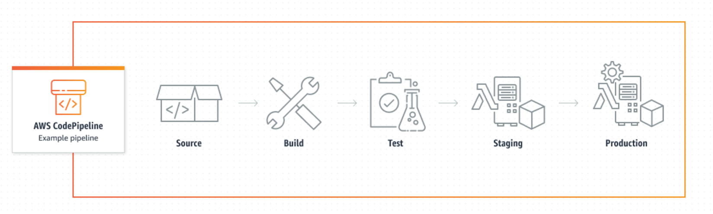
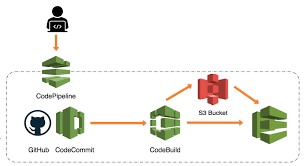

# Code Pipeline 

AWS CodePipeline is a continuous delivery service you can use to model, visualize, and automate the steps required to release your software. You can quickly model and configure the different stages of a software release process. CodePipeline automates the steps required to release your software changes continuously.

Here is the flow of code pipeline 

Codepipeline comprises of 3 stages 

1. Source stage 

2. Build stage 

3. Deploy stage 