## Here is hands-on example of creating CODE PIPELINE from scratch: 

AWS Services used are as follows:

1. GitHub as Source

2. AWS CodeBuild for building the artifact using buildspec.yml file

3. S3 Bucket to store the artifact

4. AWS CodeDeploy for deploying the configuration present in the artifact from AWS CodeBuild using appspec.yml file
AWS CodePipeline

## note: Codepipeline comprises on three stages i.e source, build and deploy. 

Step – 1: Upload the source code to GitHub Repository. (https://github.com/AadeshBhardwaj/wordpress-ci-cd )

The first stage includes the Source where we create connection from github/bitbucket to the code pipeline using login credentials or code star connection

Second is the buildstage which includes creating the project where we have to provide the name of the project and then the source provider which can be from git to S3 bucket.
The code build project basically looks for the buildspec file in the root directory of the source provider . If the buildspec file has some other name then we can provide the same name in the project build. Once the project is created then we can build the project .

Step – 2: Created the buildpec.yml file

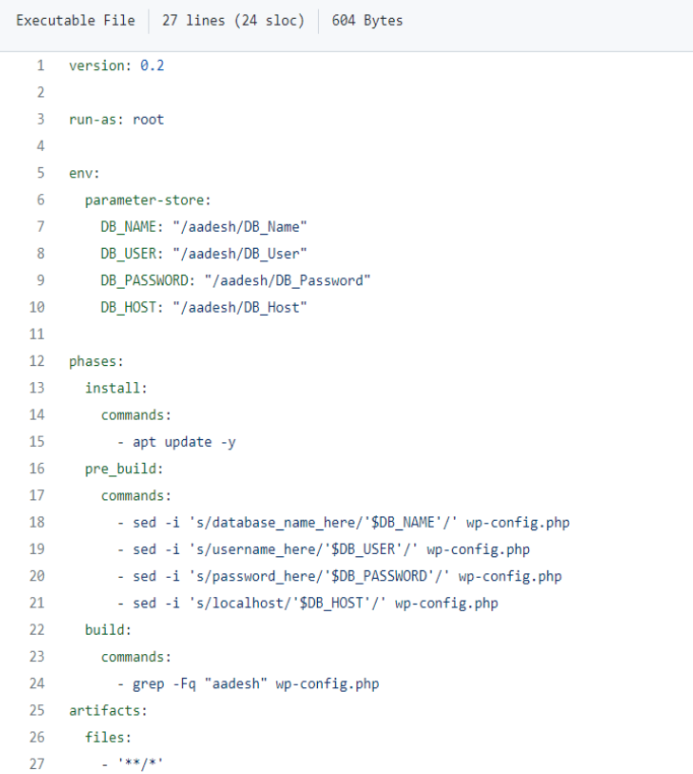

The buildspec file basically contains the information about variables to be taken from and then pre-build, build and post build steps.

Step – 3: Successfully executed the build phase

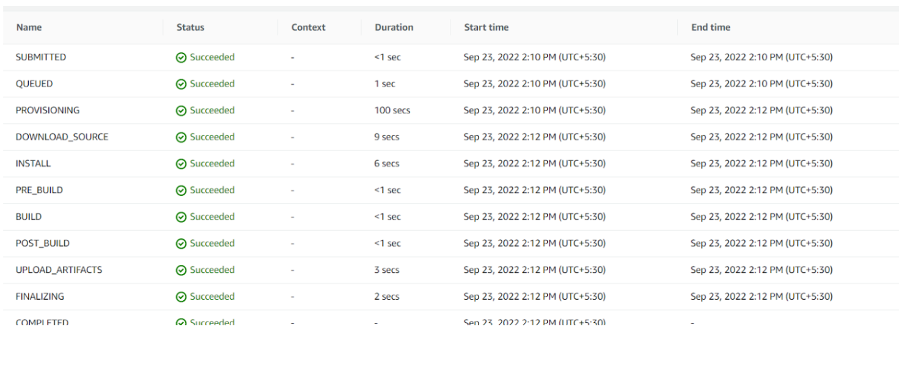

Step – 4: The build artifact stored in s3 bucket

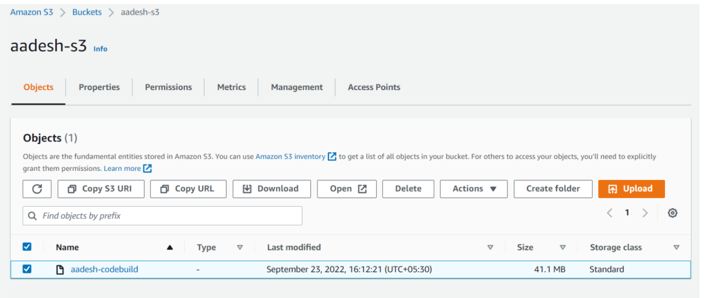

Step – 5: Created the appspec.yml file

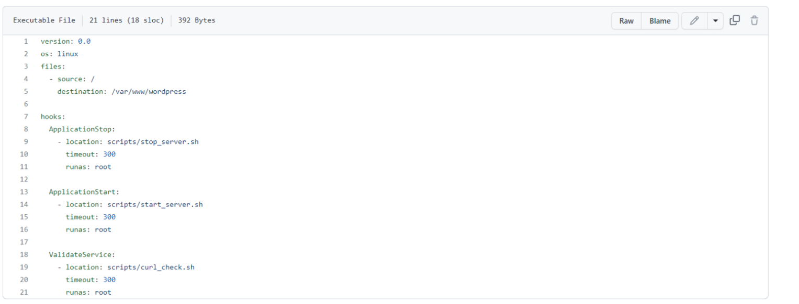

The appspec file contains information about the commands to be run during different hooks like ApplicationStop, ApplicationStart, BeforeInstall.

Step – 6: Successfully executed the deployment phase from the build artifact stored in s3

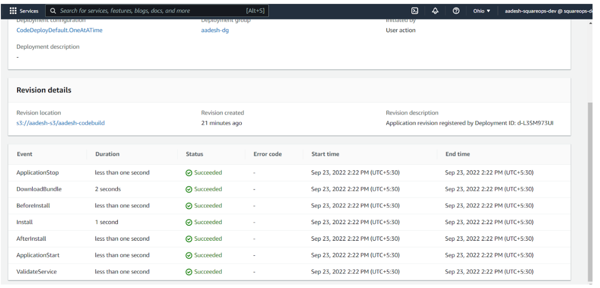


After the successful build is done we can move to the next step called CodeDeploy.Here we will first create the application .After the application is created we will now create the deployment group where we can provide the information like service role , type of deployment, environment (like instances which can be on-premise or from autoscaling group) and the load balancer.

Install code deploy agent as follows on ec2 instance or adding as user data in launch template: 

```
#!/bin/bash
sudo apt-get update
sudo apt-get install ruby
sudo apt-get install wget
cd /home/ubuntu
wget https://aws-codedeploy-us-east-2.s3.us-east02.amazonaws.com/latest/install
chmod +x ./install
sudo ./install auto
```

For checking the service 

        sudo service codedeploy-agent status

Step – 7: Details of Instance, in which the application was deployed

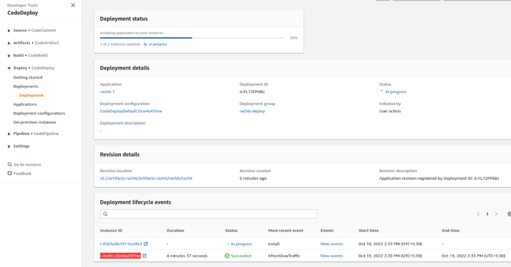

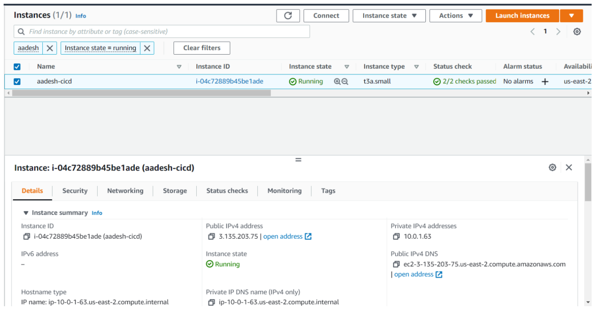

Step – 8: After hitting the Public IPv4 of the instance, the wordpress install page appeared


After installation WP was working

This is how the code pipeline looks after all the 3 stages executed successfully 

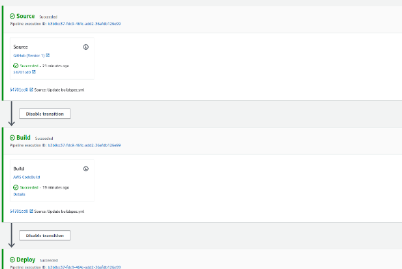

## DEPLOYMENT VERIFICATION

Step – 1: Published an article to check whether it gets stored in DB or not.

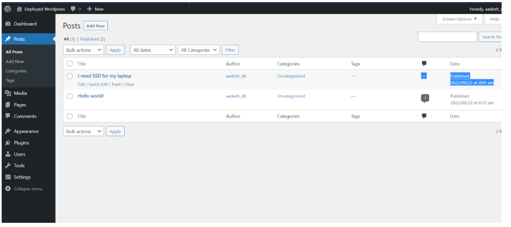

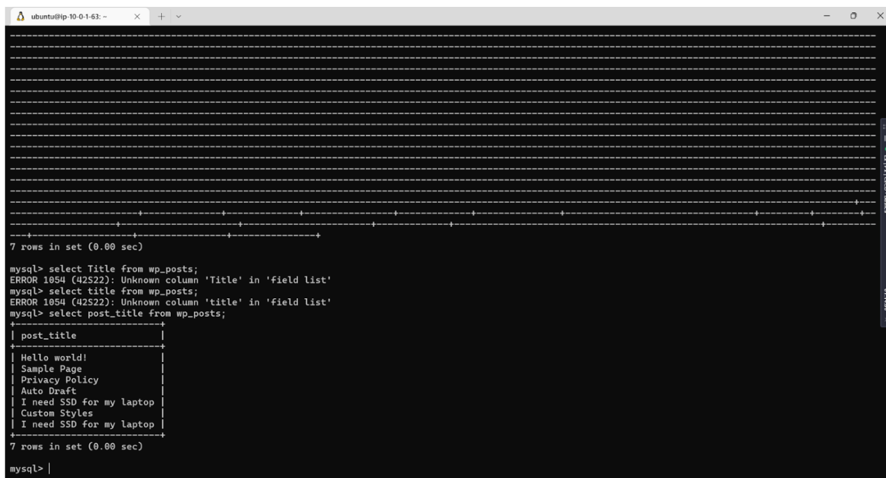

Article stored in RDS

Step – 2: Checked if EFS was still mounted after deployment

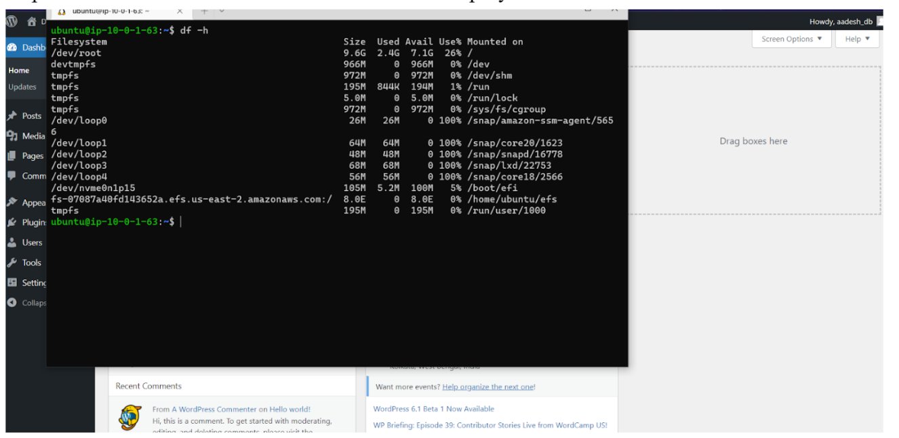

EFS still mounted
