# CloudWatch Monitoring 

Amazon CloudWatch collects and visualizes real-time logs, metrics, and event data in automated dashboards to streamline your infrastructure and application maintenance.

  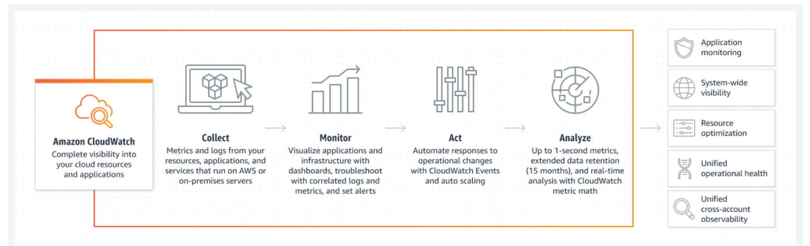

The CloudWatch Logs agent provides an automated way to send log data to CloudWatch Logs from Amazon EC2 instances. The agent includes the following components:

- A plug-in to the AWS CLI that pushes log data to CloudWatch Logs.

- A script (daemon) that initiates the process to push data to CloudWatch Logs.

- A cron job that ensures that the daemon is always running.
  
## Install the unified CloudWatch agent on the AMI and use SSM Parameter store to configure unified CloudWatch agent

1. Installation of unified CloudWatch Agent on EC2 instance

```
#!/bin/bash
sudo mkdir /tmp/cwa
cd /tmp/cwa
sudo wget https://s3.amazonaws.com/amazoncloudwatch-agent/linux/amd64/latest/AmazonCloudWatchAgent.zip -O AmazonCloudWatchAgent.zip
sudo apt-get install -y unzip
sudo unzip -o AmazonCloudWatchAgent.zip
sudo ./install.sh
sudo mkdir -p /usr/share/collectd/
sudo touch /usr/share/collectd/types.db 
sudo /opt/aws/amazon-cloudwatch-agent/bin/amazon-cloudwatch-agent-ctl -a fetch-config -m ec2 -c file:/opt/aws/amazon-cloudwatch-agent/bin/config.json -s

/opt/aws/amazon-cloudwatch-agent/bin/amazon-cloudwatch-agent-ctl -m ec2 -a status
{ 
"status": "running", 
"starttime": "2020-06-07T10:04:41+00:00", 
"version": "1.245315.0" 
}
systemctl status amazon-cloudwatch-agent.service
```

Run the CodeDeploy Agent wizard after this, and SSM Parameter Store will be configured there itself.

2. Code to use SSM Parameter Store to configure Unified CloudWatch Agent

```
sudo /opt/aws/amazon-cloudwatch-agent/bin/amazon-cloudwatch-agent-ctl -a fetch-config -m ec2 -c ssm:AmazonCloudWatch-RoadToDevops –s
```
3. Created a CloudWatch Dashboard, added EC2 and RDS Metrics

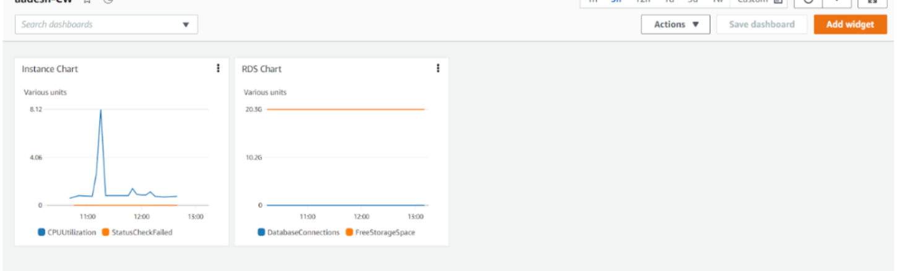

4. Shipped logs from the instance:

### a. Access log of Nginx Webserver (access.log)

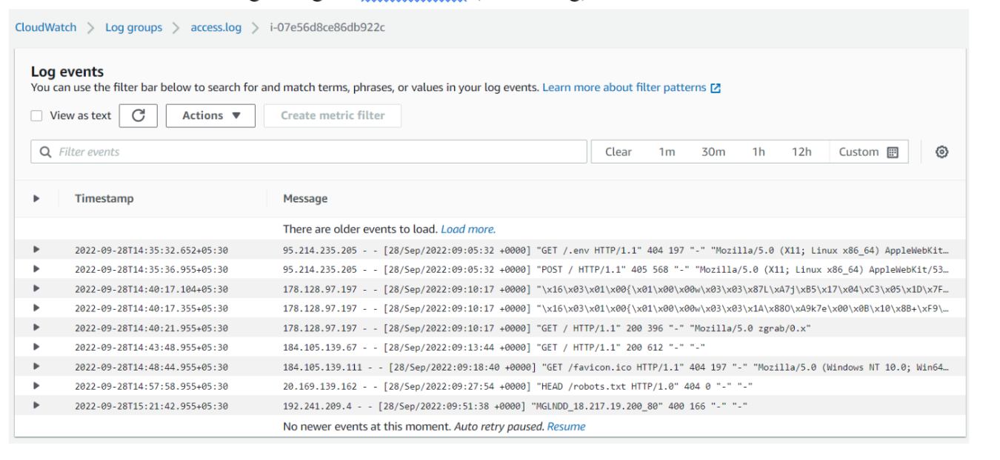

### b. Error log of Nginx Web Server (error.log)

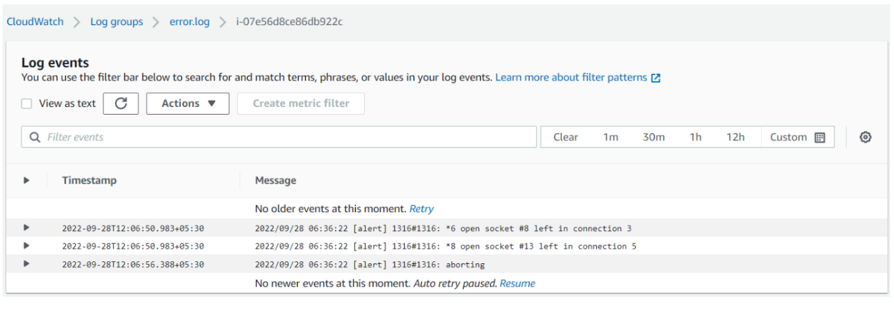

### c. syslog

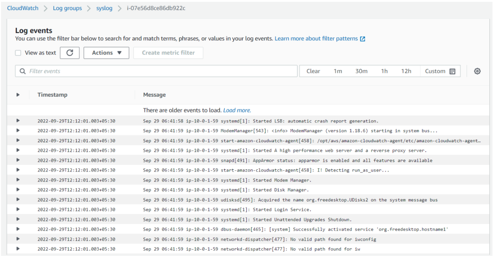

5. Created metric filter for 404 status code access.log

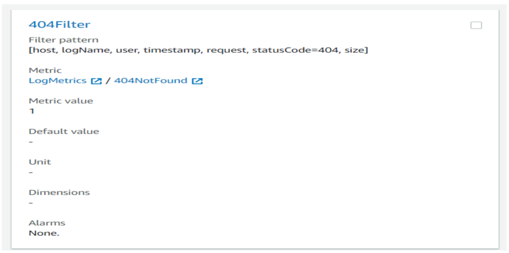

### a. Created a 404 Alarm based on this metric and an SNS Alert also executed

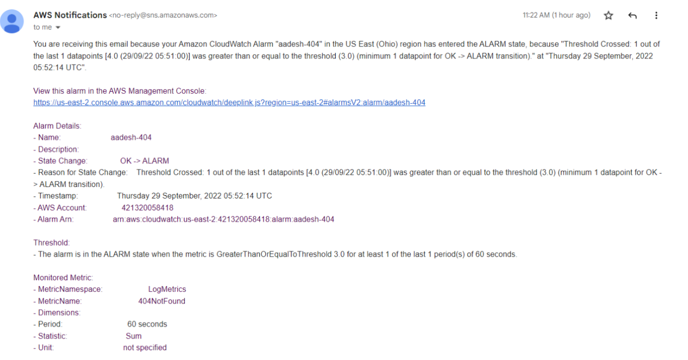

6. Alarms

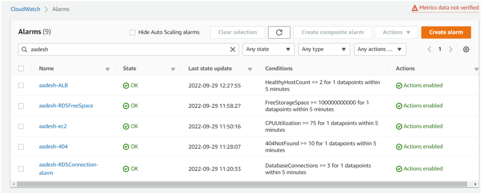

7. Chaos Testing

- EC2 SNS Trigger for CPUUtilization Metric

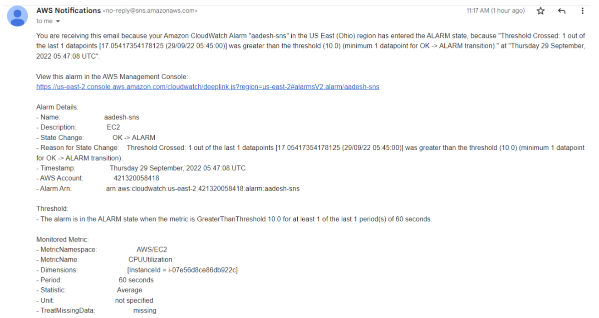

- Command used for stress testing:

            sudo apt install stress
            stress –c 4 –m 6 –d 4

- RDS SNS alert for DatabaseConnections Metric

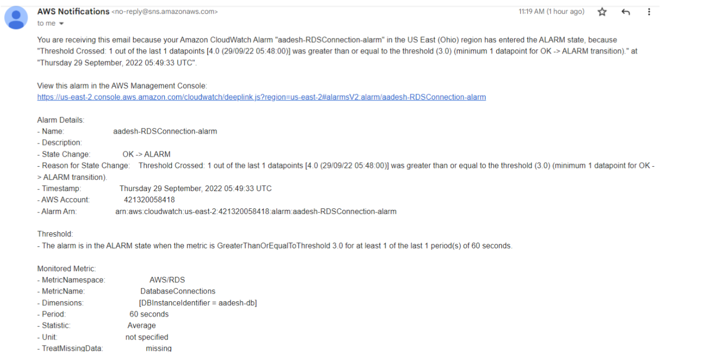

- Script used to test DB Connections

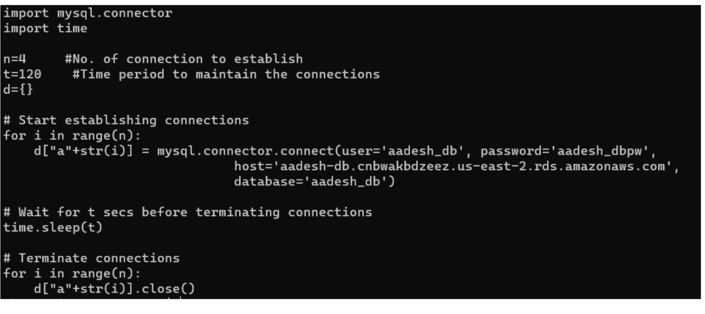

- SNS alert for FreeStorageSpace Metric

- ELB SNS Trigger for HealthyHostCount Metric


- Tested by manually terminating target instances.

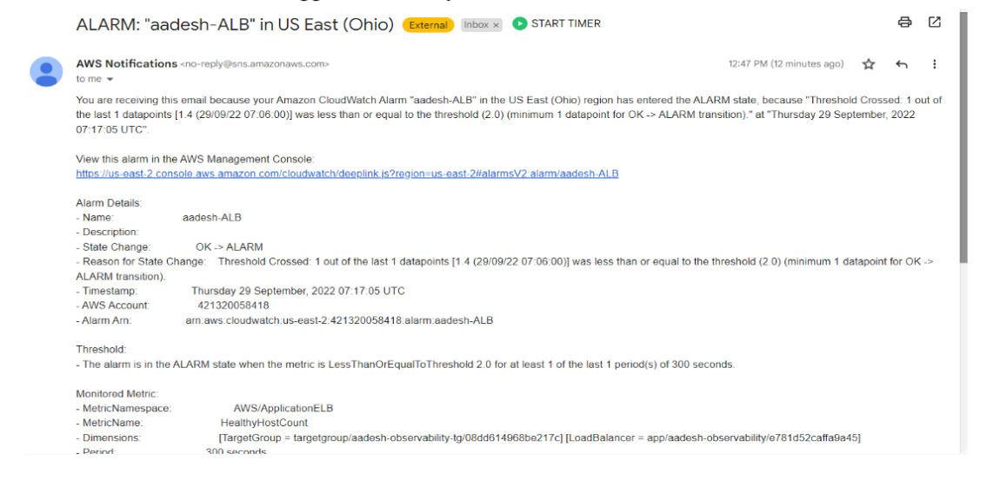
