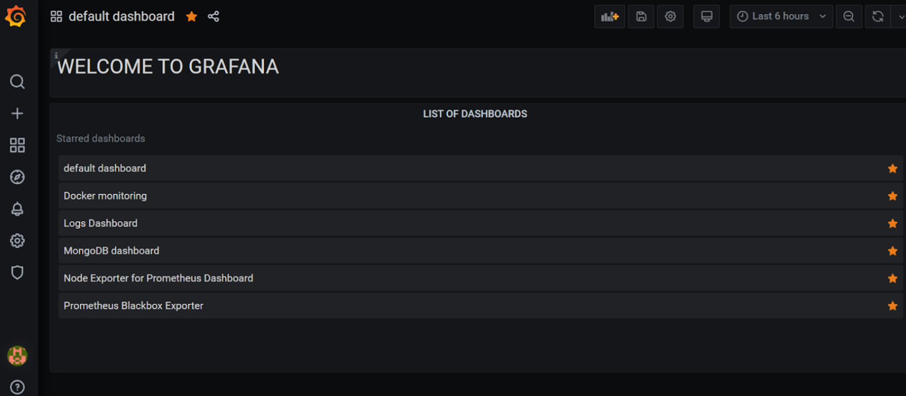

## Grafana

Grafana is an open-source solution for running data analytics with the help of metrics that give us an insight into the complex infrastructure and massive amount of data that our services deal with, with the help of customizable dashboards.

Grafana connects with every possible data source such as Graphite, Prometheus, Influx DB, ElasticSearch, MySQL, PostgreSQL etc. The open-source nature of the solution helps us alternatively write custom plugins to connect with any data source of our choice.

The tool helps us study, analyze and monitor data over a period of time, technically called time series analytics. It helps us track the user behavior, application behavior, frequency of errors popping up in production, pre-prod or any other environment, type of errors popping up and the contextual scenarios by providing relative data.

Grafana allows you to query, visualize, alert on, and understand your metrics no matter where they are stored. Create, explore, and share beautiful dashboards with your team and foster a data-driven culture.

## Install GRAFANA by running the following command on ubuntu server
```
sudo apt-get update
sudo apt-get upgrade
sudo apt-get install -y gnupg2 curl
curl https://packages.grafana.com/gpg.key | sudo apt-key add -
sudo add-apt-repository "deb https://packages.grafana.com/oss/deb stable main"
sudo apt-get update
sudo apt-get -y install grafana
sudo systemctl start grafana-server
sudo systemctl enable grafana-server
now check grafana is accessible on (http://server_IP:3000)
make sure you have allowed 3000 port in sg

```




