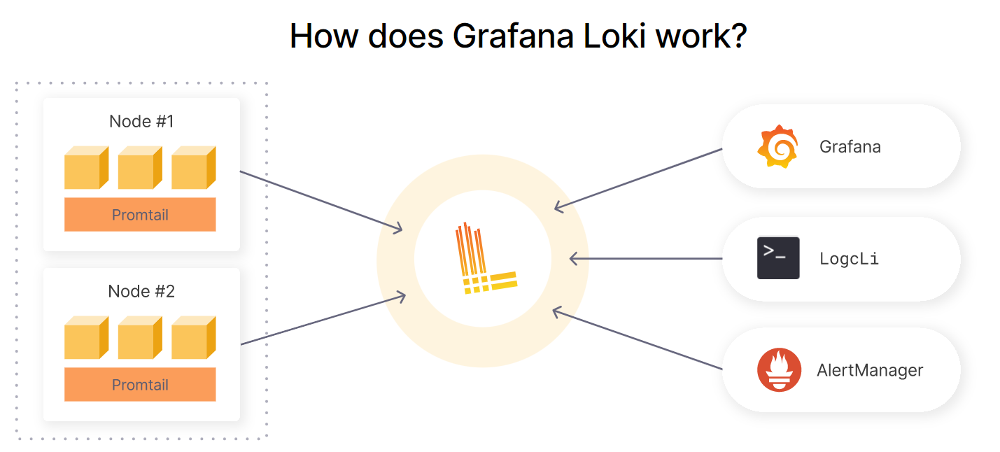

# LOKI

Loki is a log aggregation system designed to store and query logs from all your applications and infrastructure. Loki takes a unique approach by only indexing the metadata rather than the full text of the log lines.

Loki’s minimal indexing approach means that storing the same set of logs in Loki requires far less storage than with other solutions

- Log any and all formats
- Fast writes
- Tiny indexes
- Cheaper to run
- Simpler to operate
- Fast queries
- Cut and slice your logs in dynamic ways (Flexible)
  
  

## Install LOKI by running the following command on ubuntu server

```
curl -s https://api.github.com/repos/grafana/loki/releases/latest | grep browser_download_url | cut -d '"' -f 4 | grep loki-linux-amd64.zip | wget -i -
sudo apt install unzip
unzip loki-linux-amd64.zip
sudo mv loki-linux-amd64 /usr/local/bin/loki
loki --version
sudo mkdir -p /data/loki
sudo vim /etc/loki-local-config.yaml
```

- Paste the following contents in the loki-local-config:
```
auth_enabled: false

server:
  http_listen_port: 3100

ingester:
  lifecycler:
    address: 127.0.0.1
    ring:
      kvstore:
        store: inmemory
      replication_factor: 1
    final_sleep: 0s
  chunk_idle_period: 5m
  chunk_retain_period: 30s
  max_transfer_retries: 0

schema_config:
  configs:
    - from: 2018-04-15
      store: boltdb
      object_store: filesystem
      schema: v11
      index:
        prefix: index_
        period: 168h

storage_config:
  boltdb:
    directory: /data/loki/index

  filesystem:
    directory: /data/loki/chunks

limits_config:
  enforce_metric_name: false
  reject_old_samples: true
  reject_old_samples_max_age: 168h

chunk_store_config:
  max_look_back_period: 0s

table_manager:
  retention_deletes_enabled: false
  retention_period: 0s

```
- Create Loki service:
```
sudo tee /etc/systemd/system/loki.service<<EOF
[Unit]
Description=Loki service
After=network.target

[Service]
Type=simple
User=root
ExecStart=/usr/local/bin/loki -config.file /etc/loki-local-config.yaml

[Install]
WantedBy=multi-user.target
EOF
sudo systemctl daemon-reload
sudo systemctl start loki.service
sudo systemctl status loki
access Loki metrics via http://server-IP:3100/metrics
To set retention add these parameters in /etc/loki-local-config.yaml (here 45 days days retention is set )

table_manager:
  retention_deletes_enabled: true
  retention_period: 1080h
```

## CONFIGURE LOKI DATA SOURCE 

- login to grafana and add data source

- select LOKI from available option

- Input the values as:
```
Name: Loki
URL: http://127.0.0.1:3100
click SAVE & TEST
```

## Note : Use will get hands-on upon Observability tools in LEVEL 3 