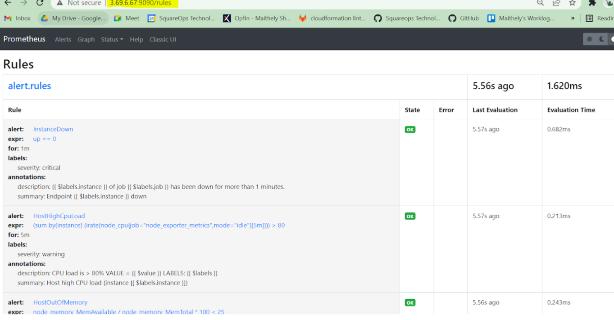
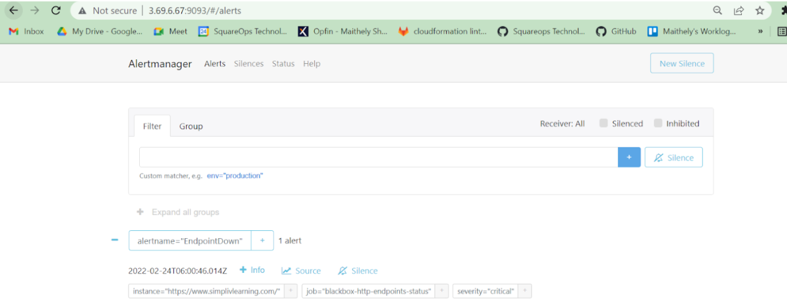
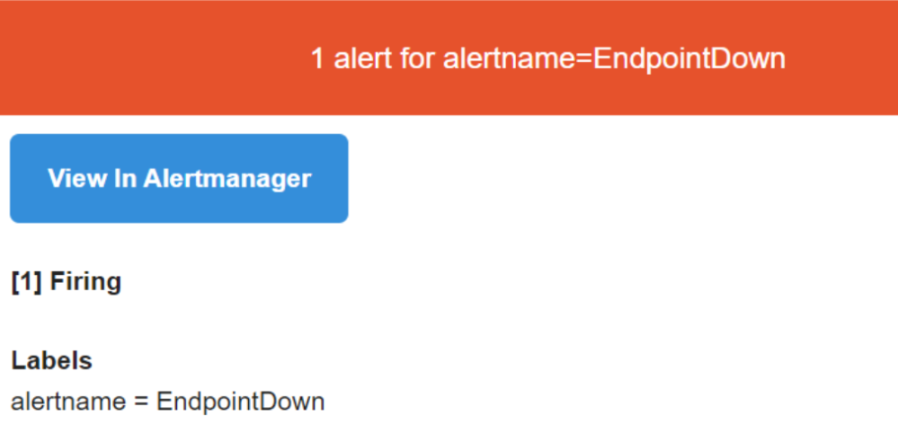

## AlertManager 
The Alertmanager handles alerts sent by client applications such as the Prometheus server. It takes care of deduplicating, grouping, and routing them to the correct receiver integration such as email, PagerDuty, or OpsGenie. It also takes care of silencing and inhibition of alerts.

## Alerting in Prometheus using alert manger by running the following commands:

```
wget https://github.com/prometheus/alertmanager/releases/download/v0.23.0/alertmanager-0.23.0.linux-amd64.tar.gz
tar -xvf alertmanager-0.23.0.linux-amd64.tar.gz
cd ~/alertmanager-0.23.0.linux-amd64/
sudo cp -r . /usr/local/bin/alertmanager
```
## Create service file
```
sudo vi /etc/systemd/system/alertmanager.service

[Unit]
Description=AlertManager Server Service
Wants=network-online.target
After=network-online.target

[Service]
User=root
Group=root
Type=simple
ExecStart=/usr/local/bin/alertmanager/alertmanager --config.file /usr/local/bin/alertmanager/alertmanager.yml
[Install]
WantedBy=multi-user.target
```

## Create alertmanager configuration file 

```
sudo vim /usr/local/bin/alertmanager/alertmanager.yml

global:
  resolve_timeout: 5m
  smtp_from: 'alerts@abc.com'
  smtp_auth_username: 'alerts@abc.com'
  smtp_auth_password: 'Qwerty@!7890'
  smtp_smarthost: 'smtp.office365.com:587'
route:
  group_by: ['alertname']
  group_wait: 10s
  group_interval: 5m
  repeat_interval: 5m
  receiver: 'email'
receivers:
- name: 'email'
  email_configs:
  - to: 'devops@squareops.com,abc@xyz.com'
    require_tls: yes
inhibit_rules:
  - source_match:
      severity: 'critical'
    target_match:
      severity: 'warning'
    equal: ['alertname', 'instance']
```

## Change file permissions 
```
cd /usr/local/bin/alertmanager/
sudo chmod 777 alertmanager alertmanager.yml
```

## Create rules in for alerting

```
sudo vim /etc/prometheus/alert.rules.yml

groups:
- name: alert.rules
  rules:
  - alert: InstanceDown
    expr: up == 0
    for: 1m
    labels:
      severity: "critical"
    annotations:
      summary: "Endpoint {{ $labels.instance }} down"
      description: "{{ $labels.instance }} of job {{ $labels.job }} has been down for more than 1 minutes."
  - alert: HostHighCpuLoad
    expr: (sum by (instance) (irate(node_cpu{job="node_exporter_metrics",mode="idle"}[5m]))) > 80
    for: 5m
    labels:
      severity: warning
    annotations:
      summary: "Host high CPU load (instance {{ $labels.instance }})"
      description: "CPU load is > 80%\n  VALUE = {{ $value }}\n  LABELS: {{ $labels }}"     
  - alert: HostOutOfMemory
    expr: node_memory_MemAvailable / node_memory_MemTotal * 100 < 25
    for: 5m
    labels:
      severity: warning
    annotations:
      summary: "Host out of memory (instance {{ $labels.instance }})"
      description: "Node memory is filling up (< 25% left)\n  VALUE = {{ $value }}\n  LABELS: {{ $labels }}"
  - alert: HostOutOfDiskSpace
    expr: (node_filesystem_avail{mountpoint="/"}  * 100) / node_filesystem_size{mountpoint="/"} < 30
    for: 1s
    labels:
      severity: warning
    annotations:
      summary: "Host out of disk space (instance {{ $labels.instance }})"
      description: "Disk is almost full (< 30% left)\n  VALUE = {{ $value }}\n  LABELS: {{ $labels }}"
  - alert: EndpointDown
    expr: probe_success == 0
    for: 10s
    labels:
      severity: "critical"
    annotations:
      summary: "Endpoint {{ $labels.instance }} down" 

```
## Create alert rules configuration in prometheus.yml file 
```
sudo vim /etc/prometheus/prometheus.yml

rule_files:
  - alert.rules.yml
alerting:
  alertmanagers:
  - static_configs:
    - targets:
      - 'localhost:9093'
```

## start alertmanager service 
```
sudo systemctl daemon-reload

sudo systemctl start alertmanager

sudo systemctl status alertmanager

/usr/local/bin/alertmanager/amtool check-config /usr/local/bin/alertmanager/alertmanager.yml

sudo systemctl stop node_exporter && sudo systemctl start node_exporter && sudo systemctl stop prometheus && sudo systemctl start prometheus && sudo systemctl stop alertmanager && sudo systemctl start alertmanager

journalctl -xe -u alertmanager.service 
```
- Check alerts configured in prometheus 



- Check alerts in alertmanager as well at 9093 port



- Then for verification check alerts being sent on the desired target (such as in this case it is email)




