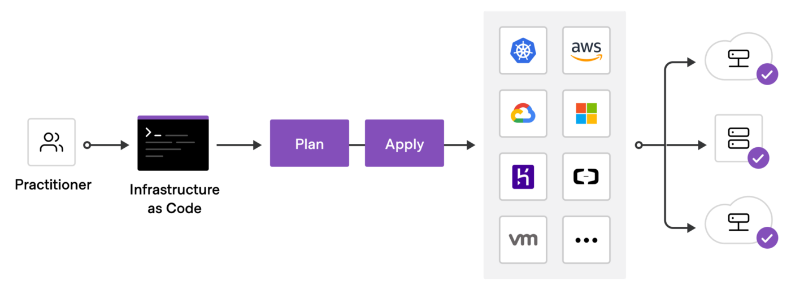
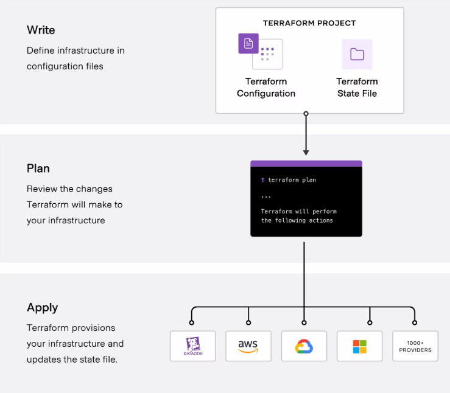

## What Is Terraform? 

- Terraform is an IAC tool, used primarily by DevOps teams to automate various infrastructure tasks. The provisioning of cloud resources, for instance, is one of the main use cases of Terraform. It’s a cloud-agnostic, open-source provisioning tool written in the Go language and created by HashiCorp.

- Terraform allows you to describe your complete infrastructure in the form of code. Even if your servers come from different providers such as AWS or Azure, Terraform helps you build and manage these resources in parallel across providers. Think of Terraform as connective tissue and common language that you can utilize to manage your entire IT stack.

## What is Terraform used for?

- One of the main functions of Terraform is for public cloud provisioning on one of the major providers. Providing an IaC for services such as AWS and Azure has -- and will continue to be -- the main focus of Terraform. Terraform enables the use of these public clouds via a provider, a plugin that wraps existing APIs and languages like Azure Bicep, and creates Terraform syntax.

- The second main use for Terraform is to facilitate multi-cloud deployments. One of the main draws of Terraform is that it performs across all cloud providers simultaneously, unlike some of its other IaC competitors. The capability to deploy resources into multiple cloud providers is critical because engineers can utilize the same syntax without familiarizing themselves with multiple tools and technologies.

- The third most common use of Terraform is deploying, managing, and orchestrating resources with custom cloud providers. A provider is a way in Terraform to wrap an existing API and convert it to the Terraform declarative syntax, and this can be done even if you’re not using AWS or another one of the major cloud services. Providers can also be written for internal use cases where you may desire to convert existing tools or APIs into Terraform.

In short, Terraform helps manage your entire IT ecosystem via IaC, whether it’s a single cloud, multi-cloud, or custom deployment.

 

## Benefits of Infrastructure-as-Code (IaC)

IaC replaces standard operating procedures and manual effort required for IT resource management with lines of code. Instead of manually configuring cloud nodes or physical hardware, IaC automates the process infrastructure management through source code.

Here are several of the major key benefits of using an IaC solution like Terraform:

- Speed and Simplicity. IaC eliminates manual processes, thereby accelerating the delivery and management lifecycles. IaC makes it possible to spin up an entire infrastructure architecture by simply running a script.
- Team Collaboration. Various team members can collaborate on IaC software in the same way they would with regular application code through tools like Github. Code can be easily linked to issue tracking systems for future use and reference.
- Error Reduction. IaC minimizes the probability of errors or deviations when provisioning your infrastructure. The code completely standardizes your setup, allowing applications to run smoothly and error-free without the constant need for admin oversight.
- Disaster Recovery. With IaC you can actually recover from disasters more rapidly. Because manually constructed infrastructure needs to be manually rebuilt. But with IaC, you can usually just re-run scripts and have the exact same software provisioned again.
- Enhanced Security. IaC relies on automation that removes many security risks associated with human error. When an IaC-based solution is installed correctly, the overall security of your computing architecture and associated data improves massively.

While there are many other benefits of employing IaC, things like speed, accuracy, data visibility, and security are key reasons that organizations choose to implement solutions like Terraform. 

## How Does Terraform Work?

Terraform lets you define and manage your entire infrastructure via configuration files and version control. It accomplishes this by using the two main components of Terraform architecture: Core and Providers.

## 1. How Terraform Core Works

To do its job, Terraform core uses two input sources. The first is the source input that the user configures into Terraform, defining what resources need to be created or provisioned. The second input source consists of data feeds into Terraform about what the current infrastructure setup looks like.

Terraform then takes these inputs and determines what actions need to be taken. It takes the user-specified desired state, compares it with the current state, and configures the architecture in a way that closes the gaps. Terraform Core essentially figures out what needs to be created, updated, or deleted in order to fully provision your infrastructure.

## 2. How Terraform Providers Work

The second key component that makes Terraform go are providers for specific technologies. This is typically cloud providers like AWS or Azure but can be any other infrastructure or platform as a service tool. Kubernetes, for instance, would also be considered a provider that Terraform utilizes.

Terraform has more than one hundred providers for various technologies, granting users access to its resources. If you’re using AWS, for instance, Terraform will also have access to EC2 instances and other resources within the tech stack. You can then create infrastructure on different levels, stacking Kubernetes on top of Azure, for example.

This is how Terraform works, using both Core and Provider functionality to complete your application and infrastructure setup quickly and using only code.

 

The core Terraform workflow consists of three stages:

- Write: You define resources, which may be across multiple cloud providers and services. For example, you might create a configuration to deploy an application on virtual machines in a Virtual Private Cloud (VPC) network with security groups and a load balancer.
- Plan: Terraform creates an execution plan describing the infrastructure it will create, update, or destroy based on the existing infrastructure and your configuration.
- Apply: On approval, Terraform performs the proposed operations in the correct order, respecting any resource dependencies. For example, if you update the properties of a VPC and change the number of virtual machines in that VPC, Terraform will recreate the VPC before scaling the virtual machines.

## Terraform vs. Competitors

There are alternatives on IaC market, each with its own advantages and drawbacks when stacked up against Terraform. Here are a few of the other major IaC tools on the market and how they compare with Terraform.

## Terraform vs. Ansible
Ansible is an IaC tool designed for automating system configuration and management. The main difference is that Ansible is not a provisioning tool and follows a procedural approach, meaning the user needs to manually specify the steps of provisioning. This provides DevOps users with more control, but also requires more work. Ansible is best for provisioning servers with the proper software and updates already configured, while Terraform can set up and orchestrate infrastructure from scratch. Finally, Terraform allows for complete lifecycle management, while Ansible does not.

## Terraform vs. Pulumi
Pulumi is a popular open-source IaC tool that can be used to design, deploy and manage cloud infrastructure resources. As opposed to Terraform, Pulumi doesn’t use a domain-specific software language, allowing users to deploy in GO, .NET, JavaScript, and others. And while Terraform follows strict coding guidelines, Pulumi does not, making it a bit more flexible in certain scenarios. However, Pulumi’s community is substantially smaller than Terraform’s, meaning there is less documentation available. While there are some flexibility benefits to Pulumi, Terraform is generally superior the larger the scope of deployment.

## Terraform Workflow
The Terraform workflow consists of the following three steps:

## Step 1: Write
In this first step in the Terraform workflow, you’ll declare your infrastructure resources as code using the Hashicorp Configuration Language (HCL).

## Step 2: Review
Terraform will then display its plan to either add or remove resources predicated upon the comparison of your declared infrastructure and the current state of existing resources.

## Step 3: Apply
Finally, you can accept planned changes to add or remove any infrastructure resources. Your infrastructure will then be ready to be fully deployed with the help of Terraform.

