## Installing terraform on ubuntu:
```
curl -fsSL https://apt.releases.hashicorp.com/gpg | sudo apt-key add -
sudo apt-add-repository "deb [arch=$(dpkg --print-architecture)] https://apt.releases.hashicorp.com $(lsb_release -cs) main"
sudo apt install terraform
```

Basics:

 1. Terraform enables multiple providers and services to be combined and composed.Terraform providers:
 
 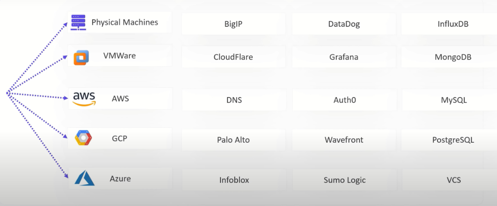

 2. Terraform separates the planning and execution phase 

 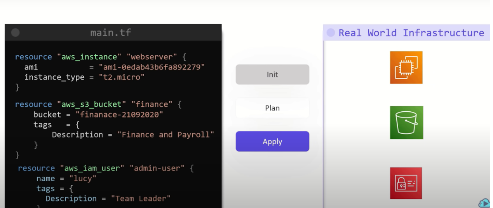

- In Init phase it initializes the providers used in tf files.
- By running terraform plan, the current state is refreshed and the configuration is consulted to generate an action plan. The plan includes all actions to be taken: which resources will be created, destroyed or modified. It can be inspected by operators to ensure it is exactly what is expected. Using terraform graph, the plan can be visualized to show dependent ordering. Once the plan is captured, the execution phase can be limited to only the actions in the plan.
- terraform apply, actually executes the plan and creates the infrastructure and if any resource is deleted manually then applying again will create only the missing resource.

3. Terraform uses HCL language(Hashicorp configuration language) and it contains file with .tf extension.

 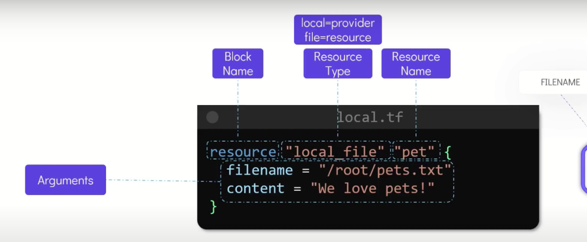

4. Terraform is immutable whenever any change in resource is made, it will delete the resource and will create the new one  
5. terraform output to display the variables used 
6. Terraform show command to show the ids of resources created
7. terraform destroy, deletes the resources present in the file

 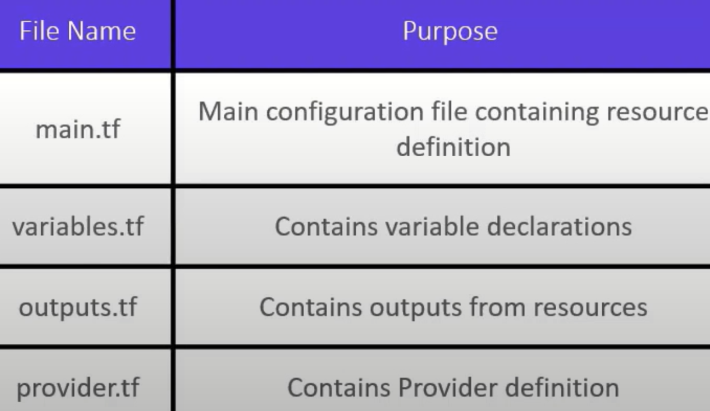

## Variables in terraform:
Store variables in variables.tf file and refer with var.variable_name in main file

 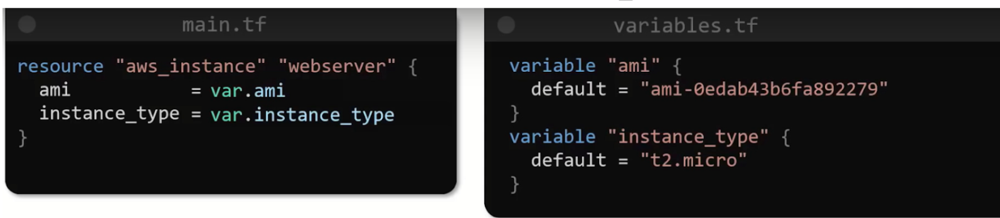

1. List of a Type:

 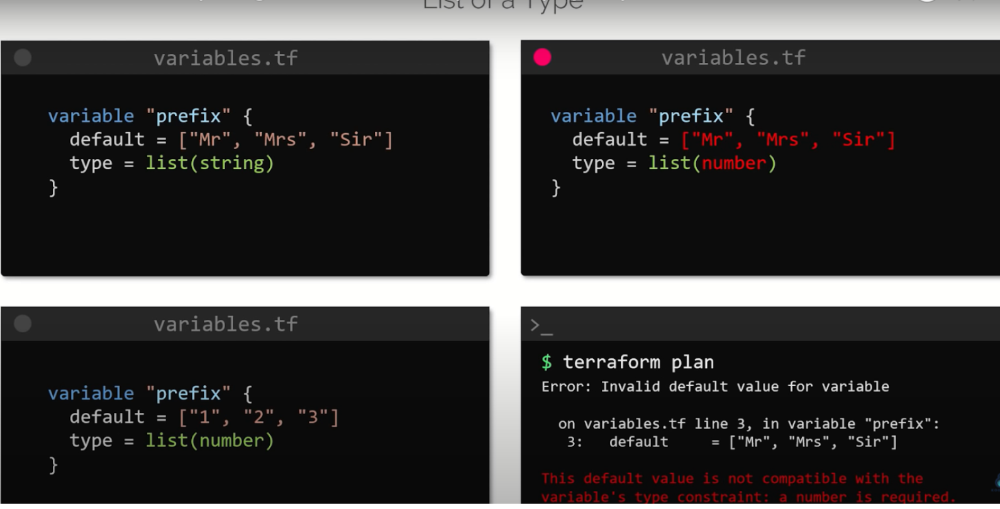

2. Map of a Type:

 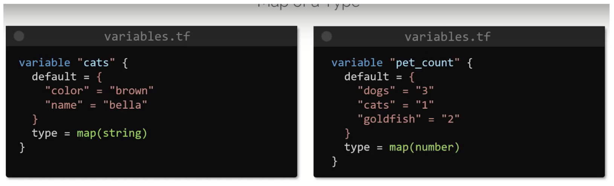

3. Set:

- Similar to list but does not support duplicate values

 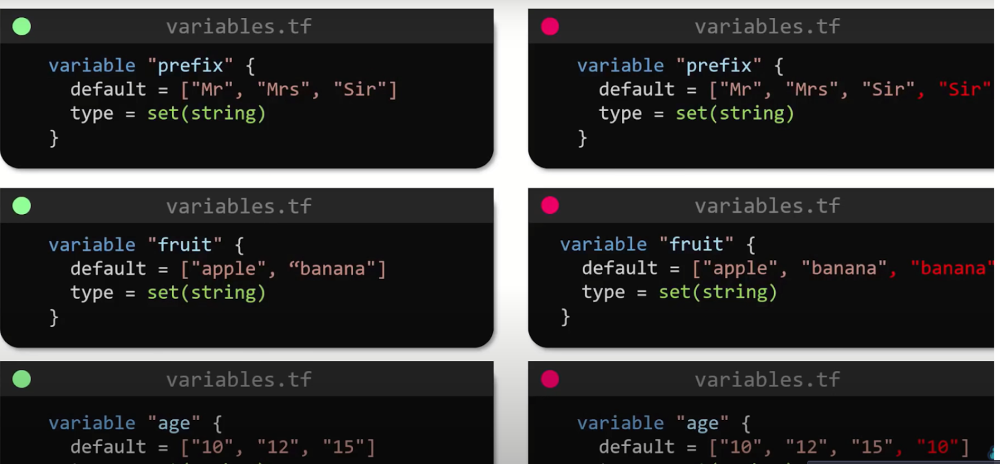

4. Objects:

 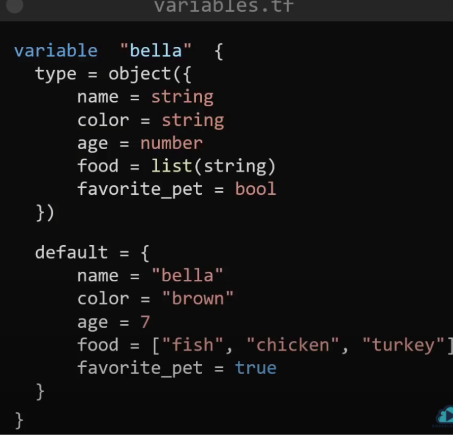

5. Tuples:

 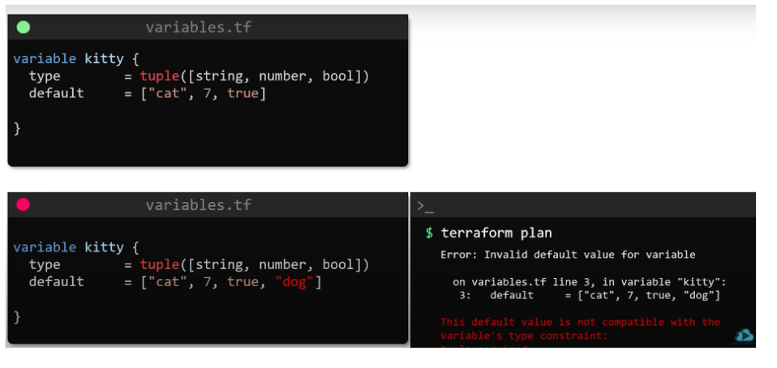

Variables definition precedence:

 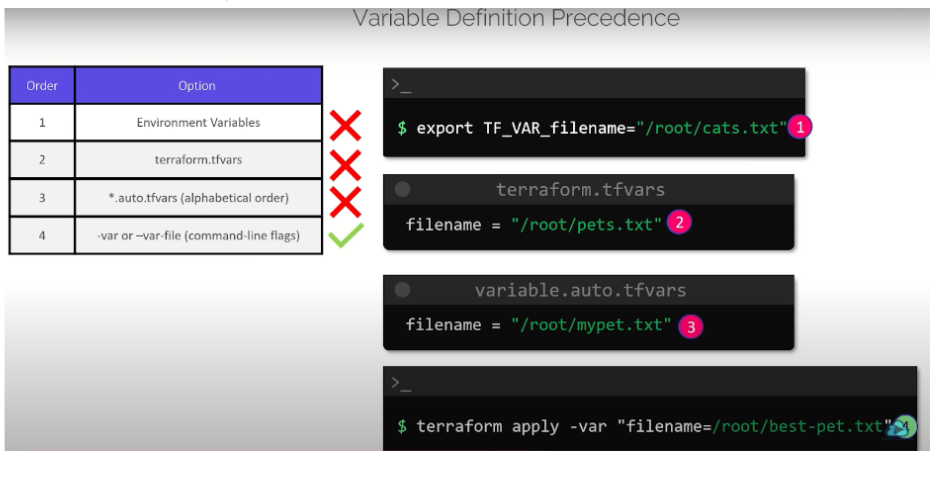

Take the output of one resource as the input for another resource :

 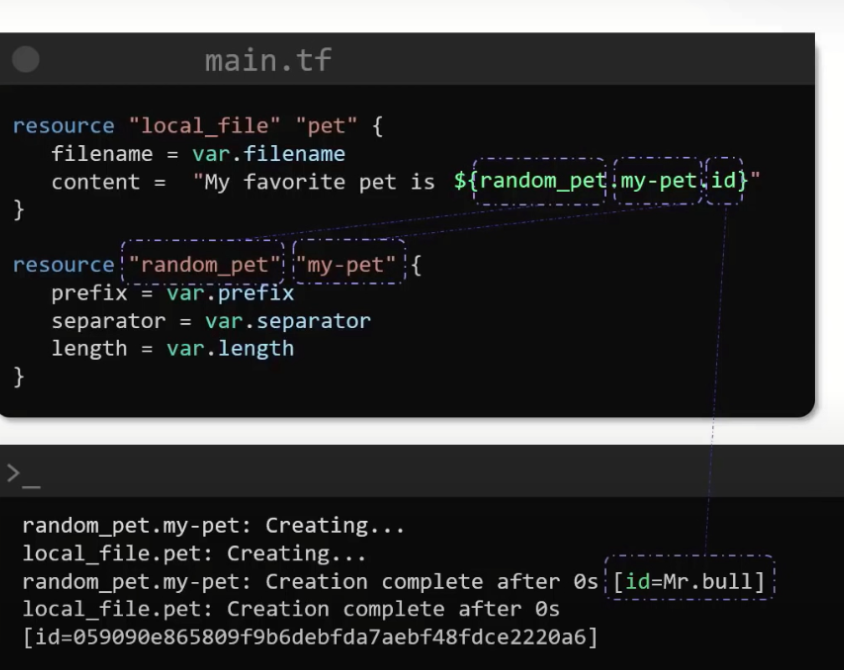

## Terraform commands:

```
terraform validate: to validate the configuration files.

terraform fmt: the files that are changed in configuration directory are displayed.

terraform show: prints the current state of infrastructure as seen by terraform (additionally use (-json) for json format).

terraform providers: to list the providers in configuration directory (additionally use mirror to display the output in another file eg: terraform providers mirror /root/terraform/new_local_file)

terraform output: to display outputs of the variables or terraform output variable for particular variable output

terraform refresh: to sync terraform with the real world infrastructure(will modify the tfstate file if any updates to the resources are done out of terraform control such as manually)

terraform graph: to visualize the configurations file without even initializing(for proper visualization on ubuntu use apt update;apt install graphviz -y;terraform graph | dot -Tsvg > graph.svg) 

Terraform workspace: to select the For team usage store .tfstate file on S3, Hashicorp terraform cloud etc.
Terraform state file also contains the sensitive data in simple json file such as private ips of ec2-instance ssh-keypair used and for rds the initial password is also stored.
```

### Lifecycle:

https://www.terraform.io/docs/language/meta-arguments/lifecycle.html for lifecycles such as create_before_destroy, prevent_destroy, ignore_changes


## Data Sources:
Use of data sources allows a Terraform configuration to build on information defined outside of Terraform, or defined by another separate Terraform configuration.

### Modules:
Modules are small, reusable Terraform configurations that let you manage a group of related resources as if they were a single resource.

Official link of terraform public registry https://registry.terraform.io/


For lab practice link: https://kodekloud.com/topic/lab-hcl-basics-2/

Terraform state lock removal forcefully terrafrom force-unlock <lock-id>
For loops and lists https://blog.gruntwork.io/terraform-tips-tricks-loops-if-statements-and-gotchas-f739bbae55f9:


