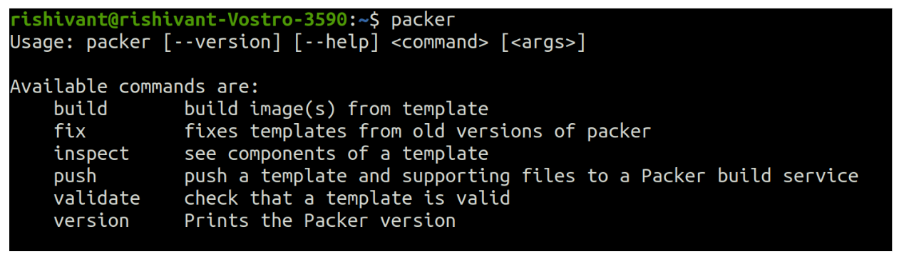
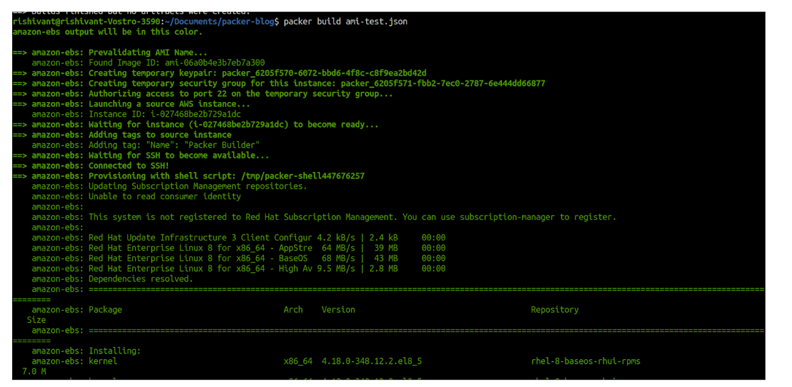
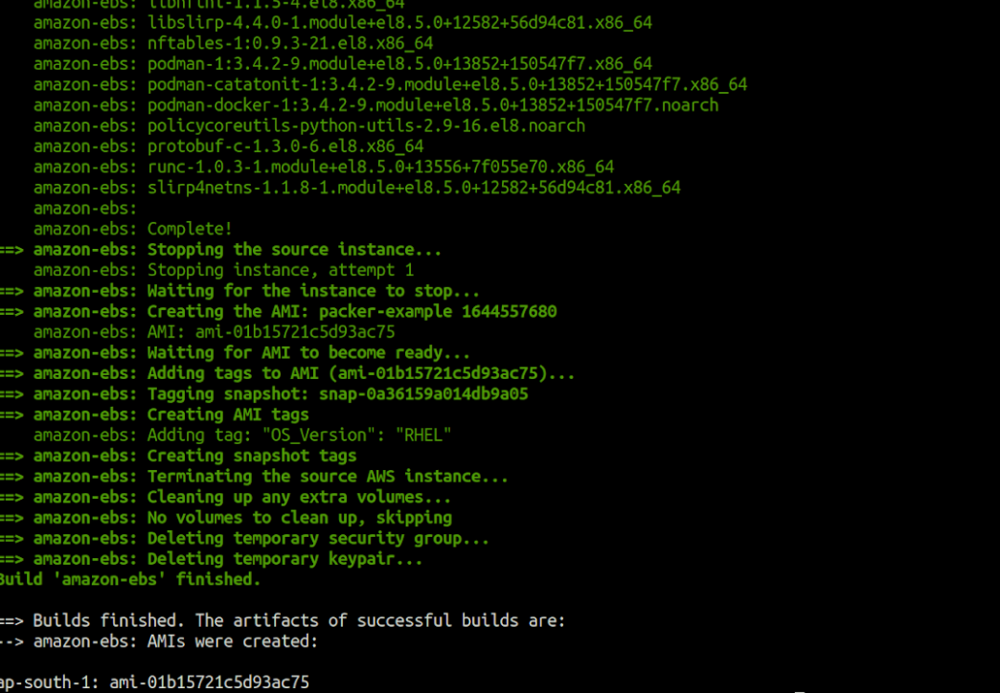

## What is packer ?
Packer is a open source tool that is used for making machine images (ami) from source configuration.Packer has made it really easy to automate the process of provisioning instance without manual configuration.

## Why Packer ?
It is so because it supports cross platform. We can build multiple machine images from a single source file.

To achieve this Packer uses JSON template files to describe the configuration needed to build the image.

### Steps we will use to build ami

1 – Prerequsite

2 – Json file for packer.

3 – Run packer to create AMI


## 1 – Install packer on your machine

Follow the below commands to install packer on your linux machine.

```
curl -fsSL https://apt.releases.hashicorp.com/gpg | sudo apt-key add -

sudo apt-add-repository "deb [arch=amd64] https://apt.releases.hashicorp.com $(lsb_release -cs) main"

sudo apt-get update && sudo apt-get install packer
To verify the installation follow the below :

```
## 2 – Create a packer template for the ami.

We will use a JSON file for this.

In the packer(json) file we will use three defintions.

variables
builders
provisioners
My ami-test.json looks like this :-

```
{
    "variables": {
      "aws_access_key": "",
      "aws_secret_key": ""
    },
    "builders": [{
      "type": "amazon-ebs",
      "access_key": "{{user `aws_access_key`}}",
      "secret_key": "{{user `aws_secret_key`}}",
      "region": "ap-south-1",
      "source_ami": "ami-06a0b4e3b7eb7a300",
      "skip_region_validation":"true",
      "instance_type": "t2.micro",
      "ssh_username": "ec2-user",    
      "tags": {
        "OS_Version": "RHEL"      
      },    
      "ami_name": "packer-example {{timestamp}}"
    }],
    "provisioners": [{
      "type": "shell",
      "inline": [
        "sleep 30",
        "sudo yum update -y",
        "sudo yum install -y docker"
      ]
    }]
  }
```
Things to keep in mind for the above code

## Variables section

- In the aws access key and secret key add your aws access key and secret key.
- You can use many more variables in the section as per your need.

## Builders section

- Region defined is as per your ami need.
- Source ami is the ami of the redhat image that i will build using this packer.
- Instance type is the type of instance you want to build.
- ssh username is the username of instance.

## Provisioner

- This section provides the bash script or path to bash script.

- For more types of provisioner definition i will mention the document link in reference.

## 3 – Running the json file to build the ami.

To run the above use the below command.

        packer build ami-test.json 

Now when you will run the above command the building of image will start and the output will be as below shows :

 

The above image shows the starting steps that it runs using the .json file.
```
amazon-ebs: Prevalidating AMI Name...
    amazon-ebs: Found Image ID: ami-06a0b4e3b7eb7a300
==> amazon-ebs: Creating temporary keypair: packer_6205f570-6072-bbd6-4f8c-c8f9ea2bd42d
==> amazon-ebs: Creating temporary security group for this instance: packer_6205f571-fbb2-7ec0-2787-6e444dd66877
==> amazon-ebs: Authorizing access to port 22 on the temporary security group...
==> amazon-ebs: Launching a source AWS instance...
    amazon-ebs: Instance ID: i-027468be2b729a1dc
==> amazon-ebs: Waiting for instance (i-027468be2b729a1dc) to become ready...
==> amazon-ebs: Adding tags to source instance
    amazon-ebs: Adding tag: "Name": "Packer Builder"
==> amazon-ebs: Waiting for SSH to become available...
==> amazon-ebs: Connected to SSH!
==> amazon-ebs: Provisioning with shell script: /tmp/packer-shell447676257
    amazon-ebs: Updating Subscription Management repositories.
The above snippet shows the clear output steps that runs as per my definition in the .json file.
```
Finally after the packer is able to build the ami the artifacts are produced at the end with a successful completion.

 


The build is successful and artifacts is published. As per the requirement the instance is up..Provisioning

 


The above aws console image is showing the instance that was up by packer.

Conclusion
So the above steps describe the best way to create an ami with packer. Using the above we don’t need to manually up the machines on aws . So as per the requisites the needs can be fulfilled for the number of services on aws.

Packer is a great tool that helps to simplify deployments in both small and large virtualised and containerised environments.

