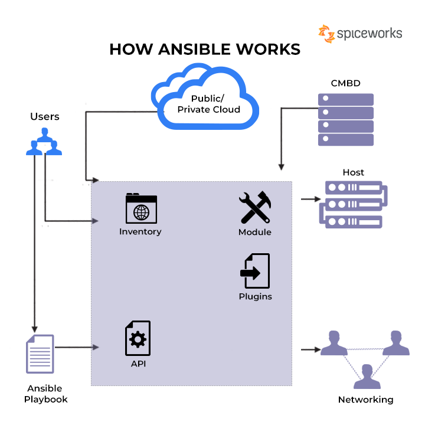

## What is Ansible 

Ansible is a software tool that provides simple but powerful automation for cross-platform computer support. It is primarily intended for IT professionals, who use it for application deployment, updates on workstations and servers, cloud provisioning, configuration management, intra-service orchestration, and nearly anything a systems administrator does on a weekly or daily basis. Ansible doesn't depend on agent software and has no additional security infrastructure, so it's easy to deploy.

Because Ansible is all about automation, it requires instructions to accomplish each job. With everything written down in simple script form, it's easy to do version control. The practical result of this is a major contribution to the "infrastructure as code" movement in IT: the idea that the maintenance of server and client infrastructure can and should be treated the same as software development, with repositories of self-documenting, proven, and executable solutions capable of running an organization regardless of staff changes.

While Ansible may be at the forefront of automation, systems administration, and DevOps, it's also useful to everyday users. Ansible allows you to configure not just one computer, but potentially a whole network of computers at once, and using it requires no programming skills. Instructions written for Ansible are human-readable. Whether you're entirely new to computers or an expert, Ansible files are easy to understand.

 

## How Ansible works

In Ansible, there are two categories of computers: the control node and managed nodes. The control node is a computer that runs Ansible. There must be at least one control node, although a backup control node may also exist. A managed node is any device being managed by the control node.

Ansible works by connecting to nodes (clients, servers, or whatever you're configuring) on a network, and then sending a small program called an Ansible module to that node. Ansible executes these modules over SSH and removes them when finished. The only requirement for this interaction is that your Ansible control node has login access to the managed nodes. SSH keys are the most common way to provide access, but other forms of authentication are also supported.

 

## What Ansible does

The term Ansible modules sounds complex, but most of the complexity is handled by Ansible and not the user. An Ansible module is written to be a model of the desired state of a system, meaning that each module defines what should be true on any given managed node. For instance, if a systems administrator decides that all workstations in an organization should have LibreOffice version X.Z installed, then it's up to Ansible's packaging module to determine whether each node has LibreOffice X.Z on it. Should Ansible find a managed node with LibreOffice X.Y installed, then it detects the operating system and runs the necessary routine to update it to LibreOffice X.Z. In this way, every workstation in an organization can be updated overnight with the software supported by the IT department.

Maintaining infrastructure is about more than just checking versions of software, though. When people talk about using Ansible, what they're really referring to is using Ansible modules, because those are the parts of Ansible that perform specific tasks. Should you need to automate something across several computers, take a look at Ansible modules to find the one that handles the task you need to be performed, and then install Ansible so you can configure and invoke that module. If you are a programmer, you can also write your own custom modules to perform specialized tasks. If your module is generally useful, you can also submit it to the Ansible project for inclusion so others can benefit from your work.

## Ansible playbooks
While modules provide the means of accomplishing a task, the way you use them is through an Ansible playbook. A playbook is a configuration file written in YAML that provides instructions for what needs to be done in order to bring a managed node into the desired state. Playbooks are meant to be simple, human-readable, and self-documenting. They are also idempotent, meaning that a playbook can be run on a system at any time without having a negative effect upon it. If a playbook is run on a system that's already properly configured and in its desired state, then that system should still be properly configured after a playbook runs.

A playbook can be very simple, such as this one that installs, as a privileged user, the Apache HTTP server on any node in an IT department's webservers group:
```
---
- name: Apache server installed
  hosts: webservers
  become: yes
```

Playbooks can also be very complex, with conditionals and variables. However, because most of the real work is done by Ansible modules, playbooks remain brief, readable, and clear even though they can orchestrate entire networks of managed nodes.

## Learning Ansible
You can learn Ansible by using it at home or at work. If you're new to YAML, take time to learn it and then write your first playbook. If you prefer to start small, you can install Ansible on your personal computer and use it to manage itself or just a few computers on your home network. Most importantly, try different modules so you can get comfortable using and configuring new ones. They're your gateway to making your nodes conform to your infrastructure designs, and Ansible is the engine that makes it possible.

