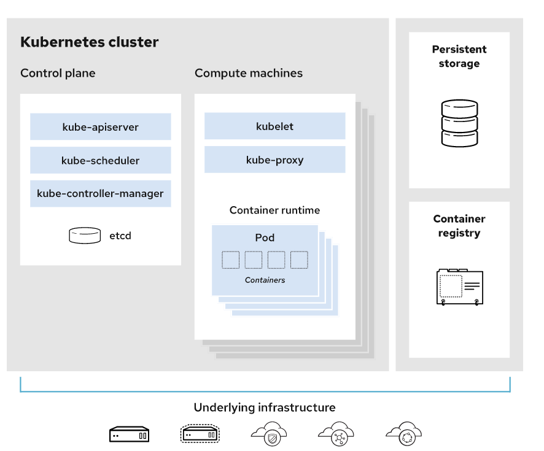

# Kubernetes
Kubernetes is a popular open source platform for container orchestration — that is, for the management of applications built out of multiple, largely self-contained runtimes called containers. Containers have become increasingly popular since the Docker containerization project launched in 2013, but large, distributed containerized applications can become increasingly difficult to coordinate. By making containerized applications dramatically easier to manage at scale, Kubernetes has become a key part of the container revolution.

## What is container orchestration?
Containers support VM-like separation of concerns but with far less overhead and far greater flexibility. As a result, containers have reshaped the way people think about developing, deploying, and maintaining software. In a containerized architecture, the different services that constitute an application are packaged into separate containers and deployed across a cluster of physical or virtual machines. But this gives rise to the need for container orchestration—a tool that automates the deployment, management, scaling, networking, and availability of container-based applications.

## What is Kubernetes?
Kubernetes is an open source project that has become one of the most popular container orchestration tools around; it allows you to deploy and manage multi-container applications at scale. While in practice Kubernetes is most often used with Docker, the most popular containerization platform, it can also work with any container system that conforms to the Open Container Initiative (OCI) standards for container image formats and runtimes. And because Kubernetes is open source, with relatively few restrictions on how it can be used, it can be used freely by anyone who wants to run containers, most anywhere they want to run them—on-premises, in the public cloud, or both.

## Google and Kubernetes
Kubernetes began life as a project within Google. It’s a successor to—though not a direct descendent of—Google Borg, an earlier container management tool that Google used internally. Google open sourced Kubernetes in 2014, in part because the distributed microservices architectures that Kubernetes facilitates makes it easy to run applications in the cloud. Google sees the adoption of containers, microservices, and Kubernetes as potentially driving customers to its cloud services (although Kubernetes certainly works with Azure and AWS as well). Kubernetes is currently maintained by the Cloud Native Computing Foundation, which is itself under the umbrella of the Linux Foundation.

## Kubernetes vs. other projects
Kubernetes is not the only way to manage containers at scale, although it has emerged as the most common and broadly supported choice. A few of the other options deserve discussion.

## Kubernetes vs. Docker and Docker swarm mode
Kubernetes doesn’t replace Docker, but augments it. However, Kubernetes does replace some of the higher-level technologies that have emerged around Docker.

One such technology is Docker swarm mode, a system for managing a cluster of Docker Engines referred to as a “swarm” — essentially a small orchestration system. It’s still possible to use Docker swarm mode instead of Kubernetes, but Docker Inc. has chosen to make Kubernetes a key part of Docker support going forward.

However, note that Kubernetes is significantly more complex than Docker swarm mode, and requires more work to deploy. But again, the work is intended to provide a big payoff in the long run—a more manageable, resilient application infrastructure. For development work, and smaller container clusters, Docker swarm mode presents a simpler choice. 

## Kubernetes vs. Mesos
Another project you might have heard about as a competitor to Kubernetes is Mesos. Mesos is an Apache project that originally emerged from developers at Twitter; it was actually seen as an answer to the Google Borg project.

Mesos does in fact offer container orchestration services, but its ambitions go far beyond that: it aims to be a sort of cloud operating system that can coordinate both containerized and non-containerized components. To that end, a lot of different platforms can run within Mesos—including Kubernetes itself.

## Kubernetes architecture: How Kubernetes works
Kubernetes’s architecture makes use of various concepts and abstractions. Some of these are variations on existing, familiar notions, but others are specific to Kubernetes.

### Kubernetes clusters
The highest-level Kubernetes abstraction, the cluster, refers to the group of machines running Kubernetes (itself a clustered application) and the containers managed by it. A Kubernetes cluster must have a master, the system that commands and controls all the other Kubernetes machines in the cluster. A highly available Kubernetes cluster replicates the master’s facilities across multiple machines. But only one master at a time runs the job scheduler and controller-manager.

### Kubernetes nodes and pods
Each cluster contains Kubernetes nodes. Nodes might be physical machines or VMs. Again, the idea is abstraction: Whatever the app is running on, Kubernetes handles deployment on that substrate. Kubernetes even makes it possible to ensure that certain containers run only on VMs or only on bare metal.

Nodes run pods, the most basic Kubernetes objects that can be created or managed. Each pod represents a single instance of an application or running process in Kubernetes, and consists of one or more containers. Kubernetes starts, stops, and replicates all containers in a pod as a group. Pods keep the user’s attention on the application, rather than on the containers themselves. Details about how Kubernetes needs to be configured, from the state of pods on up, is kept in Etcd, a distributed key-value store.

Pods are created and destroyed on nodes as needed to conform to the desired state specified by the user in the pod definition. Kubernetes provides an abstraction called a controller for dealing with the logistics of how pods are spun up, rolled out, and spun down. Controllers come in a few different flavors depending on the kind of application being managed. For instance, the StatefulSet controller is used to deal with applications that need persistent state. The Deployment controller is used to scale an app up or down, update an app to a new version, or roll back an app to a known-good version if there’s a problem.

### Kubernetes services
Because pods live and die as needed, we need a different abstraction for dealing with the application lifecycle. An application is supposed to be a persistent entity, even when the pods running the containers that comprise the application aren’t themselves persistent. To that end, Kubernetes provides an abstraction called a service.

A service in Kubernetes describes how a given group of pods (or other Kubernetes objects) can be accessed via the network. As the Kubernetes documentation puts it, the pods that constitute the back-end of an application might change, but the front-end shouldn’t have to know about that or track it. Services make this possible.

A few more pieces internal to Kubernetes round out the picture. The scheduler parcels out workloads to nodes so that they’re balanced across resources and so that deployments meet the requirements of the application definitions. The controller manager ensures that the state of the system—applications, workloads, etc.—matches the desired state defined in Etcd’s configuration settings.

It is important to keep in mind that none of the low-level mechanisms used by containers, such as Docker itself, are replaced by Kubernetes. Rather, Kubernetes provides a larger set of abstractions for using these mechanisms for the sake of keeping apps running at scale.

### Kubernetes policies
Policies in Kubernetes ensure that pods adhere to certain standards of behavior. Policies prevent pods from using excessive CPU, memory, process IDs, or disk space, for example. Such “limit ranges” are expressed in relative terms for CPU (e.g., 50% of a hardware thread) and absolute terms for memory (e.g., 200MB). These limits can be combined with resource quotas to ensure that different teams of Kubernetes users (as opposed to applications generally) have equal access to resources.

### Kubernetes Ingress
Kubernetes services are thought of as running within a cluster. But you’ll want to be able to access these services from the outside world. Kubernetes has several components that facilitate this with varying degrees of simplicity and robustness, including NodePort and LoadBalancer, but the component with the most flexibility is Ingress. Ingress is an API that manages external access to a cluster’s services, typically via HTTP.

Ingress does require a bit of configuration to set up properly. Matthew Palmer, who wrote a book on Kubernetes development, steps you through the process on his website.

### Kubernetes Dashboard
One Kubernetes component that helps you keep on top of all of these other components is Dashboard, a web-based UI with which you can deploy and troubleshoot apps and manage cluster resources. Dashboard isn’t installed by default, but adding it isn’t too much trouble.