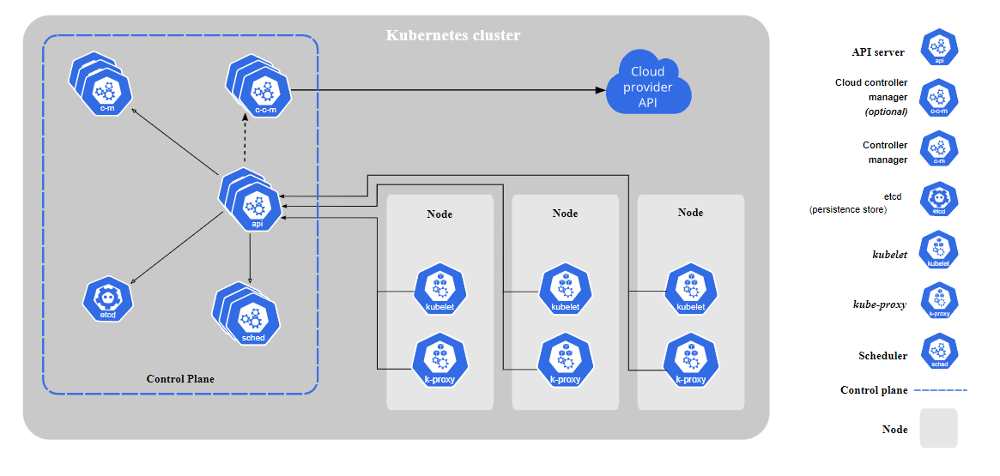
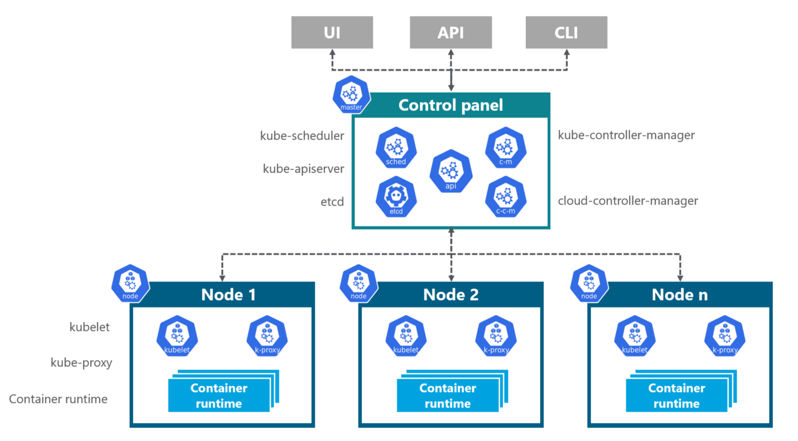

# What is Kubernetes Architecture ?

Kubernetes is an architecture that offers a loosely coupled mechanism for service discovery across a cluster. A Kubernetes cluster has one or more control planes, and one or more compute nodes. Overall, the control plane is responsible for managing the overall cluster, exposing the application program interface (API), and for scheduling the initiation and shutdown of compute nodes based on a desired configuration. Each of the compute nodes runs a container runtime like Docker along with an agent, kubelet, which communicates with the control plane. Each node can be bare metal servers, or on-premises or cloud-based virtual machines (VMs).

- [What is Kubernetes Architecture ?](#what-is-kubernetes-architecture-)
- [What are Kubernetes architecture components?](#what-are-kubernetes-architecture-components)
- [What is Kubernetes Control Plane architecture?](#what-is-kubernetes-control-plane-architecture)
  - [Controller functions included in this process include:](#controller-functions-included-in-this-process-include)
  - [Elements of the cloud controller manager include:](#elements-of-the-cloud-controller-manager-include)
- [What is Kubernetes node architecture?](#what-is-kubernetes-node-architecture)
- [What are other Kubernetes infrastructure components?](#what-are-other-kubernetes-infrastructure-components)
- [What are Kubernetes architecture best practices and design principles?](#what-are-kubernetes-architecture-best-practices-and-design-principles)

# What are Kubernetes architecture components?
The main components of a Kubernetes cluster include:

- Nodes: Nodes are VMs or physical servers that host containerized applications. Each node in a cluster can run one or more application instance. There can be as few as one node, however, a typical Kubernetes cluster will have several nodes (and deployments with hundreds or more nodes are not uncommon).

- Image Registry: Container images are kept in the registry and transferred to nodes by the control plane for execution in container pods.

- Pods: Pods are where containerized applications run. They can include one or more containers and are the smallest unit of deployment for applications in a Kubernetes cluster.

# What is Kubernetes Control Plane architecture?
A Kubernetes control plane is the control plane for a Kubernetes cluster. Its components include:

- kube-apiserver. As its name suggests the API server exposes the Kubernetes API, which is communications central. External communications via command line interface (CLI) or other user interfaces (UI) pass to the kube-apiserver, and all control planes to node communications also goes through the API server.
- etcd: The key value store where all data relating to the cluster is stored. etcd is highly available and consistent since all access to etcd is through the API server. Information in etcd is generally formatted in human-readable YAML (which stands for the recursive “YAML Ain’t Markup Language”).
- kube-scheduler: When a new Pod is created, this component assigns it to a node for execution based on resource requirements, policies, and ‘affinity’ specifications regarding geolocation and interference with other workloads.
- kube-controller-manager: Although a Kubernetes cluster has several controller functions, they are all compiled into a single binary known as kube-controller-manager.

## Controller functions included in this process include:

- Replication controller: Ensures the correct number of pods is in existence for each replicated pod running in the cluster
- Node controller: Monitors the health of each node and notifies the cluster when nodes come online or become unresponsive
- Endpoints controller: Connects Pods and Services to populate the Endpoints object
- Service Account and Token controllers: Allocates API access tokens and default accounts to new namespaces in the cluster
- cloud-controller-manager: If the cluster is partly or entirely cloud-based, the cloud controller manager links the cluster to the cloud provider’s API. Only those controls specific to the cloud provider will run. The cloud controller manager does not exist on clusters that are entirely on-premises. More than one cloud controller manager can be running in a cluster for fault tolerance or to improve overall cloud performance.

## Elements of the cloud controller manager include:

- Node controller: Determines status of a cloud-based node that has stopped responding, i.e., if it has been deleted
- Route controller: Establishes routes in the cloud provider infrastructure
- Service controller: Manages cloud provider’s load balancers

# What is Kubernetes node architecture?
Nodes are the machines, either VMs or physical servers, where Kubernetes place Pods to execute. Node components include:

- kubelet: Every node has an agent called kubelet. It ensures that the container described in PodSpecs are up and running properly. 

- kube-proxy: A network proxy on each node that maintains network nodes which allows for the communication from Pods to network sessions, whether inside or outside the cluster, using operating system (OS) packet filtering if available.

- container runtime: Software responsible for running the containerized applications. Although Docker is the most popular, Kubernetes supports any runtime that adheres to the Kubernetes CRI (Container Runtime Interface).

# What are other Kubernetes infrastructure components?
- Pods: By encapsulating one (or more) application containers, pods are the most basic execution unit of a Kubernetes application. Each Pod contains the code and storage resources required for execution and has its own IP address. Pods include configuration options as well. Typically, a Pod contains a single container or few containers that are coupled into an application or business function and that share a set of resources and data.

- Deployments: A method of deploying containerized application Pods. A desired state described in a Deployment will cause controllers to change the actual state of the cluster to achieve that state in an orderly manner. Learn more about Kubernetes Deployments.

- ReplicaSet: Ensures that a specified number of identical Pods are running at any given point in time.

- Cluster DNS: serves DNS records needed to operate Kubernetes services.

- Container Resource Monitoring: Captures and records container metrics in a central database.

# What are Kubernetes architecture best practices and design principles?

Gartner’s Container Best Practices suggest a platform strategy that considers security, governance, monitoring, storage, networking, container lifecycle management and orchestration like Kubernetes.

Here are some best practices for architecting Kubernetes clusters:

- Ensure you have updated to the latest Kubernetes version (1.18 as of this writing).
- Invest up-front in training for developer and operations teams.
- Establish governance enterprise-wide. Ensure tools and vendors are aligned and integrated with Kubernetes orchestration.
- Enhance security by integrating image-scanning processes as part of your CI/CD process, scanning during build and run phases. Open-source code pulled from a Github repository should always be considered suspect.
- Adopt role-based access control (RBAC) across the cluster. Least privilege, zero-trust models should be the standard.
- Further secure containers by using only non-root users and making the file system read-only.
- Avoid use of default value, since simple declaratives are less error-prone and demonstrate intent more clearly.
- Be careful when using basic Docker Hub images, which can contain malware or be bloated with unnecessary code. Start with lean, clean code and build packages up from there. Small images build faster, are smaller on disk, and image pulls are faster as well.
- Keep containers simple. One process per container will let the orchestrator report if that one process is healthy or not. 
- When in doubt, crash. Kubernetes will restart a failed container, so do not restart on failure.
- Be verbose. Descriptive labels help current developers and will be invaluable to developers to follow in their footsteps.
- Don’t get too granular with microservices. Not every function within a logical code component need be its own microservice.
- Automate, where it makes sense. Automating CI/CD pipeline lets you avoid manual Kubernetes deployments entirely.
- Use livenessProbe and readinessProbe to help manage Pod lifecycles, or pods may end up being terminated while initializing or begin receiving user requests before they are ready.

Kubernetes architecture is straightforward and intuitive. The loose coupling between control plane and node allows for nearly infinite flexibility and the ability for an application to scale out virtually instantaneously to meet changing needs, to migrate users to new builds, and to support migration from on-premises to cloud-based nodes or between multiple clouds to take advantage of desired features of each cloud provider.