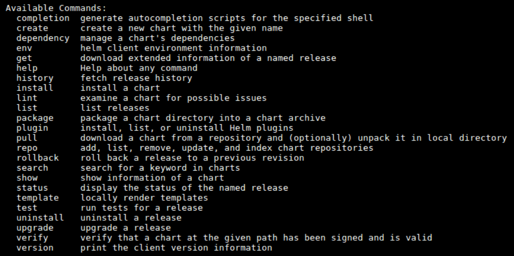
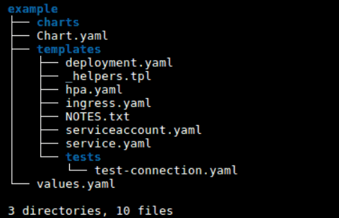

## Introduction

Helm is a Kubernetes deployment tool for automating creation, packaging, configuration, and deployment of applications and services to Kubernetes clusters.

Kubernetes is a powerful container-orchestration system for application deployment. There are multiple independent resources to deal with, and each requires a dedicated YAML manifest file.

This article explains what Helm and Helm charts are and how to automate application deployment to Kubernetes.

## What is Helm?
If Kubernetes were an operating system, Helm would be the package manager. Ubuntu uses apt, CentOS uses yum, and Kubernetes uses helm.

Helm deploys packaged applications to Kubernetes and structures them into charts. The charts contain all pre-configured application resources along with all the versions into one easily manageable package.

Helm streamlines installing, upgrading, fetching dependencies, and configuring deployments on Kubernetes with simple CLI commands. Software packages are found in repositories or are created.

## Why Do We Need Helm?
Kubernetes objects are challenging to manage. With helpful tools, the Kubernetes learning curve becomes smooth and manageable. Helm automates maintenance of YAML manifests for Kubernetes objects by packaging information into charts and advertises them to a Kubernetes cluster.

Helm keeps track of the versioned history of every chart installation and change. Rolling back to a previous version or upgrading to a newer version is completed with comprehensible commands.

  

## What Can You Do With Helm?

Helm allows software developers to deploy and test an environment in the simplest possible way. Less time is needed to get from development to testing to production.

Besides boosting productivity, Helm presents a convenient way for developers to pack and send applications to end users for installation.

## How Does Helm Work?
Helm and Kubernetes work like a client/server application. The Helm client pushes resources to the Kubernetes cluster. The server-side depends on the  version: Helm 2 uses Tiller while Helm 3 got rid of Tiller and entirely relies on the Kubernetes API.

  

## What Is a Helm Chart?

Helm charts are Helm packages consisting of YAML files and templates which convert into Kubernetes manifest files. Charts are reusable by anyone for any environment, which reduces complexity and duplicates. Folders have the following structure:

  

## How Do Helm Charts Work?

The three basic concepts of Helm charts are:

1. Chart – Pre-configured template of Kubernetes resources.

2. Release – A chart deployed to a Kubernetes cluster using Helm.

3. Repository – Publicly available charts.

The workflow is to search through repositories for charts and install them to Kubernetes clusters, creating releases.

## Helm Chart Structure

The files and directories of a Helm chart each have a specific function:

| Name	| Type	| Function |
|-------|-------|----------|
|charts/|	Directory	| Directory for manually managed chart dependencies.|
|templates/|	Directory |	Template files are written in Golang and combined with configuration values from the values.yaml file to generate Kubernetes manifests.|
|Chart.yaml|	File | 	Metadata about the chart, such as the version, name, search keywords, etc.|
|LICENSE (optional) |	File	| License for the chart in plaintext format. | 
|README.md (optional) |	File |	Human readable information for the users of the chart.|
|requirements.yaml (optional)	| File	| List of chart’s dependencies.|
|values.yaml |	File	| Default configuration values for the chart.| 

## Helm Chart Repositories

The repositories contain charts which can be installed or shared with other users. Helm provides a command to search directly from the client. There are two general types of searches:

1. helm search hub – Searches through the Artifact Hub from dozens of repositories.

2. helm search repo – Searches through repositories added in the local helm client using helm repo add.

        helm search hub wordpress

