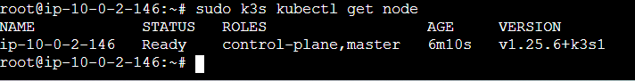
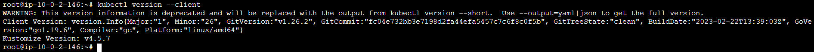

### Overview: 
K3s is a certified lightweight kubernetes. The tool can be used to create a single node kubernetes cluster.

- [Install and Configure K3s](#install-and-configure-k3s)
  - [Installation:](#installation)
  - [Get nodes in cluster:](#get-nodes-in-cluster)
  - [Install kubectl:](#install-kubectl)
  - [Verify installation:](#verify-installation)
  - [Configure kubectl to access cluster:](#configure-kubectl-to-access-cluster)
  - [Ensure kubectl works:](#ensure-kubectl-works)
  - [Install Helm3 (Ref: https://helm.sh/docs/intro/install/)](#install-helm3-ref-httpshelmshdocsintroinstall)
  - [Install mysql Helm3](#install-mysql-helm3)

## Install and Configure K3s 

Spun up an Ubuntu 20 EC2 instance and run the following commands on it 

### Installation: 

    curl -sfL https://get.k3s.io | sh -

  

### Get nodes in cluster:

    sudo k3s kubectl get node

  

### Install kubectl:

    curl -LO "https://dl.k8s.io/release/$(curl -L -s https://dl.k8s.io/release/stable.txt)/bin/linux/amd64/kubectl"

    sudo install -o root -g root -m 0755 kubectl /usr/local/bin/kubectl

  

### Verify installation: 

    kubectl version --client

  

### Configure kubectl to access cluster:

- Copy k3s kubeconfig from its default location to .kube/config

```

mkdir ~/.kube

sudo cp  /etc/rancher/k3s/k3s.yaml ~/.kube/config

sudo chown $USER:$USER ~/.kube/config
```
  

### Ensure kubectl works:

    kubectl cluster-info

  

### Install Helm3 (Ref: https://helm.sh/docs/intro/install/)

```
curl https://baltocdn.com/helm/signing.asc | gpg --dearmor | sudo tee /usr/share/keyrings/helm.gpg > /dev/null

sudo apt-get install apt-transport-https --yes

echo "deb [arch=$(dpkg --print-architecture) signed-by=/usr/share/keyrings/helm.gpg] https://baltocdn.com/helm/stable/debian/ all main" | sudo tee /etc/apt/sources.list.d/helm-stable-debian.list

sudo apt-get update

sudo apt-get install helm

```

  

### Install mysql Helm3

```
helm repo add my-repo https://charts.bitnami.com/bitnami
helm install my-release my-repo/mysql
```

  
