# Deploy Sentiment Analyzer using Kubernetes

Here we will deploy the same sentiment analyzer application but over Kubernetes by creating various deployments which up spun up respective pods and also create services accordingly to expose the application for accessing 

- [Deploy Sentiment Analyzer using Kubernetes](#deploy-sentiment-analyzer-using-kubernetes)
  - [Step 1: Prepare K3S cluster](#step-1-prepare-k3s-cluster)
  - [Step 2 : Install dependencies on EC2](#step-2--install-dependencies-on-ec2)
    - [NodeJs Dependencies](#nodejs-dependencies)
    - [Docker Dependencies](#docker-dependencies)
  - [Step 3: Clone Github Repository](#step-3-clone-github-repository)
  - [Step 4: Pull docker Images](#step-4-pull-docker-images)
  - [Step 5: Setup the Application](#step-5-setup-the-application)
- [Deploy Sentiment Analyzer using Kubernetes using Kubernetes and ingress](#deploy-sentiment-analyzer-using-kubernetes-using-kubernetes-and-ingress)
  - [Step 1: Enable ingress by below command](#step-1-enable-ingress-by-below-command)
  - [Step 2: Check whether the load balancer created or not in your account](#step-2-check-whether-the-load-balancer-created-or-not-in-your-account)
  - [Step 3: Clone the Repository \& deploy application](#step-3-clone-the-repository--deploy-application)
  - [Step 4: Create your all host names in route 53 and attach it to load balancer](#step-4-create-your-all-host-names-in-route-53-and-attach-it-to-load-balancer)
  - [Step 5: Verify the application](#step-5-verify-the-application)
- [Deploy Sentiment Analyzer using Kubernetesand helm chart](#deploy-sentiment-analyzer-using-kubernetesand-helm-chart)
  - [Install HELM dependencies](#install-helm-dependencies)
- [Conclusion](#conclusion)

## Step 1: Prepare K3S cluster 

Follow this [tutorial to setup K3s cluster](https://github.com/squareops/road-to-devops/blob/develop/Level-3/M2-HandsOnKubernetes/L02-SetupK3sCluster.md) with master and worker nodes respectively

## Step 2 : Install dependencies on EC2 

Now SSH into the master and run the following commands

### NodeJs Dependencies
```
apt update
apt install net-tools -y
curl -fsSL https://deb.nodesource.com/setup_14.x | sudo -E bash -
apt-get install gcc make -y
apt-get install nodejs -y 
```

### Docker Dependencies 

```
sudo apt update
sudo apt install apt-transport-https ca-certificates curl software-properties-common
curl -fsSL https://download.docker.com/linux/ubuntu/gpg | sudo apt-key add -
sudo add-apt-repository "deb [arch=amd64] https://download.docker.com/linux/ubuntu focal stable"
apt-cache policy docker-ce
sudo apt install docker-ce
sudo systemctl status docker
```

## Step 3: Clone Github Repository  

        git clone https://github.com/rinormaloku/k8s-mastery.git

## Step 4: Pull docker Images 

We have stored docker images in AWS ECR public repository. 

**note: If you have not stored images on ECR, build the images and store in ECR or Docker Hub** 

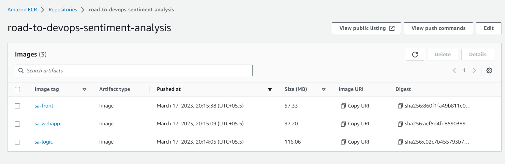

To pull these images on master node, run the following commands 

    docker pull IMAGE_URI 

Like, in our case the image URI is as follows:

```
docker pull public.ecr.aws/u8i3s3j7/road-to-devops-sentiment-analysis:sa-logic

docker pull public.ecr.aws/u8i3s3j7/road-to-devops-sentiment-analysis:sa-webapp

docker pull public.ecr.aws/u8i3s3j7/road-to-devops-sentiment-analysis:sa-front

```
To check the images run the following command

    docker images

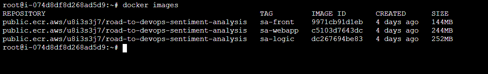

## Step 5: Setup the Application 

**Run the following commands to deploy logic pods and create logic service**

```
cd sentiment-analyzer-example-app/resource-manifests/ 
kubectl apply -f sa-logic-deployment.yaml
kubectl apply -f service-sa-logic.yaml
```
Now update the SA_LOGIC_API_URL in the sa-webapp/Dockerfile 

```
FROM maven:3.6.0-jdk-11-slim AS build
WORKDIR /app
COPY . .
RUN mvn  clean package
RUN mvn install

FROM openjdk:11-jre-slim
# Environment Variable that defines the endpoint of sentiment-analysis python api.
ENV SA_LOGIC_API_URL http://10.0.101.254:5000
COPY --from=build /app/target/sentiment-analysis-web-0.0.1-SNAPSHOT.jar /usr/local/lib/app.jar
EXPOSE 8080
CMD ["java", "-jar", "/usr/local/lib/app.jar", "--sa.logic.api.url=${SA_LOGIC_API_URL}"]
```

**Run the following commands to deploy webapp pods and create webapp service**

```
cd sentiment-analyzer-example-app/sa-webapp/
docker build -t webapp .
```
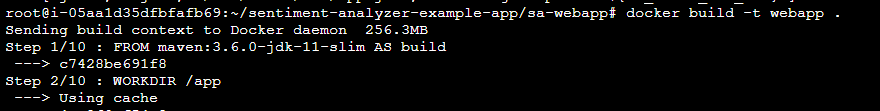

Now tag the images builded above as follows 
```
docker tag webapp:latest public.ecr.aws/u8i3s3j7/road-to-devops-sentiment-analysis:webapp 
```
Push this images into the ECR
```
docker tag public.ecr.aws/u8i3s3j7/road-to-devops-sentiment-analysis:webapp 
```

**note: you have installed aws-cli 2 and configured using your IAM User credentials**

Also change API_URL value to sa-logic endpoint in deployment file

```
cd sentiment-analyzer-example-app/resource-manifests/
```
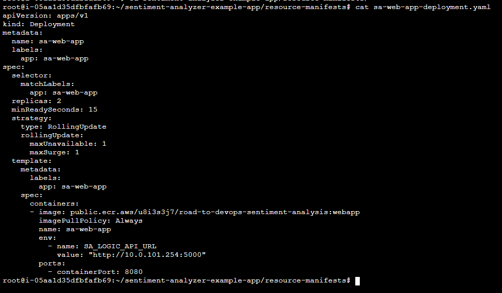

```
kubectl apply -f sa-web-app-deployment.yaml
kubectl apply -f service-sa-web-app-lb.yaml
```

Run the following command to get the services running 
```
root@i-05aa1d35dfbfafb69:~/sentiment-analyzer-example-app/resource-manifests# kubectl get svc
NAME             TYPE           CLUSTER-IP      EXTERNAL-IP                                                              PORT(S)        AGE
kubernetes       ClusterIP      10.43.0.1       <none>                                                                   443/TCP        3h53m
sa-logic         ClusterIP      10.43.149.139   <none>                                                                   80/TCP         3h31m
sa-web-app-lb    LoadBalancer   10.43.83.145    aae11149a40274fcb8ae54f9d4f26e55-415424989.us-east-1.elb.amazonaws.com   80:32382/TCP   130m
```
Pass the above external IP to App.js file of frontend

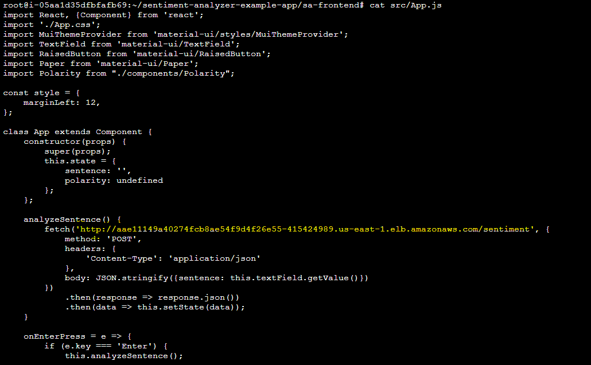

**Run the following commands to deploy frontend pods and create frontend service**

```
cd sentiment-analyzer-example-app/sa-frontend/

sudo npm install 
sudo npm run build 

cd sentiment-analyzer-example-app/resource-manifests/
kubectl apply -f sa-frontend-deployment.yaml
kubectl apply -f service-sa-frontend-lb.yaml

```

Now check all services and pods are up 

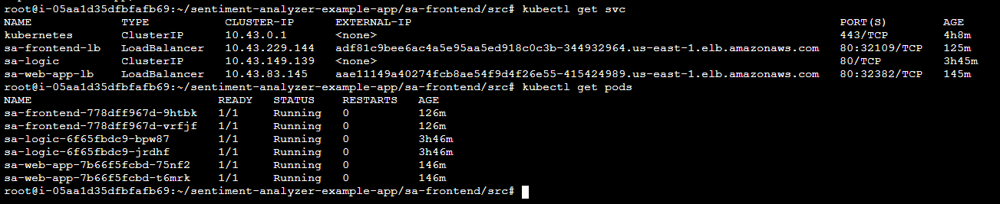

Hit the Domain and the application will work 

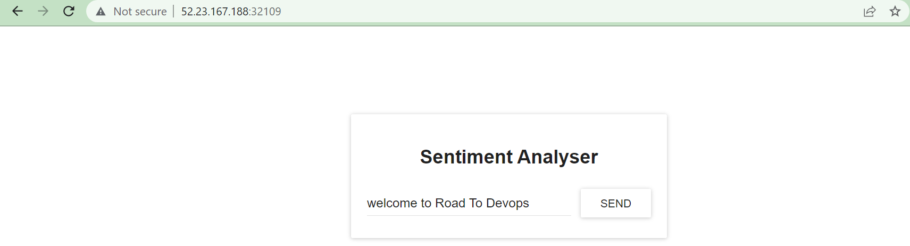

**Now we will deploy the same application using Ingress**

# Deploy Sentiment Analyzer using Kubernetes using Kubernetes and ingress

## Step 1: Enable ingress by below command

    kubectl apply -f https://raw.githubusercontent.com/kubernetes/ingress-nginx/controller-v1.1.1/deploy/static/provider/cloud/deploy.yaml

## Step 2: Check whether the load balancer created or not in your account

    kubectl get all -n ingress-nginx

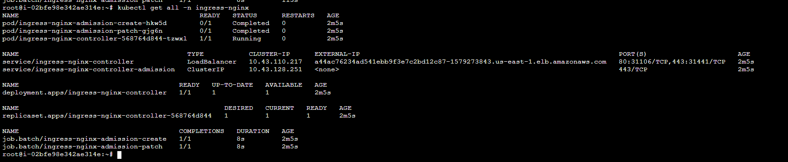

check loadbalancer created in the AWS account 

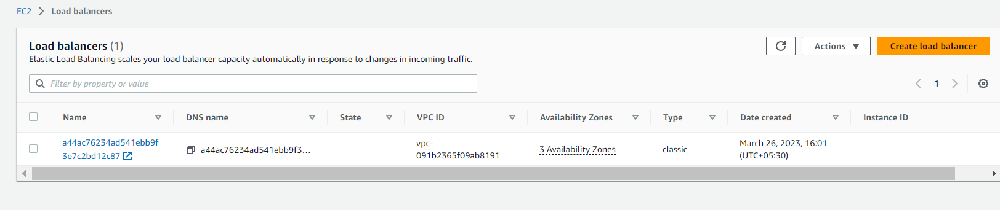

## Step 3: Clone the Repository & deploy application

    git clone https://github.com/sq-ldc/sentiment-analyzer-example-app.git

Go to this folder deployment-through-ingress 

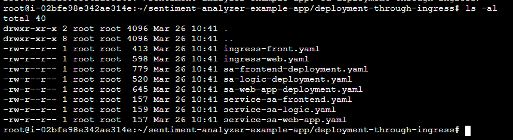

Make sure you have built and updated the deployment files with your docker images respectively
1. update image in sa-logic-deployment.yaml

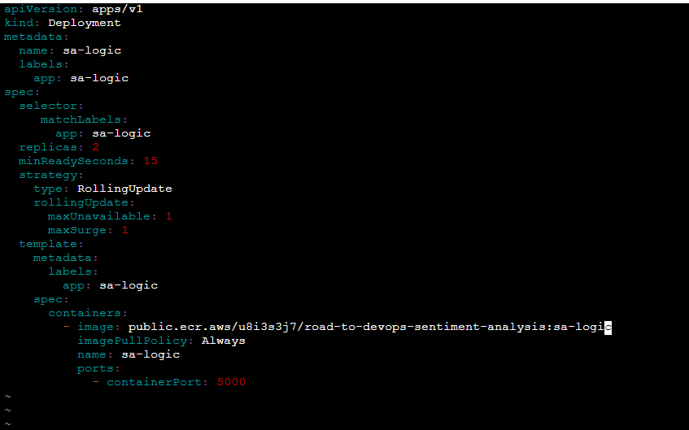

2. update image in sa-web-app-deployment.yaml

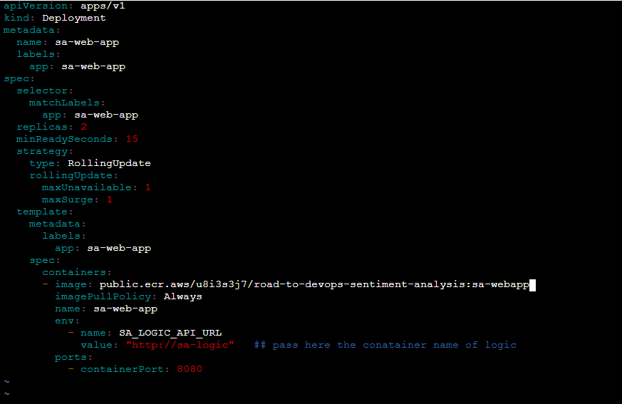

3. update the host name in the ingress-web.yaml file

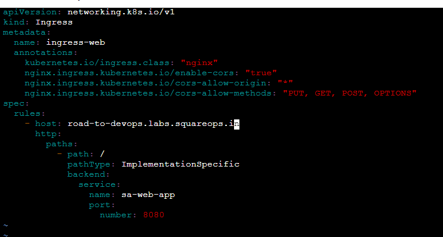

4. 
Firstly deploy logic deployment and logic service by running the following commands 

```
kubectl apply -f sa-logic-deployment.yaml
kubecl apply -f  service-sa-logic.yaml

```
Now the check the pods and svc created 

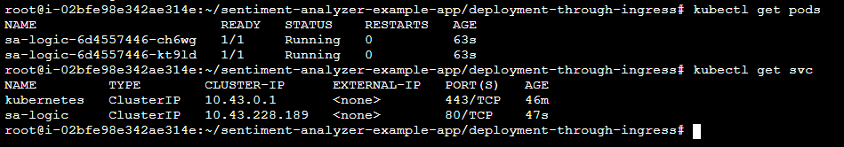


Then deploy webapp, webapp service and web-app ingress using the following commands 

```
kubectl apply -f sa-web-app-deployment.yaml
kubectl apply -f service-sa-web-app.yaml
kubectl apply -f ingress-web.yaml
```

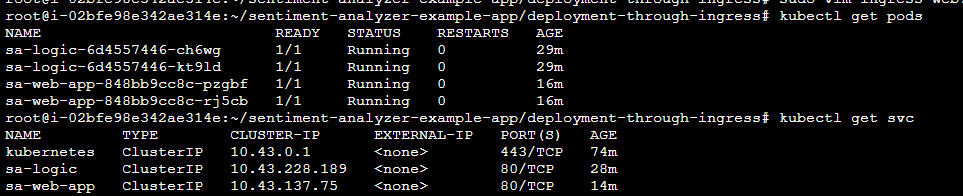

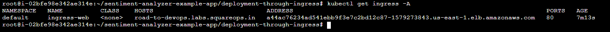

If You will get the error that webapp ingress is not deployed , then run.

    kubectl delete -A ValidatingWebhookConfiguration ingress-nginx-admission

Pass your web-app host name in the App.js of frontend

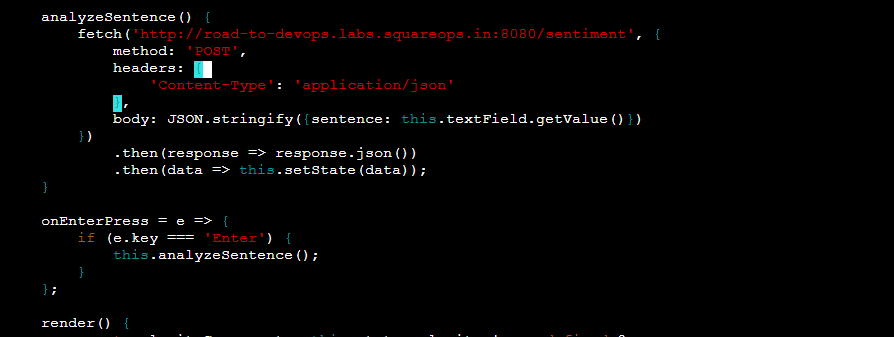

```
cd ..
sudo npm install
sudo npm run build
```
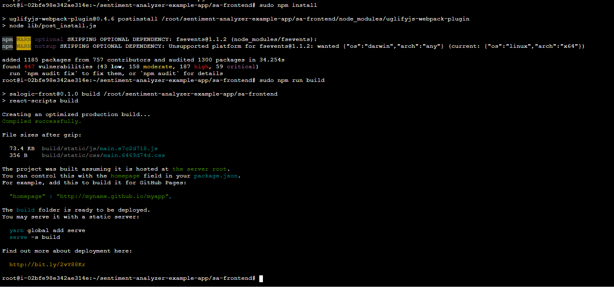

Create image of frontend and push it to docker hub.

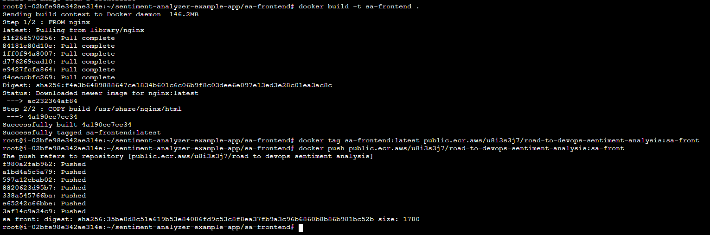

Then deploy frontend, frontend service and frontend ingress

- update the docker image in sa-frontend-deployment.yaml

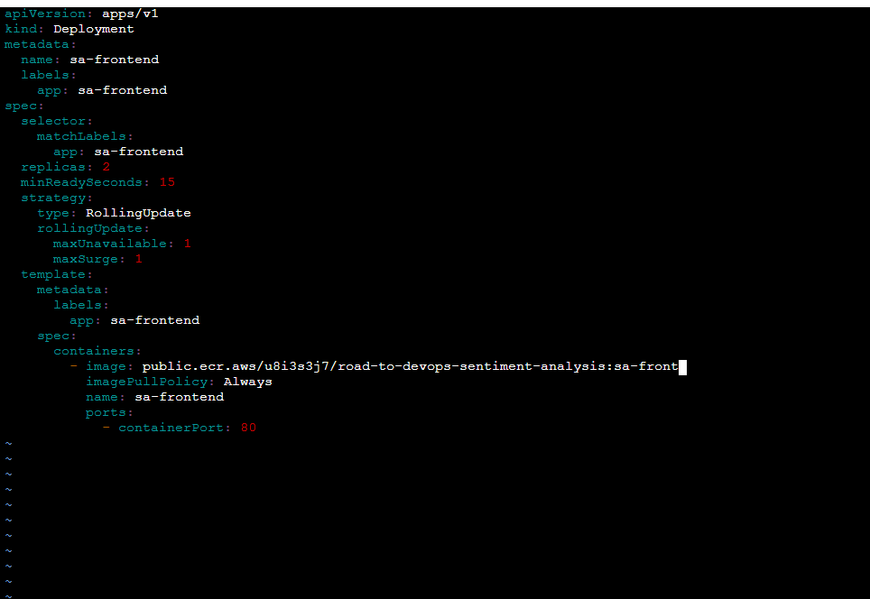

- update host in ingress-front.yaml 


```
kubectl apply -f sa-frontend-deployment.yaml
kubectl apply -f service-sa-frontend.yaml
kubectl apply -f ingress-front.yaml
```
Check whether all get host name and address of load balancer using below command
```
kubectl get ingress
```
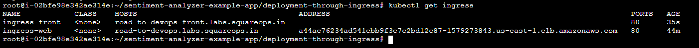

## Step 4: Create your all host names in route 53 and attach it to load balancer 

- hostname for webapp 

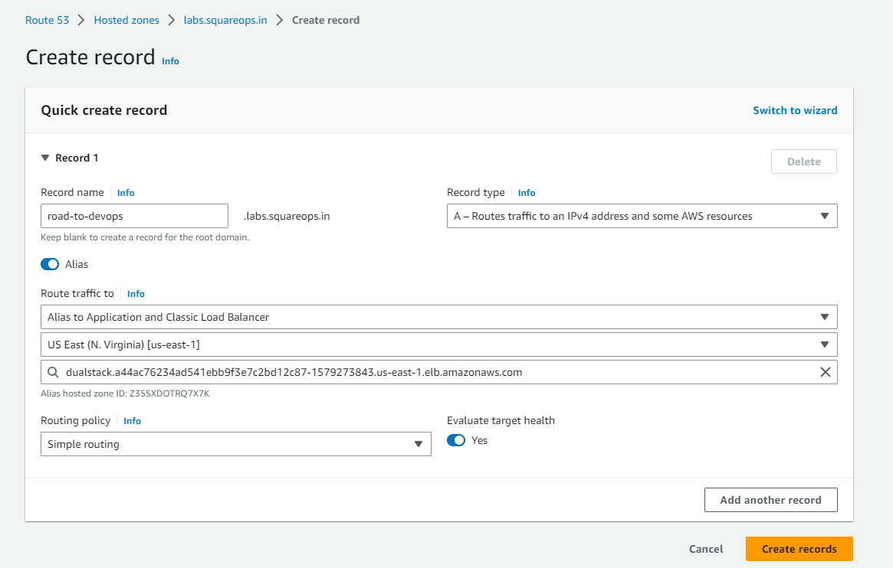

- hostname for frontend 

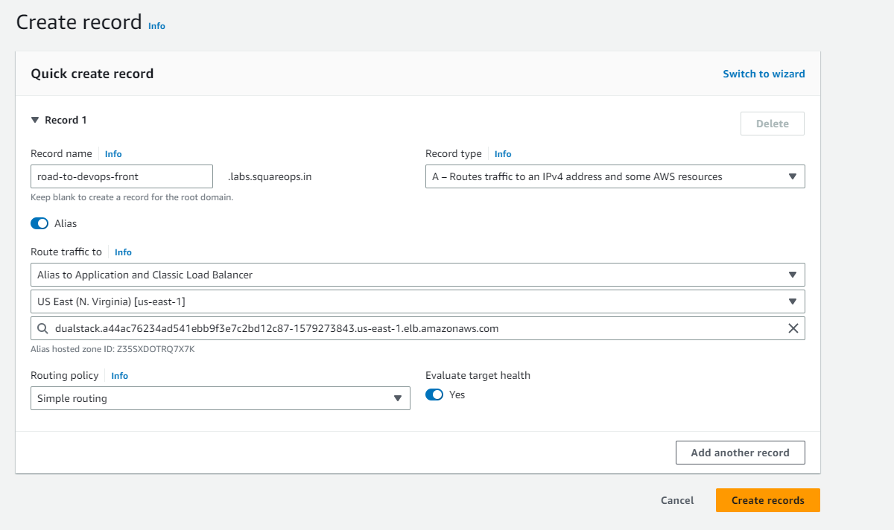

## Step 5: Verify the application 

Hit your front domain and check app will work.

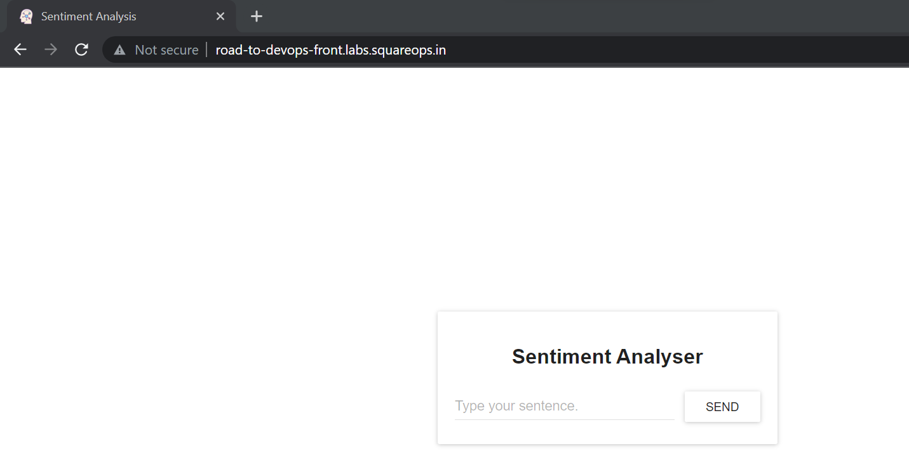

# Deploy Sentiment Analyzer using Kubernetesand helm chart

## Install HELM dependencies

```
curl -fsSL -o get_helm.sh https://raw.githubusercontent.com/helm/helm/master/scripts/get-helm-3
chmod 700 get_helm.sh
./get_helm.sh
```

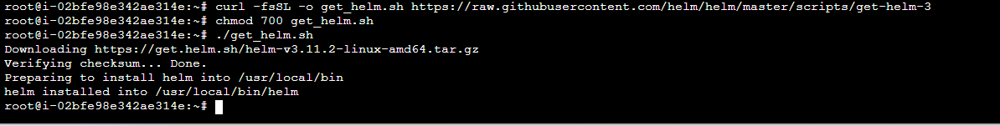

Run below commands

```
helm create sa-webapp
helm create sa-frontend
helm create sa-logic
```

Enter every directory and change the required values in values.yaml file like ingress value(only in front and webapp) image, image tag, etc.

Don’t forget to pass the env variable in webapp deployment which is required to connect webapp service to logic service or you can take the help from https://github.com/sq-ldc/sentiment-analyzer-example-app/tree/main/HELM
Also don’t forget to disable probes in webapp and logic helm deployment file
Run these commands
```
helm install sa-logic sa-logic/ --values sa-logic/values.yaml
helm install sa-webapp sa-webapp/ --values sa-webapp/values.yaml
helm install sa-frontend sa-frontend/ --values sa-frontend/values.yaml
```
Hit the frontend domain you’ll get the application output


# Conclusion 

You have deployed application on Kubernetes using ingress and helm for which you had deployed pods, services as loadbalancer and ingress. Next you had updated the docker images in respective values.yaml for helm chart deployment 