# Setup Jenkins On Kubernetes Cluster

Hosting Jenkins on a Kubernetes cluster is beneficial for Kubernetes-based deployments and dynamic container-based scalable Jenkins agents.

In this guide, I have explained the step-by-step process for setting up Jenkins on a [Kubernetes cluster](https://github.com/squareops/road-to-devops/blob/develop/Level-3/M2-HandsOnKubernetes/L02-SetupK3sCluster.md).

- [Setup Jenkins On Kubernetes Cluster](#setup-jenkins-on-kubernetes-cluster)
  - [Step 1: Create a Namespace for Jenkins. It is good to categorize all the devops tools as a separate namespace from other applications.](#step-1-create-a-namespace-for-jenkins-it-is-good-to-categorize-all-the-devops-tools-as-a-separate-namespace-from-other-applications)
  - [Step 2: Create a serviceAccount.yaml file and copy the following admin service account manifest.](#step-2-create-a-serviceaccountyaml-file-and-copy-the-following-admin-service-account-manifest)
  - [Step 3: Create volume.yaml and copy the following persistent volume manifest.](#step-3-create-volumeyaml-and-copy-the-following-persistent-volume-manifest)
  - [Step 4: Create a Deployment file named deployment.yaml and copy the following deployment manifest.](#step-4-create-a-deployment-file-named-deploymentyaml-and-copy-the-following-deployment-manifest)
  - [Step 5: Create service.yaml and copy the following service manifest.](#step-5-create-serviceyaml-and-copy-the-following-service-manifest)

For setting up a Jenkins cluster on Kubernetes, we will do the following.

1. Create a Namespace
2. Create a service account with Kubernetes admin permissions.
3. Create local persistent volume for persistent Jenkins data on Pod restarts.
4. Create a deployment YAML and deploy it.
5. Create a service YAML and deploy it.
6. Access the Jenkins application on a Node Port.

**Jenkins Kubernetes Manifest Files**

All the Jenkins Kubernetes manifest files used in this blog are hosted on Github. Please clone the repository if you have trouble copying the manifest from the blog.

        git clone https://github.com/scriptcamp/kubernetes-jenkins

Let’s get started with deploying Jenkins on Kubernetes.

## Step 1: Create a Namespace for Jenkins. It is good to categorize all the devops tools as a separate namespace from other applications.

        kubectl create namespace devops-tools

## Step 2: Create a serviceAccount.yaml file and copy the following admin service account manifest.
```
---
apiVersion: rbac.authorization.k8s.io/v1
kind: ClusterRole
metadata:
  name: jenkins-admin
rules:
  - apiGroups: [""]
    resources: ["*"]
    verbs: ["*"]

---
apiVersion: v1
kind: ServiceAccount
metadata:
  name: jenkins-admin
  namespace: devops-tools

---
apiVersion: rbac.authorization.k8s.io/v1
kind: ClusterRoleBinding
metadata:
  name: jenkins-admin
roleRef:
  apiGroup: rbac.authorization.k8s.io
  kind: ClusterRole
  name: jenkins-admin
subjects:
- kind: ServiceAccount
  name: jenkins-admin
  namespace: devops-tools

```

The serviceAccount.yaml creates a jenkins-admin clusterRole, jenkins-admin ServiceAccount and binds the clusterRole to the service account.

The jenkins-admin cluster role has all the permissions to manage the cluster components. You can also restrict access by specifying individual resource actions.

Now create the service account using kubectl.

    kubectl apply -f serviceAccount.yaml

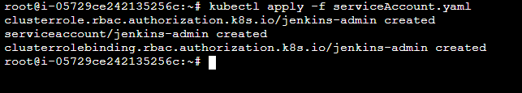

## Step 3: Create volume.yaml and copy the following persistent volume manifest.

```
kind: StorageClass
apiVersion: storage.k8s.io/v1
metadata:
  name: local-storage
provisioner: kubernetes.io/no-provisioner
volumeBindingMode: WaitForFirstConsumer

---
apiVersion: v1
kind: PersistentVolume
metadata:
  name: jenkins-pv-volume
  labels:
    type: local
spec:
  storageClassName: local-storage
  claimRef:
    name: jenkins-pv-claim
    namespace: devops-tools
  capacity:
    storage: 10Gi
  accessModes:
    - ReadWriteOnce
  local:
    path: /mnt
  nodeAffinity:
    required:
      nodeSelectorTerms:
      - matchExpressions:
        - key: kubernetes.io/hostname
          operator: In
          values:
          - worker-node01

---
apiVersion: v1
kind: PersistentVolumeClaim
metadata:
  name: jenkins-pv-claim
  namespace: devops-tools
spec:
  storageClassName: local-storage
  accessModes:
    - ReadWriteOnce
  resources:
    requests:
      storage: 3Gi
```

**Important Note: Replace instance-id with any one of your cluster worker nodes hostname.**

You can get the worker node hostname using the kubectl.

    kubectl get nodes

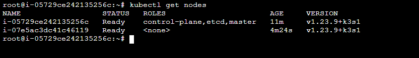

Let’s create the volume using kubectl

    kubectl create -f volume.yaml

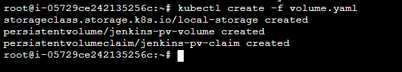

## Step 4: Create a Deployment file named deployment.yaml and copy the following deployment manifest.

Here we are using the latest Jenkins LTS docker image from the Docker hub.
```
apiVersion: apps/v1
kind: Deployment
metadata:
  name: jenkins
  namespace: devops-tools
spec:
  replicas: 1
  selector:
    matchLabels:
      app: jenkins-server
  template:
    metadata:
      labels:
        app: jenkins-server
    spec:
      securityContext:
            fsGroup: 1000 
            runAsUser: 1000
      serviceAccountName: jenkins-admin
      containers:
        - name: jenkins
          image: jenkins/jenkins:lts
          resources:
            limits:
              memory: "2Gi"
              cpu: "1000m"
            requests:
              memory: "500Mi"
              cpu: "500m"
          ports:
            - name: httpport
              containerPort: 8080
            - name: jnlpport
              containerPort: 50000
          livenessProbe:
            httpGet:
              path: "/login"
              port: 8080
            initialDelaySeconds: 90
            periodSeconds: 10
            timeoutSeconds: 5
            failureThreshold: 5
          readinessProbe:
            httpGet:
              path: "/login"
              port: 8080
            initialDelaySeconds: 60
            periodSeconds: 10
            timeoutSeconds: 5
            failureThreshold: 3
          volumeMounts:
            - name: jenkins-data
              mountPath: /var/jenkins_home         
      volumes:
        - name: jenkins-data
          persistentVolumeClaim:
              claimName: jenkins-pv-claim
```

In this Jenkins Kubernetes deployment we have used the following.

- securityContext for Jenkins pod to be able to write to the local persistent volume.
- Liveliness and readiness probe.
- Local persistent volume based on local storage class that holds the Jenkins data path /var/jenkins_home

Create the deployment using kubectl.

        kubectl apply -f deployment.yaml

Check the deployment status.

        kubectl get deployments -n devops-tools

Now, you can get the deployment details using the following command.

        kubectl  describe deployments --namespace=devops-tools

**Accessing Jenkins Using Kubernetes Service**

We have created a deployment. However, it is not accessible to the outside world. For accessing the Jenkins deployment from the outside world, we should create a service and map it to the deployment.

## Step 5: Create service.yaml and copy the following service manifest.

```
apiVersion: v1
kind: Service
metadata:
  name: jenkins-service
  namespace: devops-tools
  annotations:
    prometheus.io/scrape: "true"
    prometheus.io/path: /
    prometheus.io/port: "8080"
spec:
  selector:
    app: jenkins-server
  type: NodePort
  ports:
    - name: httpport
      port: 8080
      targetPort: 8080
      nodePort: 32000
    - name: jnlpport
      port: 50000
      targetPort: 50000

```

Note: Here, we are using the type as NodePort which will expose Jenkins on all kubernetes node IPs on port 32000. If you have an ingress setup, you can create an ingress rule to access Jenkins. Also, you can expose the Jenkins service as a Loadbalancer if you are running the cluster on AWS, Google, or Azure cloud.

Create the Jenkins service using kubectl.

    kubectl apply -f service.yaml

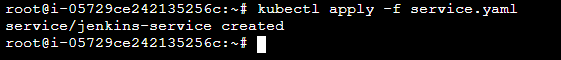

Now if you browse to any one of the Node IPs on port 32000, you will be able to access the Jenkins dashboard.

**http://node-ip:32000**

**note: make sure you have allowed port 32000**

Jenkins will ask for the initial Admin password when you access the dashboard for the first time.

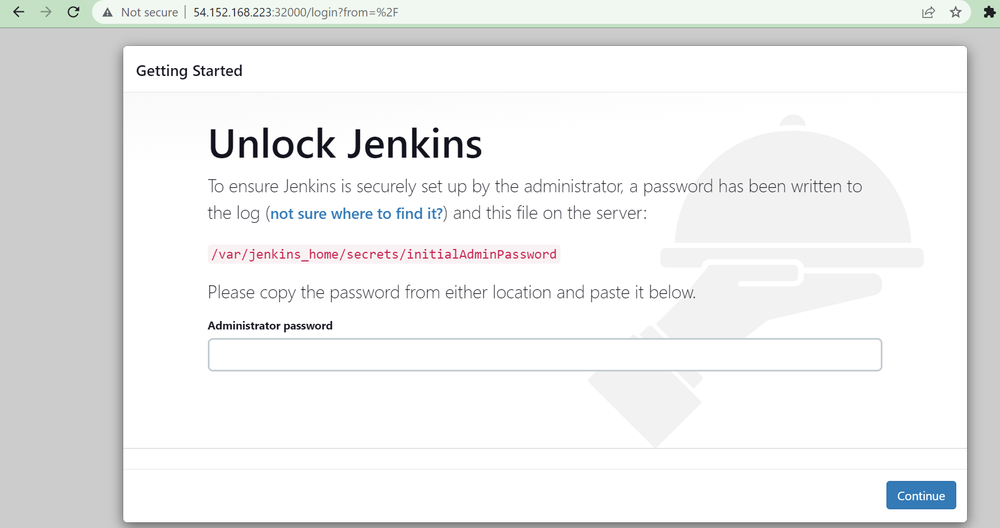

You can get the pod details using the following CLI command.

    kubectl get pods --namespace=devops-tools

And with the pod name, you can get the logs as shown below. replace the pod name with your pod name.

    kubectl logs jenkins-deployment-2539456353-j00w5 --namespace=jenkins

The password can be found at the end of the log as shown below.


Install suggested plugins to set up jenkins.

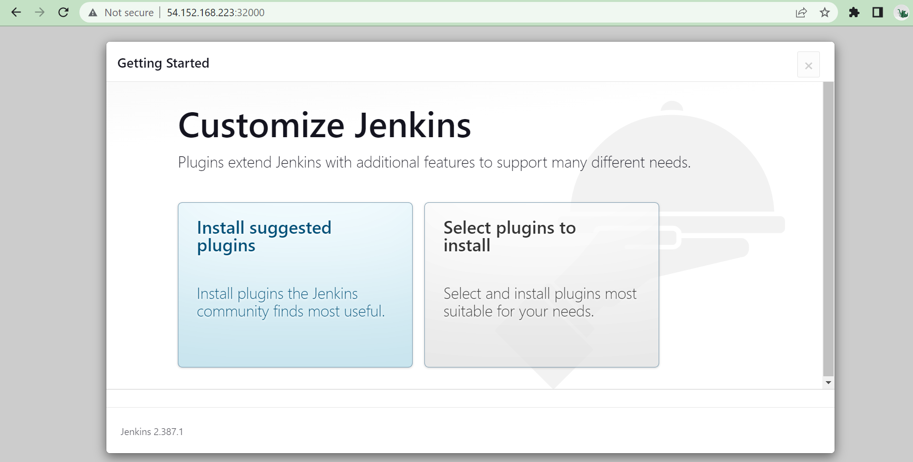

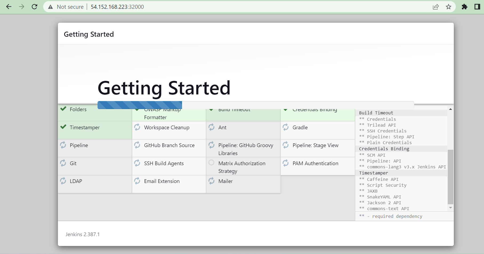

Create your jenkins credential to login into jenkins UI .

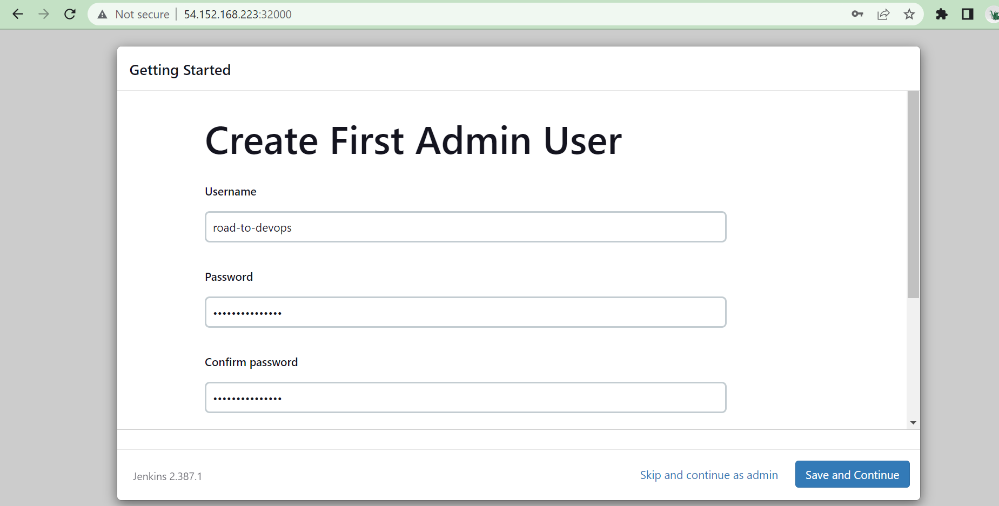

Confirm the jenkins url to access jenkins UI.

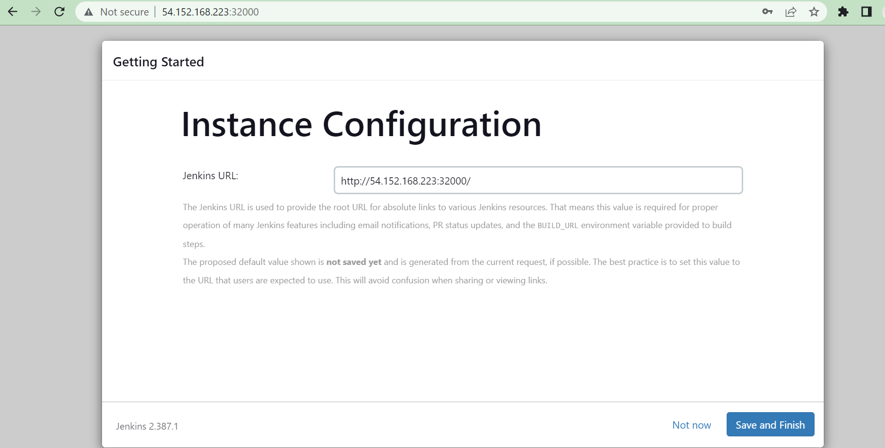

Our Jenkins setup is ready now.


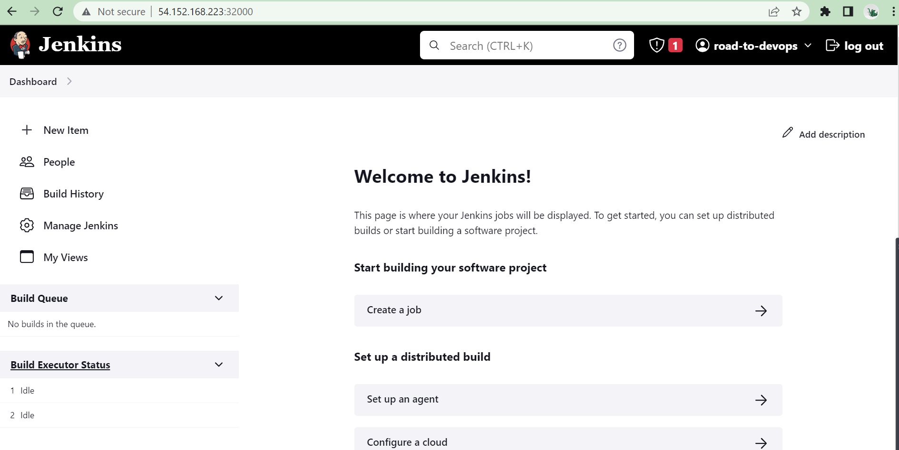

Kubernetes integrates with jenkins. Require Kubernetes plugin to setup k3s cloud.


Click on manage jenkins -> manage nodes and clouds -> configure clouds -> select cloud from dropdown list as kubernetes .

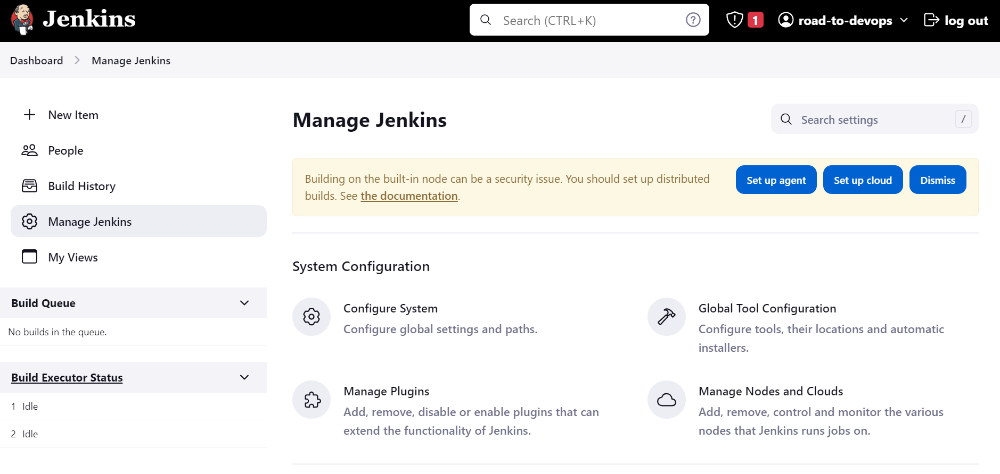

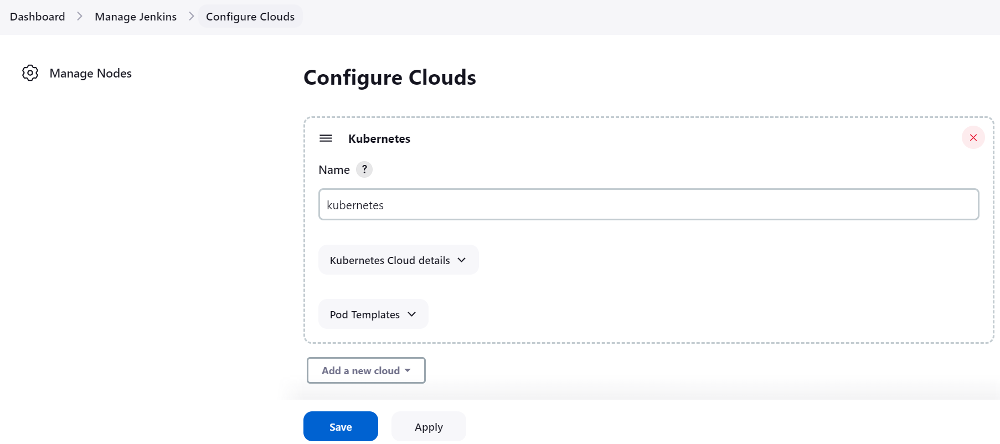

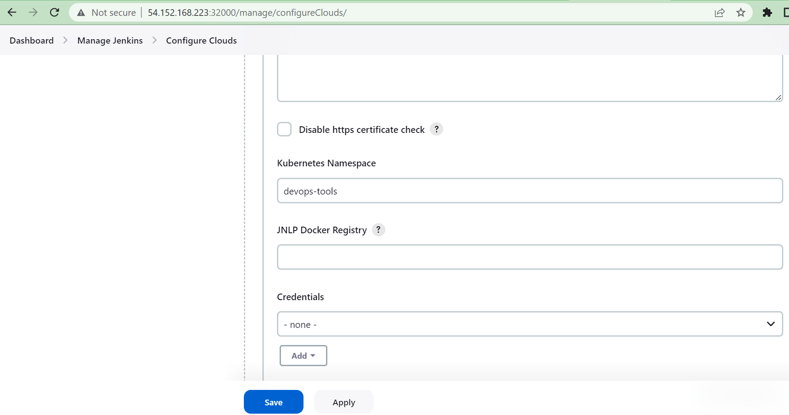

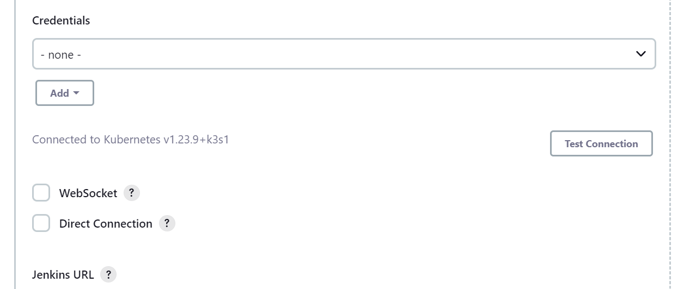

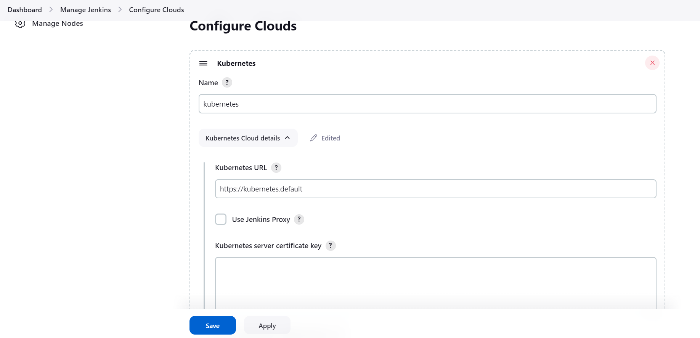

Describe jenkins-jnlp service to get jenkins tunnel as Endpoints.

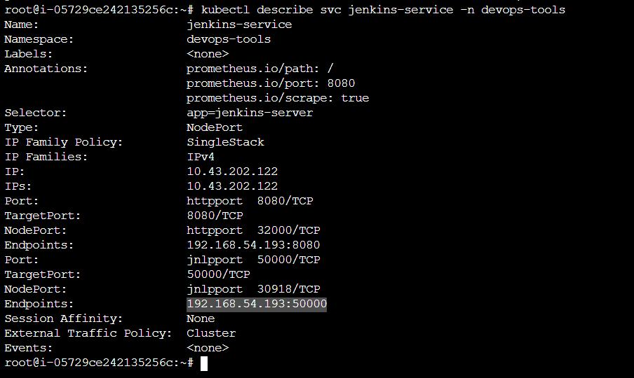

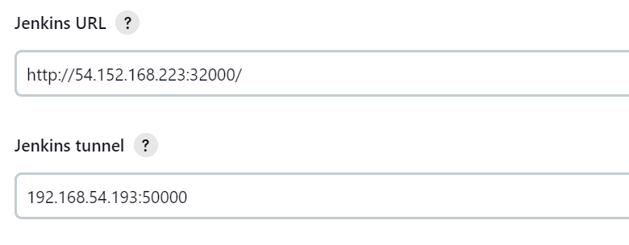

Now click on create **Pipeline**

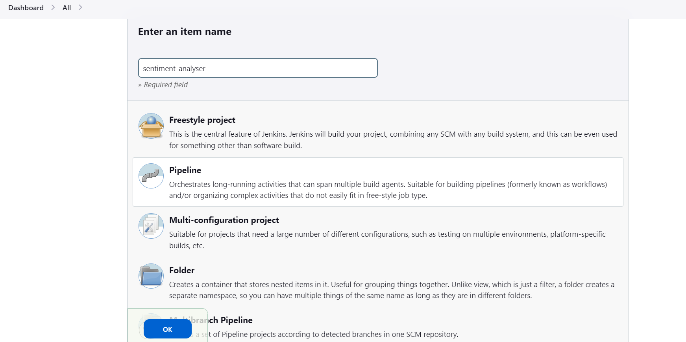

Copy the following code in script section

```
pipeline {
  agent {
    kubernetes {
      yaml '''
        apiVersion: v1
        kind: Pod
        spec:
          containers:
          - name: maven
            image: maven:alpine
            command:
            - cat
            tty: true
          - name: docker
            image: docker:latest
            command:
            - cat
            tty: true
            volumeMounts:
             - mountPath: /var/run/docker.sock
               name: docker-sock
          volumes:
          - name: docker-sock
            hostPath:
              path: /var/run/docker.sock    
        '''
    }
  }
  stages {
    stage('Clone Repository') {
      steps {
        container('maven') {
             git branch: 'master', changelog: false, poll: false, url: 'https://github.com/sq-ldc/sentiment-analyzer-example-app.git'
        }
      }
    }  
    stage('Login Into Docker') {
      steps {
        container('docker') {
          sh 'docker login --username xxxxxx --password xxxxxxx'
      }
    }
    }
    stage('Build Docker Images') {
      steps {
        container('docker') {
          dir("sa-frontend") {
            sh 'docker build -t reponame/sentiment-analysis-frontend:latest .'
          }
          dir("sa-webapp") {
            sh 'docker build -t reponame/sentiment-analysis-web-app:latest .'
          }
          dir("sa-logic") {
            sh 'docker build -t reponame/sentiment-analysis-logic:latest .'
          }
        }
      }
    }
     stage('Push Images Docker to DockerHub') {
      steps {
        container('docker') {
          sh 'docker push reponame/sentiment-analysis-frontend:latest'
          sh 'docker push reponame/sentiment-analysis-web-app:latest'
          sh 'docker push reponame/sentiment-analysis-logic:latest'
      }
     }
     }
  }
    post {
      always {
        container('docker') {
          sh 'docker logout'
      }
      }
    }
}
```

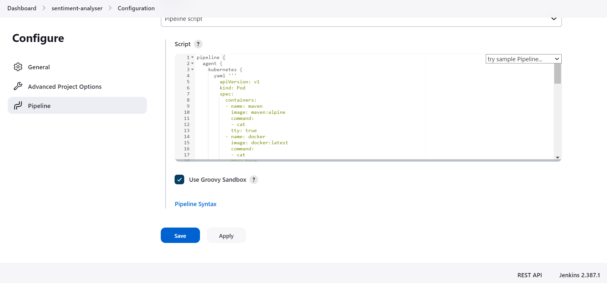

Install docker on both worker and master nodes using the following [link](https://www.digitalocean.com/community/tutorials/how-to-install-and-use-docker-on-ubuntu-20-04). If you face error while checking the status of docker, then run the following command 

  rm -fr /var/run/docker.sock

Then start the docker and check the status 

```
sudo systemctl start docker 
sudo systemctl status docker 
```

**note: make sure you have allowed port 8080 from everywhere**

Update the DockerHub credentials as follows

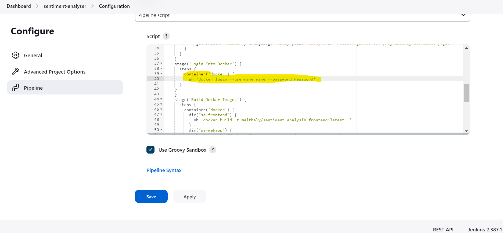

Now run the pipeline 

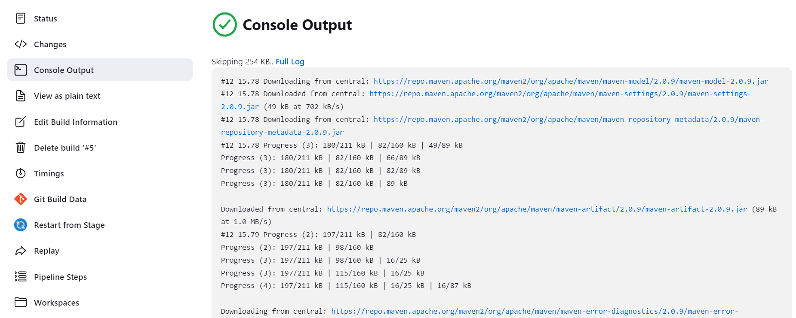

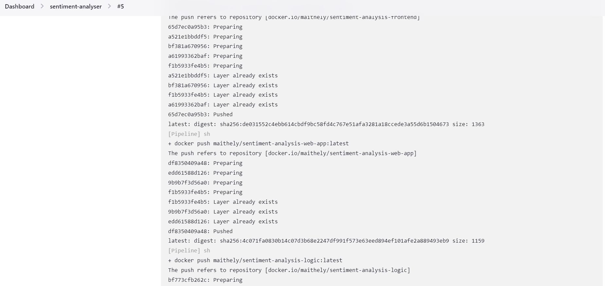

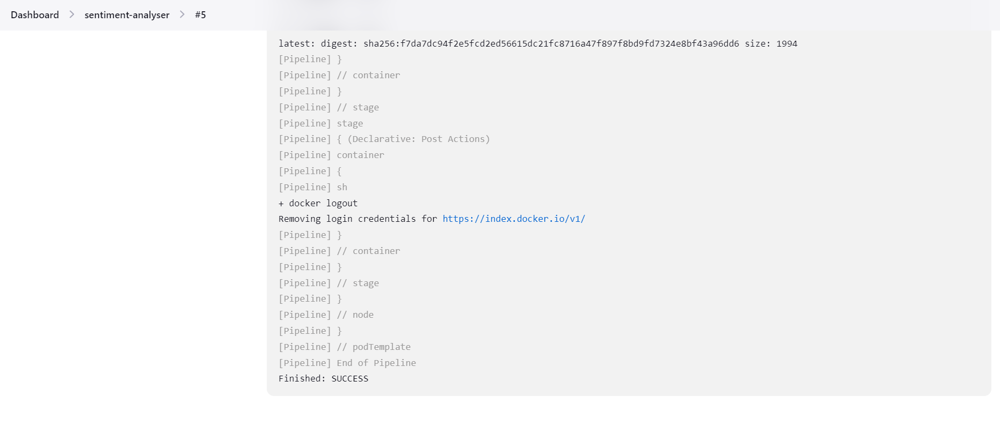

Now that your Jenkins Pipeline is running successfully and images are pushed into DockerHub , you can say that you have completed with CI(Continuous Integration)

Let's start with Continuous Deployment in the next lecture